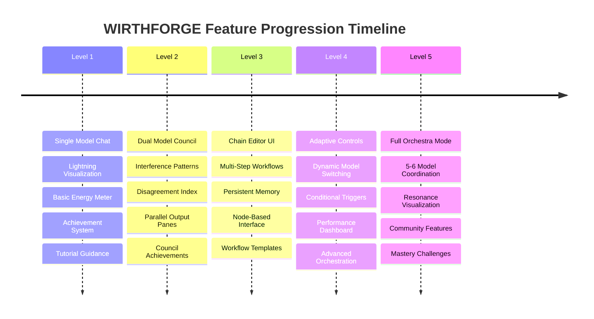
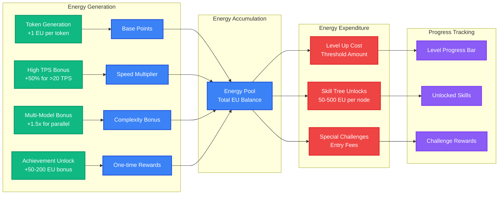

# WF-UX-002 Level Progression Flow

## User Progression from Level 1 to Level 5

```mermaid
flowchart TD
    Start([User First Launch]) --> L1{Level 1: Lightning Strikes}
    
    L1 --> L1_Features[Single Model Chat<br/>Basic Lightning Visualization<br/>Energy Bar Display<br/>First Strike Achievement]
    L1_Features --> L1_Progress{Progress Check:<br/>100 EU + Tutorial Complete?}
    L1_Progress -->|No| L1_Actions[Generate Tokens<br/>Complete Prompts<br/>Earn Energy Points]
    L1_Actions --> L1_Progress
    L1_Progress -->|Yes| L1_Unlock[🎉 Level 2 Unlocked!<br/>Dual Lightning Animation]
    
    L1_Unlock --> L2{Level 2: Parallel Streams}
    L2 --> L2_Features[Dual Model Council<br/>Interference Visualization<br/>Disagreement Index<br/>Council Member Badge]
    L2_Features --> L2_Progress{Progress Check:<br/>500 EU + Council Achievement?}
    L2_Progress -->|No| L2_Actions[Run Parallel Models<br/>Observe Interference<br/>Complete Council Sessions]
    L2_Actions --> L2_Progress
    L2_Progress -->|Yes| L2_Unlock[🎉 Level 3 Unlocked!<br/>Chain Flow Animation]
    
    L2_Unlock --> L3{Level 3: Structured Architectures}
    L3 --> L3_Features[Multi-Step Workflows<br/>Chain Editor UI<br/>Persistent Memory<br/>Architect Badge]
    L3_Features --> L3_Progress{Progress Check:<br/>1000 EU + Architect Achievement?}
    L3_Progress -->|No| L3_Actions[Build Chains<br/>Create Workflows<br/>Link Model Outputs]
    L3_Actions --> L3_Progress
    L3_Progress -->|Yes| L3_Unlock[🎉 Level 4 Unlocked!<br/>Adaptive Field Animation]
    
    L3_Unlock --> L4{Level 4: Adaptive Fields}
    L4 --> L4_Features[Dynamic Model Switching<br/>Conditional Orchestration<br/>Adaptive Controls<br/>Master Badge]
    L4_Features --> L4_Progress{Progress Check:<br/>2000 EU + Orchestrator Achievement?}
    L4_Progress -->|No| L4_Actions[Use Adaptive Mode<br/>Configure Triggers<br/>Master Orchestration]
    L4_Actions --> L4_Progress
    L4_Progress -->|Yes| L4_Unlock[🎉 Level 5 Unlocked!<br/>Resonance Celebration]
    
    L4_Unlock --> L5{Level 5: Resonance Fields}
    L5 --> L5_Features[Full Multi-Model Orchestra<br/>5-6 Models Simultaneous<br/>Resonance Visualization<br/>All Features Unlocked]
    L5_Features --> L5_Mastery[Mastery Challenges<br/>Community Leadership<br/>Global Competitions]
    
    %% Skill Tree Branches
    L1_Features -.-> ST1[Skill Tree:<br/>Enhanced Visualization<br/>Custom Themes<br/>Advanced Metrics]
    L2_Features -.-> ST2[Skill Tree:<br/>Third Model Slot<br/>Advanced Interference<br/>Council Debates]
    L3_Features -.-> ST3[Skill Tree:<br/>Complex Chains<br/>Memory Persistence<br/>Workflow Templates]
    L4_Features -.-> ST4[Skill Tree:<br/>Custom Triggers<br/>AI Monitoring<br/>Performance Tuning]
    L5_Features -.-> ST5[Skill Tree:<br/>Orchestra Conductor<br/>Resonance Mastery<br/>Community Features]
    
    %% Achievement Paths
    L1_Actions --> A1[First Strike<br/>Speed Demon<br/>Persistent User]
    L2_Actions --> A2[Council Initiate<br/>Interference Expert<br/>Parallel Master]
    L3_Actions --> A3[Architect<br/>Chain Reactor<br/>Workflow Designer]
    L4_Actions --> A4[Adaptive Master<br/>Field Controller<br/>Orchestrator]
    L5_Mastery --> A5[Resonance Conductor<br/>AI Whisperer<br/>Community Leader]
    
    %% Styling
    classDef level fill:#1e293b,stroke:#fbbf24,stroke-width:3px,color:#f8fafc
    classDef unlock fill:#10b981,stroke:#059669,stroke-width:2px,color:#ffffff
    classDef skill fill:#6366f1,stroke:#4f46e5,stroke-width:2px,color:#ffffff
    classDef achievement fill:#f59e0b,stroke:#d97706,stroke-width:2px,color:#ffffff
    
    class L1,L2,L3,L4,L5 level
    class L1_Unlock,L2_Unlock,L3_Unlock,L4_Unlock unlock
    class ST1,ST2,ST3,ST4,ST5 skill
    class A1,A2,A3,A4,A5 achievement
```

## Level Unlock Requirements Matrix

```mermaid
graph LR
    subgraph "Level 1: Lightning Strikes"
        L1_Start[Available by Default] --> L1_Tutorial[Complete Tutorial]
        L1_Tutorial --> L1_Energy[Accumulate 100 EU]
        L1_Energy --> L1_Achievement[Earn 'First Strike']
    end
    
    subgraph "Level 2: Parallel Streams"
        L1_Achievement --> L2_Energy[Accumulate 500 EU]
        L2_Energy --> L2_Council[Complete 5 Prompts]
        L2_Council --> L2_Achievement[Earn 'Council Member']
    end
    
    subgraph "Level 3: Structured Architectures"
        L2_Achievement --> L3_Energy[Accumulate 1000 EU]
        L3_Energy --> L3_Parallel[Complete Multi-Model Session]
        L3_Parallel --> L3_Achievement[Earn 'Architect']
    end
    
    subgraph "Level 4: Adaptive Fields"
        L3_Achievement --> L4_Energy[Accumulate 2000 EU]
        L4_Energy --> L4_Chain[Build Complex Chain]
        L4_Chain --> L4_Achievement[Earn 'Orchestrator']
    end
    
    subgraph "Level 5: Resonance Fields"
        L4_Achievement --> L5_Energy[Accumulate 3000+ EU]
        L5_Energy --> L5_Multi[Use 3+ Models Simultaneously]
        L5_Multi --> L5_Complete[All Prior Achievements]
    end
    
    %% Styling
    classDef requirement fill:#374151,stroke:#6b7280,stroke-width:2px,color:#f9fafb
    classDef energy fill:#fbbf24,stroke:#f59e0b,stroke-width:2px,color:#1f2937
    classDef achievement fill:#10b981,stroke:#059669,stroke-width:2px,color:#ffffff
    
    class L1_Start,L1_Tutorial,L2_Council,L3_Parallel,L4_Chain,L5_Multi,L5_Complete requirement
    class L1_Energy,L2_Energy,L3_Energy,L4_Energy,L5_Energy energy
    class L1_Achievement,L2_Achievement,L3_Achievement,L4_Achievement achievement
```

## Progressive Feature Unlocks

```mermaid
timeline
    title WIRTHFORGE Feature Progression Timeline
    
    Level 1 : Single Model Chat
            : Lightning Visualization
            : Basic Energy Meter
            : Achievement System
            : Tutorial Guidance
    
    Level 2 : Dual Model Council
            : Interference Patterns
            : Disagreement Index
            : Parallel Output Panes
            : Council Achievements
    
    Level 3 : Chain Editor UI
            : Multi-Step Workflows
            : Persistent Memory
            : Node-Based Interface
            : Workflow Templates
    
    Level 4 : Adaptive Controls
            : Dynamic Model Switching
            : Conditional Triggers
            : Performance Dashboard
            : Advanced Orchestration
    
    Level 5 : Full Orchestra Mode
            : 5-6 Model Coordination
            : Resonance Visualization
            : Community Features
            : Mastery Challenges
```

## Energy Point Flow

```mermaid
flowchart LR
    subgraph "Energy Generation"
        Tokens[Token Generation<br/>+1 EU per token] --> Base[Base Points]
        Speed[High TPS Bonus<br/>+50% for >20 TPS] --> Multiplier[Speed Multiplier]
        Multi[Multi-Model Bonus<br/>+1.5x for parallel] --> Complexity[Complexity Bonus]
        Achieve[Achievement Unlock<br/>+50-200 EU bonus] --> Bonus[One-time Rewards]
    end
    
    subgraph "Energy Accumulation"
        Base --> Pool[Energy Pool<br/>Total EU Balance]
        Multiplier --> Pool
        Complexity --> Pool
        Bonus --> Pool
    end
    
    subgraph "Energy Expenditure"
        Pool --> LevelUp[Level Up Cost<br/>Threshold Amount]
        Pool --> SkillTree[Skill Tree Unlocks<br/>50-500 EU per node]
        Pool --> Challenges[Special Challenges<br/>Entry Fees]
    end
    
    subgraph "Progress Tracking"
        LevelUp --> Progress[Level Progress Bar]
        SkillTree --> Skills[Unlocked Skills]
        Challenges --> Rewards[Challenge Rewards]
    end
    
    %% Styling
    classDef generation fill:#10b981,stroke:#059669,stroke-width:2px,color:#ffffff
    classDef accumulation fill:#3b82f6,stroke:#1d4ed8,stroke-width:2px,color:#ffffff
    classDef expenditure fill:#ef4444,stroke:#dc2626,stroke-width:2px,color:#ffffff
    classDef tracking fill:#8b5cf6,stroke:#7c3aed,stroke-width:2px,color:#ffffff
    
    class Tokens,Speed,Multi,Achieve generation
    class Base,Multiplier,Complexity,Bonus,Pool accumulation
    class LevelUp,SkillTree,Challenges expenditure
    class Progress,Skills,Rewards tracking
```
