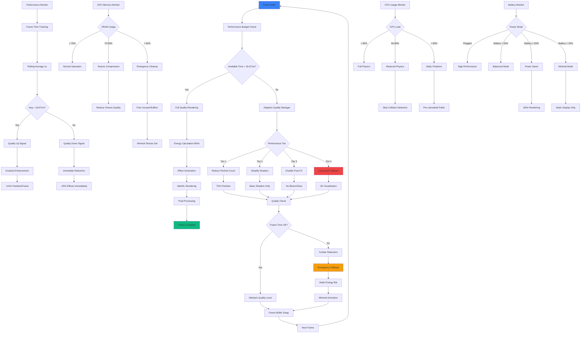

# WF-UX-003 Performance Flow

## Performance Optimization Strategy

### Frame Budget Management
- **Target**: 16.67ms per frame (60Hz)
- **Monitoring**: Real-time performance tracking
- **Adaptation**: Dynamic quality scaling

### Quality Reduction Tiers
1. **Tier 1**: Reduce particle count by 25%
2. **Tier 2**: Switch to simplified shaders
3. **Tier 3**: Disable post-processing effects
4. **Tier 4**: Fall back to Canvas2D rendering

### Resource Monitoring
- **GPU Memory**: Texture compression and cleanup
- **CPU Usage**: Physics calculation optimization
- **Battery**: Power-aware rendering modes

### Emergency Fallbacks
- **Static Energy Bar**: When all else fails
- **Minimal Animation**: Basic pulse effects only
- **Graceful Degradation**: Never crash, always show something

### Performance Recovery
- **Gradual Enhancement**: Slowly increase quality when performance improves
- **Hysteresis**: Prevent quality oscillation
- **User Override**: Manual quality settings available
