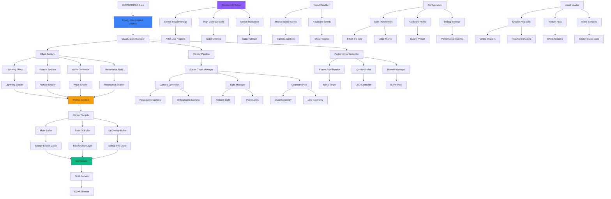

# WF-UX-003 Rendering Architecture

## Architecture Components

### Core Systems
- **Visualization Manager**: Central coordinator for all effects
- **Effect Factory**: Creates and manages visualization instances
- **Render Pipeline**: WebGL rendering orchestration
- **Performance Controller**: Maintains 60Hz target

### Effect Generators
- **Lightning Effect**: Single model energy bolts
- **Particle System**: Multi-model energy streams
- **Wave Generator**: Interference pattern visualization
- **Resonance Field**: Harmonic energy fields

### Rendering Infrastructure
- **Scene Graph**: Three.js scene management
- **Camera System**: Perspective and orthographic views
- **Lighting**: Dynamic lighting for energy effects
- **Geometry Pool**: Reusable mesh instances

### Performance & Quality
- **Frame Rate Monitor**: Real-time performance tracking
- **Quality Scaler**: Adaptive LOD system
- **Memory Manager**: Efficient buffer management
- **Compositor**: Multi-layer rendering pipeline

### Accessibility Integration
- **Screen Reader Bridge**: ARIA live region updates
- **High Contrast Mode**: Alternative color schemes
- **Motion Reduction**: Static visualization fallbacks
- **Keyboard Navigation**: Full keyboard accessibility

### Configuration System
- **User Preferences**: Customizable visualization settings
- **Hardware Profile**: Automatic quality detection
- **Debug Tools**: Developer performance overlay
