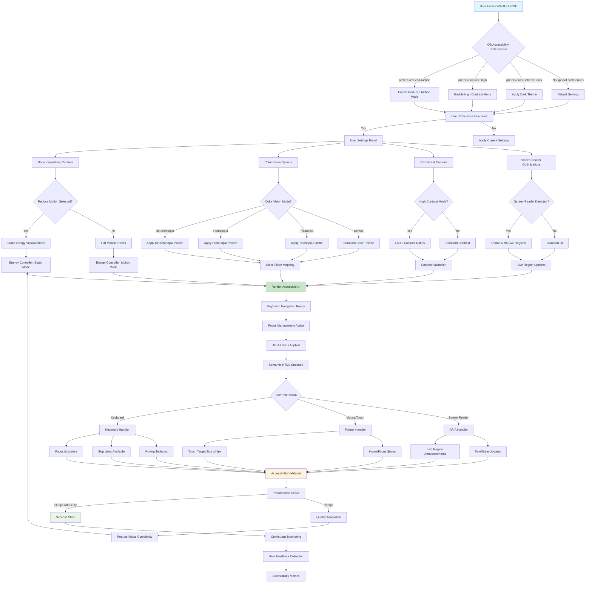

# WF-UX-004 Accessibility Flow

## Accessibility Flow Components

### Input Detection
- **OS Preferences**: Automatic detection of system accessibility settings
- **User Overrides**: Manual preference controls in settings panel
- **Assistive Technology**: Screen reader and other AT detection

### Preference Categories
- **Motion Sensitivity**: Reduced motion, static alternatives, animation controls
- **Color Vision**: Deuteranopia, protanopia, tritanopia support
- **Contrast**: High contrast mode, custom contrast ratios
- **Text**: Size scaling, font preferences, reading modes

### Implementation Layers
- **Energy Controller**: Adapts visualizations based on motion preferences
- **Color System**: Dynamic palette switching for color vision needs
- **Focus Management**: Keyboard navigation and focus indicators
- **ARIA Integration**: Live regions, roles, and semantic markup

### Validation Pipeline
- **Performance**: Maintains 60fps target with accessibility features
- **Compliance**: WCAG 2.2 AA validation at each step
- **User Testing**: Continuous feedback and metric collection
- **Quality Adaptation**: Automatic fallbacks for performance constraints
