# WF-UX-004 WCAG 2.2 AA Compliance Map

```mermaid
graph TD
    WCAG[WCAG 2.2 AA] --> P[Perceivable]
    WCAG --> O[Operable]
    WCAG --> U[Understandable]
    WCAG --> R[Robust]
    
    P --> P1[1.1 Text Alternatives]
    P --> P2[1.2 Time-based Media]
    P --> P3[1.3 Adaptable]
    P --> P4[1.4 Distinguishable]
    
    O --> O1[2.1 Keyboard Accessible]
    O --> O2[2.2 Enough Time]
    O --> O3[2.3 Seizures]
    O --> O4[2.4 Navigable]
    O --> O5[2.5 Input Modalities]
    
    U --> U1[3.1 Readable]
    U --> U2[3.2 Predictable]
    U --> U3[3.3 Input Assistance]
    
    R --> R1[4.1 Compatible]
    
    P1 --> P1A[Energy Visualization Alt Text]
    P1 --> P1B[Icon Alternative Labels]
    P1 --> P1C[Complex Image Descriptions]
    
    P1A --> COMP1[ScreenReaderLive Component]
    P1B --> COMP2[IconButton with aria-label]
    P1C --> COMP3[EnergyVisualization with longdesc]
    
    P2 --> P2A[Audio Descriptions]
    P2 --> P2B[Captions for Videos]
    P2A --> COMP4[AudioDescription Component]
    P2B --> COMP5[VideoPlayer with captions]
    
    P3 --> P3A[Semantic HTML Structure]
    P3 --> P3B[Programmatic Relationships]
    P3 --> P3C[Meaningful Sequence]
    
    P3A --> COMP6[Semantic Layout Components]
    P3B --> COMP7[ARIA Relationships]
    P3C --> COMP8[Logical Tab Order]
    
    P4 --> P4A[Color Contrast 4.5:1]
    P4 --> P4B[Color Not Sole Indicator]
    P4 --> P4C[Text Resize 200%]
    P4 --> P4D[Reflow at 320px]
    
    P4A --> COMP9[ContrastValidator Utility]
    P4B --> COMP10[MultiModal Indicators]
    P4C --> COMP11[ResponsiveText Component]
    P4D --> COMP12[FlexibleLayout System]
    
    O1 --> O1A[Keyboard Navigation]
    O1 --> O1B[No Keyboard Traps]
    O1 --> O1C[Focus Visible]
    
    O1A --> COMP13[KeyboardHandler Utility]
    O1B --> COMP14[FocusTrap Component]
    O1C --> COMP15[FocusIndicator Styles]
    
    O2 --> O2A[Timing Adjustable]
    O2 --> O2B[Pause/Stop/Hide]
    O2A --> COMP16[TimingControls Component]
    O2B --> COMP17[AnimationControls Component]
    
    O3 --> O3A[No Flashing >3Hz]
    O3 --> O3B[Motion Controls]
    O3A --> COMP18[FlashValidator Utility]
    O3B --> COMP19[MotionReducer Component]
    
    O4 --> O4A[Skip Links]
    O4 --> O4B[Page Titles]
    O4 --> O4C[Focus Order]
    O4 --> O4D[Link Purpose]
    O4 --> O4E[Multiple Ways]
    
    O4A --> COMP20[SkipLink Component]
    O4B --> COMP21[PageTitle Component]
    O4C --> COMP22[FocusManager Utility]
    O4D --> COMP23[DescriptiveLink Component]
    O4E --> COMP24[Navigation Component]
    
    O5 --> O5A[Pointer Gestures]
    O5 --> O5B[Pointer Cancellation]
    O5 --> O5C[Label in Name]
    O5 --> O5D[Motion Actuation]
    O5 --> O5E[Target Size 44px]
    
    O5A --> COMP25[GestureAlternatives]
    O5B --> COMP26[PointerHandler Utility]
    O5C --> COMP27[AccessibleLabels]
    O5D --> COMP28[MotionControls]
    O5E --> COMP29[TouchTarget Component]
    
    U1 --> U1A[Page Language]
    U1 --> U1B[Parts Language]
    U1A --> COMP30[LanguageProvider]
    U1B --> COMP31[MultilingualContent]
    
    U2 --> U2A[On Focus]
    U2 --> U2B[On Input]
    U2 --> U2C[Consistent Navigation]
    U2 --> U2D[Consistent Identification]
    
    U2A --> COMP32[FocusHandler Utility]
    U2B --> COMP33[InputHandler Utility]
    U2C --> COMP34[ConsistentNav Component]
    U2D --> COMP35[IconSystem Component]
    
    U3 --> U3A[Error Identification]
    U3 --> U3B[Labels/Instructions]
    U3 --> U3C[Error Suggestion]
    U3 --> U3D[Error Prevention]
    
    U3A --> COMP36[ErrorMessage Component]
    U3B --> COMP37[FormLabel Component]
    U3C --> COMP38[ErrorSuggestion Component]
    U3D --> COMP39[ValidationPreview]
    
    R1 --> R1A[Parsing]
    R1 --> R1B[Name/Role/Value]
    R1 --> R1C[Status Messages]
    
    R1A --> COMP40[HTMLValidator Utility]
    R1B --> COMP41[ARIAAttributes Utility]
    R1C --> COMP42[StatusAnnouncer Component]
    
    COMP1 --> IMPL1[Live Region Updates]
    COMP9 --> IMPL2[Color Token Validation]
    COMP13 --> IMPL3[Roving Tabindex]
    COMP19 --> IMPL4[prefers-reduced-motion]
    COMP29 --> IMPL5[44px Touch Targets]
    COMP42 --> IMPL6[ARIA Live Regions]
    
    IMPL1 --> TEST1[Screen Reader Tests]
    IMPL2 --> TEST2[Contrast Ratio Tests]
    IMPL3 --> TEST3[Keyboard Navigation Tests]
    IMPL4 --> TEST4[Motion Sensitivity Tests]
    IMPL5 --> TEST5[Touch Target Tests]
    IMPL6 --> TEST6[Status Message Tests]
    
    TEST1 --> VALIDATE1[NVDA/JAWS/VoiceOver]
    TEST2 --> VALIDATE2[4.5:1 Minimum Ratio]
    TEST3 --> VALIDATE3[100% Keyboard Coverage]
    TEST4 --> VALIDATE4[Static Mode Available]
    TEST5 --> VALIDATE5[Minimum 44x44px]
    TEST6 --> VALIDATE6[Proper Announcements]
    
    style WCAG fill:#e1f5fe
    style P fill:#e8f5e8
    style O fill:#fff3e0
    style U fill:#f3e5f5
    style R fill:#fce4ec
    style COMP1 fill:#c8e6c9
    style COMP9 fill:#c8e6c9
    style COMP13 fill:#c8e6c9
    style COMP19 fill:#c8e6c9
    style COMP29 fill:#c8e6c9
    style COMP42 fill:#c8e6c9
```

## WCAG 2.2 AA Compliance Implementation

### Perceivable Components
- **Text Alternatives**: Energy visualizations have descriptive ARIA labels and live region updates
- **Time-based Media**: Audio descriptions and captions for any multimedia content
- **Adaptable**: Semantic HTML structure with proper heading hierarchy and relationships
- **Distinguishable**: 4.5:1 contrast ratios, color-independent indicators, responsive text scaling

### Operable Components
- **Keyboard Accessible**: Full keyboard navigation with roving tabindex and focus management
- **Enough Time**: User-controlled timing for animations and auto-updating content
- **Seizures**: No flashing content above 3Hz, motion controls for sensitive users
- **Navigable**: Skip links, descriptive page titles, logical focus order, multiple navigation methods
- **Input Modalities**: 44px touch targets, gesture alternatives, pointer cancellation

### Understandable Components
- **Readable**: Proper language attributes, multilingual support
- **Predictable**: Consistent navigation patterns, no unexpected context changes
- **Input Assistance**: Clear error messages, helpful labels, error prevention

### Robust Components
- **Compatible**: Valid HTML, proper ARIA implementation, status message announcements

### Testing Integration
Each component maps to specific test suites that validate compliance with automated tools (axe-core, jest-axe) and manual testing procedures with real assistive technologies.
