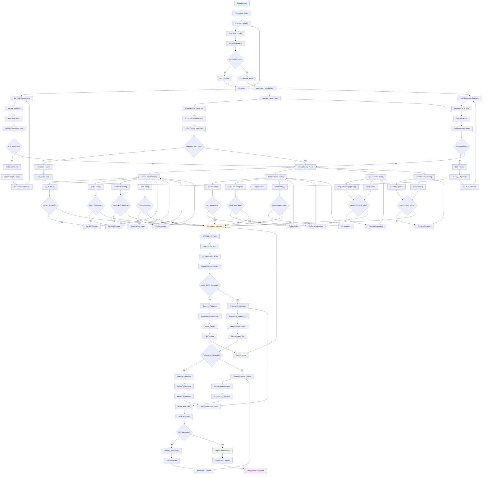

# WF-UX-004 Testing Procedures

## Testing Procedure Components

### Automated Testing Pipeline
- **Pre-commit Hooks**: ESLint a11y rules, TypeScript validation
- **Unit Tests**: Component-level accessibility validation with jest-axe
- **Integration Tests**: Flow-level screen reader and keyboard testing
- **E2E Tests**: Complete user journey validation with Playwright

### Manual Testing Categories
- **Screen Readers**: NVDA, JAWS, VoiceOver, Orca compatibility
- **Keyboard Navigation**: Tab order, arrow keys, shortcuts
- **Voice Control**: Dragon NaturallySpeaking, Voice Access
- **Switch Control**: Switch navigation, dwell clicking

### Compliance Validation
- **WCAG 2.2 AA**: Complete audit against all success criteria
- **axe-core**: Automated accessibility rule validation
- **Lighthouse**: Performance and accessibility scoring
- **Manual Checklist**: Human verification of complex interactions

### Performance Integration
- **Frame Rate**: Maintain 60fps with accessibility features enabled
- **Memory Usage**: Monitor impact of accessibility enhancements
- **Battery Life**: Test power consumption with assistive technologies

### User Acceptance Testing
- **Disabled Users**: Recruit users with various disabilities
- **Real Scenarios**: Test actual use cases and workflows
- **Feedback Collection**: Systematic gathering of user experiences
- **Iterative Improvement**: Continuous refinement based on user needs
