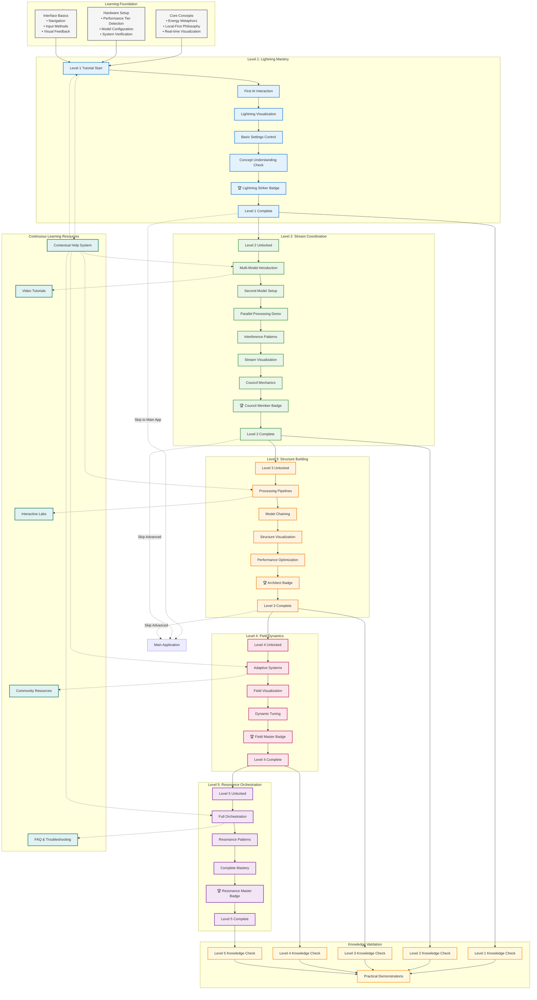

# WF-UX-005 Learning Path Progression

## Progressive Tutorial Levels and Knowledge Building

## Learning Path Architecture

### Foundation Layer
**Core Concepts**: Energy metaphors, local-first philosophy, real-time visualization principles
**Hardware Setup**: Performance detection, model configuration, system verification
**Interface Basics**: Navigation patterns, input methods, visual feedback understanding

### Progressive Level Structure

#### Level 1: Lightning (Individual AI Interaction)
- **Learning Goals**: Basic AI interaction, energy visualization understanding
- **Key Skills**: Prompt crafting, visual interpretation, basic settings
- **Validation**: Successfully generate responses, understand lightning patterns
- **Time Estimate**: 5-10 minutes

#### Level 2: Streams (Multi-Model Coordination)
- **Learning Goals**: Parallel processing, model coordination, interference patterns
- **Key Skills**: Model management, stream interpretation, council mechanics
- **Validation**: Successfully run multiple models, interpret interference
- **Time Estimate**: 10-15 minutes

#### Level 3: Structures (Pipeline Building)
- **Learning Goals**: Complex workflows, model chaining, optimization
- **Key Skills**: Pipeline design, structure visualization, performance tuning
- **Validation**: Build functional processing pipeline
- **Time Estimate**: 15-20 minutes

#### Level 4: Fields (Adaptive Systems)
- **Learning Goals**: Dynamic adaptation, field theory, system responsiveness
- **Key Skills**: Field manipulation, adaptive tuning, dynamic optimization
- **Validation**: Successfully manage adaptive field systems
- **Time Estimate**: 20-25 minutes

#### Level 5: Resonance (Master Orchestration)
- **Learning Goals**: Complete system mastery, resonance patterns, orchestration
- **Key Skills**: Full system control, resonance interpretation, master-level optimization
- **Validation**: Demonstrate complete system mastery
- **Time Estimate**: 25-30 minutes

### Knowledge Validation Framework

#### Immediate Feedback
- Real-time visual confirmation of understanding
- Interactive elements respond to correct actions
- Progressive disclosure based on demonstrated competency

#### Knowledge Checks
- Optional quizzes at level completion
- Practical demonstrations of learned skills
- Peer validation through community challenges

#### Continuous Assessment
- Usage pattern analysis
- Feature adoption tracking
- Help-seeking behavior monitoring

### Support Systems

#### Contextual Help
- Just-in-time tooltips and guidance
- Context-aware assistance
- Progressive hint systems

#### Video Tutorials
- Visual demonstrations of complex concepts
- Step-by-step walkthroughs
- Offline-accessible content

#### Interactive Labs
- Safe practice environments
- Guided experimentation
- Risk-free learning spaces

#### Community Resources
- User-generated content
- Peer learning opportunities
- Advanced technique sharing

### Adaptive Learning Paths

#### Performance-Based Adaptation
- **Low-Tier Hardware**: Simplified visuals, essential concepts only
- **Mid-Tier Hardware**: Standard progression with full features
- **High-Tier Hardware**: Enhanced demonstrations, advanced concepts

#### Learning Style Accommodation
- **Visual Learners**: Enhanced graphics, video content
- **Kinesthetic Learners**: Interactive elements, hands-on practice
- **Auditory Learners**: Narrated tutorials, sound feedback

#### Pace Customization
- **Fast Track**: Accelerated progression for experienced users
- **Standard Pace**: Recommended learning progression
- **Detailed Exploration**: Extended tutorials with deep dives

### Success Metrics

#### Completion Rates
- Tutorial completion percentage by level
- Drop-off point identification
- Re-engagement success rates

#### Skill Retention
- Feature usage after tutorial completion
- Help-seeking frequency reduction
- Independent problem-solving capability

#### User Satisfaction
- Tutorial rating and feedback
- Recommendation likelihood
- Long-term engagement metrics
