# WF-UX-005 Onboarding Flow Diagram

## Complete First-Time User Experience (FTUX) Flow

```mermaid
flowchart TD
    Start([User Launches WIRTHFORGE]) --> Welcome[Welcome Screen<br/>Vision Introduction]
    Welcome --> HWDetect{Hardware Tier Detection}
    
    HWDetect -->|Auto-detect| Low[Low Tier<br/>Basic Graphics Mode]
    HWDetect -->|Auto-detect| Mid[Mid Tier<br/>Standard Mode]
    HWDetect -->|Auto-detect| High[High Tier<br/>Enhanced Mode]
    HWDetect -->|Manual| UserSelect[User Selects Performance Profile]
    
    UserSelect --> ProfileSet{Profile Selected}
    ProfileSet -->|Basic| Low
    ProfileSet -->|Standard| Mid
    ProfileSet -->|Enhanced| High
    
    Low --> AICheck[Local AI System Check]
    Mid --> AICheck
    High --> AICheck
    
    AICheck --> AIStatus{AI Backend Status}
    AIStatus -->|Ready| FirstPrompt[Level 1 Tutorial:<br/>First AI Interaction]
    AIStatus -->|Not Ready| Troubleshoot[AI Setup Troubleshooting]
    
    Troubleshoot --> ModelCheck{Model Available?}
    ModelCheck -->|No| DownloadModel[Guide: Download Model]
    ModelCheck -->|Yes| ConfigCheck[Check Configuration]
    
    DownloadModel --> ModelInstall[Install Default Model]
    ConfigCheck --> FixConfig[Auto-fix Common Issues]
    ModelInstall --> RetryAI[Retry AI Connection]
    FixConfig --> RetryAI
    RetryAI --> AIStatus
    
    FirstPrompt --> PromptInput[User Types: 'Hello, WIRTHFORGE!']
    PromptInput --> ProcessPrompt[AI Processes Request]
    ProcessPrompt --> Lightning[⚡ Lightning Visualization Appears]
    Lightning --> WowMoment[User Sees Real-time Energy]
    
    WowMoment --> ExplainConcept[Tutorial: 'This lightning shows<br/>your AI thinking in real-time!']
    ExplainConcept --> SecondPrompt[Guided: Try Another Question]
    SecondPrompt --> EnergyMeter[Show Energy Meter Filling]
    EnergyMeter --> SettingsIntro[Tutorial: Adjust AI Creativity]
    
    SettingsIntro --> SliderDemo[User Adjusts Temperature Slider]
    SliderDemo --> VisualChange[Lightning Changes Brightness/Speed]
    VisualChange --> ConceptLink[Explain: Settings Affect Visuals]
    
    ConceptLink --> LevelIntro[Introduce 5-Level System]
    LevelIntro --> CurrentLevel[You're in Level 1: Lightning]
    CurrentLevel --> ProgressPreview[Preview: Streams, Structures, Fields, Resonance]
    
    ProgressPreview --> Achievement[🏆 Achievement: First Strike]
    Achievement --> L1Complete[Level 1 Tutorial Complete]
    
    L1Complete --> L2Unlock[Level 2 Unlocked!]
    L2Unlock --> ContinueChoice{Continue to Level 2?}
    
    ContinueChoice -->|Yes| L2Tutorial[Level 2 Tutorial:<br/>Multi-Model Introduction]
    ContinueChoice -->|Later| MainApp[Enter Main Application]
    ContinueChoice -->|Skip| SkipWarning[Show: 'You can access tutorials<br/>anytime from Help menu']
    
    SkipWarning --> MainApp
    
    L2Tutorial --> DualModel[Setup: Add Second Model]
    DualModel --> InterferenceDemo[Demo: Model Interference Patterns]
    InterferenceDemo --> StreamsVisual[Show: Streams Visualization]
    StreamsVisual --> L2Achievement[🏆 Achievement: Council Member]
    L2Achievement --> L2Complete[Level 2 Tutorial Complete]
    
    L2Complete --> L3Choice{Continue to Level 3?}
    L3Choice -->|Yes| L3Tutorial[Level 3 Tutorial Preview]
    L3Choice -->|No| MainApp
    
    L3Tutorial --> MainApp
    MainApp --> OnboardingComplete[✅ Onboarding Complete<br/>User Ready for Full Experience]
    
    %% Performance-specific paths
    Low -.->|Simplified| LowTutorial[Basic Tutorial Path<br/>Reduced Visual Effects]
    High -.->|Enhanced| HighTutorial[Extended Tutorial Path<br/>Advanced Demonstrations]
    
    LowTutorial -.-> FirstPrompt
    HighTutorial -.-> CommunityIntro[Optional: Community Features]
    CommunityIntro -.-> FirstPrompt
    
    %% Error handling paths
    ProcessPrompt -->|Timeout| ErrorHandle[Handle AI Timeout]
    ErrorHandle --> ErrorHelp[Show: 'AI taking longer than expected'<br/>Troubleshooting options]
    ErrorHelp --> RetryPrompt[Retry with Simpler Prompt]
    RetryPrompt --> ProcessPrompt
    
    %% Help system integration
    MainApp -.-> HelpAccess[Help System Always Available]
    HelpAccess -.-> TutorialReplay[Can Replay Any Tutorial]
    HelpAccess -.-> ContextHelp[Contextual Tips & Tooltips]
    HelpAccess -.-> VideoTutorials[Video Demonstrations]
    
    classDef tutorial fill:#e1f5fe,stroke:#01579b,stroke-width:2px
    classDef achievement fill:#f3e5f5,stroke:#4a148c,stroke-width:2px
    classDef error fill:#ffebee,stroke:#c62828,stroke-width:2px
    classDef system fill:#e8f5e8,stroke:#2e7d32,stroke-width:2px
    
    class FirstPrompt,SecondPrompt,L2Tutorial,L3Tutorial tutorial
    class Achievement,L2Achievement achievement
    class Troubleshoot,ErrorHandle,ErrorHelp error
    class AICheck,HWDetect,ProcessPrompt system
```

## Flow Description

### Welcome & Hardware Detection
- **Welcome Screen**: Introduces WIRTHFORGE vision and energy metaphor concept
- **Hardware Detection**: Auto-detects or allows manual selection of performance tier
- **Profile Adaptation**: Onboarding adapts visual complexity based on hardware capabilities

### AI System Verification
- **Local AI Check**: Verifies backend connectivity and model availability
- **Troubleshooting**: Guided resolution for common setup issues
- **Model Installation**: Automatic download and setup if needed

### Level 1 Tutorial (Lightning)
- **First Interaction**: User types suggested prompt, sees immediate lightning response
- **Concept Introduction**: Real-time explanation of energy visualization
- **Interactive Learning**: User adjusts settings, observes visual changes
- **Achievement System**: Rewards completion with badges and level progression

### Progressive Disclosure
- **Level System Preview**: Brief introduction to 5-level progression
- **Optional Continuation**: User can proceed to Level 2 or enter main app
- **Flexible Pacing**: Tutorials can be resumed or replayed anytime

### Performance Adaptations
- **Low Tier**: Simplified visuals, faster progression, essential concepts only
- **High Tier**: Enhanced demonstrations, community features, extended tutorials
- **Error Handling**: Graceful degradation with helpful troubleshooting

### Success Criteria
- User successfully generates AI response with visual feedback
- User understands connection between actions and energy visualization
- User knows how to access help and continue learning
- Local AI system verified and properly configured
