# WF-UX-005 Success Metrics Sequence

## Onboarding Analytics and Learning Effectiveness Measurement

```mermaid
sequenceDiagram
    participant U as User
    participant UI as Onboarding UI
    participant T as Tutorial System
    participant A as Analytics Engine
    participant P as Progress Tracker
    participant M as Metrics Collector
    participant D as Data Store

    Note over U,D: First Launch & Welcome
    U->>UI: Launch WIRTHFORGE
    UI->>A: logEvent("app_first_launch")
    UI->>U: Show Welcome Screen
    U->>UI: Click "Get Started"
    UI->>A: logEvent("onboarding_started")
    A->>M: startTimer("onboarding_duration")

    Note over U,D: Hardware Detection & Setup
    UI->>T: detectHardwareTier()
    T->>A: logEvent("hardware_detected", tier)
    T->>UI: Configure for tier
    UI->>U: Show adapted interface
    U->>UI: Confirm or adjust settings
    UI->>P: saveUserPreference("performance_tier")
    P->>D: Store user preferences

    Note over U,D: AI System Verification
    T->>T: checkAIBackend()
    alt AI Ready
        T->>A: logEvent("ai_verification_success")
        T->>UI: Proceed to tutorial
    else AI Issues
        T->>A: logEvent("ai_verification_failed", error)
        T->>UI: Show troubleshooting
        U->>UI: Follow troubleshooting steps
        UI->>A: logEvent("troubleshooting_attempted")
        T->>T: retryAICheck()
    end

    Note over U,D: Level 1 Tutorial Execution
    T->>UI: startTutorial("level1_intro")
    UI->>U: Show first prompt suggestion
    A->>M: startTimer("level1_duration")
    
    U->>UI: Type first prompt
    UI->>A: logEvent("first_prompt_entered")
    UI->>T: processPrompt(text)
    T->>UI: Show lightning visualization
    UI->>A: logEvent("lightning_visual_shown")
    A->>M: recordEngagement("visual_attention", duration)
    
    U->>UI: Observe lightning
    UI->>A: logEvent("tutorial_step_completed", "observe_lightning")
    P->>D: updateProgress("level1_intro", "observe_lightning")
    
    UI->>U: Guide to adjust settings
    U->>UI: Move creativity slider
    UI->>A: logEvent("setting_adjusted", "creativity_slider")
    UI->>T: updateVisualization()
    T->>UI: Show visual change
    A->>M: recordLearning("cause_effect_understanding")

    Note over U,D: Knowledge Validation
    UI->>U: Ask: "What does lightning represent?"
    U->>UI: Provide answer
    UI->>T: validateAnswer(response)
    alt Correct Understanding
        T->>A: logEvent("knowledge_check_passed", "lightning_concept")
        T->>UI: Show positive feedback
        A->>M: recordSuccess("concept_mastery", "lightning")
    else Incorrect/Unclear
        T->>A: logEvent("knowledge_check_failed", "lightning_concept")
        T->>UI: Provide clarification
        A->>M: recordGap("concept_confusion", "lightning")
    end

    Note over U,D: Tutorial Completion
    T->>UI: markTutorialComplete("level1_intro")
    UI->>A: logEvent("tutorial_completed", "level1_intro")
    A->>M: stopTimer("level1_duration")
    M->>A: calculateMetrics("completion_time", "engagement_score")
    P->>D: saveTutorialCompletion("level1_intro", timestamp)
    
    UI->>U: Show achievement badge
    U->>UI: View achievement
    A->>M: recordMotivation("achievement_viewed", "lightning_striker")

    Note over U,D: Level 2 Decision Point
    UI->>U: Offer Level 2 tutorial
    alt User Continues
        U->>UI: Click "Continue to Level 2"
        A->>M: recordProgression("immediate_continuation")
        UI->>T: startTutorial("level2_intro")
    else User Skips
        U->>UI: Click "Enter Main App"
        A->>M: recordProgression("tutorial_skip", "level2")
        A->>M: stopTimer("onboarding_duration")
    else User Exits
        U->>UI: Close application
        A->>M: recordDropoff("level1_completion", "app_exit")
        A->>M: stopTimer("onboarding_duration")
    end

    Note over U,D: Long-term Usage Tracking
    loop Daily Usage (Post-Onboarding)
        U->>UI: Use WIRTHFORGE features
        UI->>A: logEvent("feature_usage", feature_name)
        A->>M: trackRetention("daily_active")
        
        alt User Seeks Help
            U->>UI: Access help system
            A->>M: recordSupport("help_accessed", topic)
        end
        
        alt User Completes Advanced Tutorial
            U->>UI: Complete Level 2+ tutorial
            A->>M: recordAdvancement("level_progression")
        end
    end

    Note over U,D: Metrics Analysis & Optimization
    M->>M: aggregateMetrics()
    M->>A: generateInsights()
    A->>D: storeAnalytics()
    
    Note over M: Key Metrics Calculated
    Note over M: • Completion Rate: 85%
    Note over M: • Average Duration: 8.5 min
    Note over M: • Drop-off Point: Step 3 (12%)
    Note over M: • Knowledge Retention: 78%
    Note over M: • Feature Adoption: 65%
    Note over M: • Help Usage: 23%

    Note over U,D: A/B Testing Workflow
    alt Variant A (Current)
        UI->>A: logEvent("variant_assigned", "A")
        Note over UI: Standard tutorial flow
    else Variant B (Test)
        UI->>A: logEvent("variant_assigned", "B")
        Note over UI: Modified tutorial flow
    end
    
    M->>M: compareVariants()
    M->>A: recommendOptimalVariant()
```

## Success Metrics Framework

### Primary Success Indicators

#### Completion Metrics
- **Tutorial Completion Rate**: Percentage of users who complete each tutorial level
- **Time to Completion**: Average duration for each tutorial segment
- **Drop-off Analysis**: Identification of abandonment points and reasons
- **Progression Rate**: Percentage advancing to subsequent levels

#### Learning Effectiveness
- **Concept Comprehension**: Validation of key concept understanding
- **Skill Demonstration**: Ability to perform tasks independently post-tutorial
- **Knowledge Retention**: Long-term retention of tutorial concepts
- **Feature Adoption**: Usage of taught features in normal operation

#### Engagement Quality
- **Attention Duration**: Time spent on visual elements and explanations
- **Interaction Frequency**: Number of user interactions per tutorial segment
- **Help-Seeking Behavior**: Frequency and context of help requests
- **Replay Frequency**: How often users revisit tutorial content

### Secondary Success Indicators

#### User Satisfaction
- **Tutorial Rating**: User-provided feedback scores
- **Recommendation Likelihood**: Net Promoter Score for onboarding
- **Frustration Indicators**: Error rates, repeated attempts, help requests
- **Completion Sentiment**: Emotional state at tutorial completion

#### System Performance
- **Load Times**: Tutorial content loading and response times
- **Error Rates**: Technical failures during onboarding
- **Accessibility Compliance**: Success rates for users with assistive technology
- **Cross-Platform Consistency**: Performance across different hardware tiers

#### Long-term Impact
- **User Retention**: Continued usage after onboarding completion
- **Feature Exploration**: Breadth of feature usage post-tutorial
- **Community Engagement**: Participation in community learning resources
- **Advanced Skill Development**: Progression to expert-level features

### Data Collection Strategy

#### Real-time Analytics
- **Event Tracking**: User actions, system responses, timing data
- **Performance Monitoring**: System responsiveness, error detection
- **Engagement Measurement**: Attention tracking, interaction patterns
- **Progress Validation**: Step completion, knowledge checks, skill demonstrations

#### Privacy-Preserving Collection
- **Local Storage**: All analytics stored locally by default
- **Opt-in Sharing**: User consent required for external data sharing
- **Anonymization**: Personal identifiers removed from shared data
- **Aggregation**: Individual data combined into statistical summaries

#### Feedback Mechanisms
- **Implicit Feedback**: Behavior patterns, completion rates, usage data
- **Explicit Feedback**: Surveys, ratings, open-ended responses
- **Contextual Feedback**: Just-in-time feedback requests at key moments
- **Longitudinal Feedback**: Follow-up surveys weeks/months after onboarding

### Optimization Framework

#### Continuous Improvement Loop
1. **Data Collection**: Gather comprehensive usage and outcome data
2. **Pattern Analysis**: Identify trends, bottlenecks, and success factors
3. **Hypothesis Formation**: Develop theories for improvement opportunities
4. **A/B Testing**: Test variations against current implementation
5. **Implementation**: Deploy successful optimizations
6. **Validation**: Confirm improvements through metrics monitoring

#### Key Performance Indicators (KPIs)

##### Immediate Success (During Onboarding)
- Tutorial completion rate > 85%
- Average completion time < 10 minutes
- Knowledge check pass rate > 80%
- Drop-off rate < 15%

##### Short-term Success (First Week)
- Feature usage rate > 70%
- Help request rate < 25%
- Return usage rate > 60%
- Advanced tutorial engagement > 40%

##### Long-term Success (First Month)
- User retention rate > 75%
- Feature mastery rate > 50%
- Community engagement rate > 30%
- Recommendation rate > 8/10

### Alert Thresholds

#### Critical Issues (Immediate Action Required)
- Tutorial completion rate drops below 70%
- Average completion time exceeds 15 minutes
- System error rate exceeds 5%
- Drop-off rate at any single step exceeds 25%

#### Warning Indicators (Investigation Required)
- Knowledge check pass rate below 75%
- Help request rate above 30%
- Feature adoption rate below 60%
- User satisfaction score below 7/10

#### Optimization Opportunities (Continuous Improvement)
- Completion time variance exceeds 50%
- Engagement patterns show attention drops
- A/B test variants show significant differences
- User feedback suggests specific improvements
