# WF-UX-006 Monitoring Architecture

## Real-Time Performance Metrics Collection and Analysis

```mermaid
flowchart TB
    subgraph "Metric Collection Layer"
        A[Frame Timer] --> B[Performance Collector]
        C[System Monitor] --> B
        D[Plugin Tracker] --> B
        E[Battery Monitor] --> B
        F[Memory Tracker] --> B
        
        B --> G[Metrics Aggregator]
    end
    
    subgraph "System Metrics Sources"
        C --> H[CPU Utilization<br/>Per-core & Overall]
        C --> I[GPU Utilization<br/>Memory & Processing]
        C --> J[Thermal State<br/>Temperature & Throttling]
        
        E --> K[Battery Level<br/>0-100%]
        E --> L[Power Consumption<br/>Instantaneous Rate]
        E --> M[Charging State<br/>AC/Battery/Low Power]
        
        F --> N[RAM Usage<br/>Application Memory]
        F --> O[GPU Memory<br/>Texture & Buffer Usage]
        F --> P[Memory Pressure<br/>System-wide State]
    end
    
    subgraph "Application Metrics"
        A --> Q[Frame Timing<br/>Latest, Average, P95]
        A --> R[Frame Budget<br/>Overruns & Recovery]
        A --> S[Render Pipeline<br/>Stage Timing]
        
        D --> T[Plugin Performance<br/>Per-plugin Frame Time]
        D --> U[Plugin Resource Usage<br/>Memory & CPU]
        D --> V[Plugin Throttling<br/>Active Limitations]
    end
    
    subgraph "Metrics Processing"
        G --> W[Data Validation]
        W --> X[Statistical Analysis]
        X --> Y[Trend Detection]
        Y --> Z[Threshold Evaluation]
        
        Z --> AA{Threshold Breach?}
        AA -->|Yes| BB[Alert Generation]
        AA -->|No| CC[Continue Monitoring]
        
        BB --> DD[Adaptation Trigger]
        CC --> EE[Metrics Storage]
    end
    
    subgraph "Performance Dashboard"
        EE --> FF[Real-time Display]
        FF --> GG[FPS Graph<br/>Live Frame Rate]
        FF --> HH[Resource Usage<br/>CPU/GPU/Memory]
        FF --> II[Quality Level<br/>Current Adaptation State]
        FF --> JJ[Plugin Status<br/>Active/Throttled/Paused]
        
        GG --> KK[Developer Overlay]
        HH --> KK
        II --> KK
        JJ --> KK
    end
    
    subgraph "Alerting System"
        DD --> LL{Alert Severity}
        LL -->|Info| MM[Log Event]
        LL -->|Warning| NN[UI Notification]
        LL -->|Critical| OO[Emergency Action]
        
        MM --> PP[Performance Log]
        NN --> QQ[User Feedback]
        OO --> RR[Immediate Fallback]
    end
    
    subgraph "Data Export & Analysis"
        PP --> SS[Local Log Files]
        SS --> TT[Performance Reports]
        TT --> UU[Offline Analysis]
        
        EE --> VV[Metrics API]
        VV --> WW[Third-party Tools]
        VV --> XX[Automated Testing]
    end
    
    subgraph "Privacy & Local-First"
        YY[No Cloud Telemetry] --> ZZ[All Data Local]
        ZZ --> AAA[User Control]
        AAA --> BBB[Opt-in Sharing Only]
        
        SS --> ZZ
        VV --> ZZ
    end
    
    %% Data flow connections
    KK -.->|Debug Mode| FF
    QQ -.->|User Feedback| G
    RR -.->|Emergency Response| A
    UU -.->|Insights| Z
    XX -.->|Test Results| G
    
    classDef collection fill:#e3f2fd,stroke:#1976d2,stroke-width:2px
    classDef processing fill:#e8f5e8,stroke:#388e3c,stroke-width:2px
    classDef dashboard fill:#fff3e0,stroke:#f57c00,stroke-width:2px
    classDef alerting fill:#ffebee,stroke:#d32f2f,stroke-width:2px
    classDef privacy fill:#f3e5f5,stroke:#7b1fa2,stroke-width:2px
    
    class A,B,C,D,E,F,G,H,I,J,K,L,M,N,O,P,Q,R,S,T,U,V collection
    class W,X,Y,Z,AA,BB,CC,DD,EE processing
    class FF,GG,HH,II,JJ,KK dashboard
    class LL,MM,NN,OO,PP,QQ,RR alerting
    class YY,ZZ,AAA,BBB,SS,TT,UU,VV,WW,XX privacy
```

## Monitoring Architecture Components

### **Metric Collection System**
- **Frame Timer**: High-precision timing for 60Hz enforcement
- **System Monitor**: OS-level CPU, GPU, thermal tracking
- **Plugin Tracker**: Individual plugin performance isolation
- **Battery Monitor**: Power consumption and charging state
- **Memory Tracker**: Application and system memory usage

### **Data Processing Pipeline**
- **Real-time Validation**: Sanity checks for metric accuracy
- **Statistical Analysis**: Moving averages, percentiles, trends
- **Threshold Evaluation**: Configurable performance boundaries
- **Alert Generation**: Automated response to performance issues

### **Performance Dashboard**
- **Live Metrics Display**: Real-time FPS, resource usage graphs
- **Quality State Indicator**: Current adaptation level visualization
- **Plugin Status Monitor**: Individual plugin performance tracking
- **Developer Overlay**: Debug information for development/testing

### **Alerting & Response System**
- **Severity Classification**: Info/Warning/Critical alert levels
- **User Notifications**: Transparent performance state communication
- **Emergency Actions**: Immediate fallback for critical issues
- **Performance Logging**: Local audit trail for analysis

### **Privacy & Local-First Compliance**
- **No Cloud Telemetry**: All metrics remain on-device
- **User Control**: Opt-in data sharing for debugging
- **Local Storage**: Performance logs stored locally only
- **API Access**: Controlled access for testing and analysis tools

## Integration Points

### **Performance Framework Integration**
- Direct connection to frame budget enforcement
- Real-time adaptation trigger system
- Quality level state synchronization

### **Responsive Design Integration**
- Hardware tier detection and monitoring
- Battery-aware adaptation triggers
- Device capability tracking

### **Plugin System Integration**
- Sandbox performance monitoring
- Resource limit enforcement
- Plugin throttling coordination
