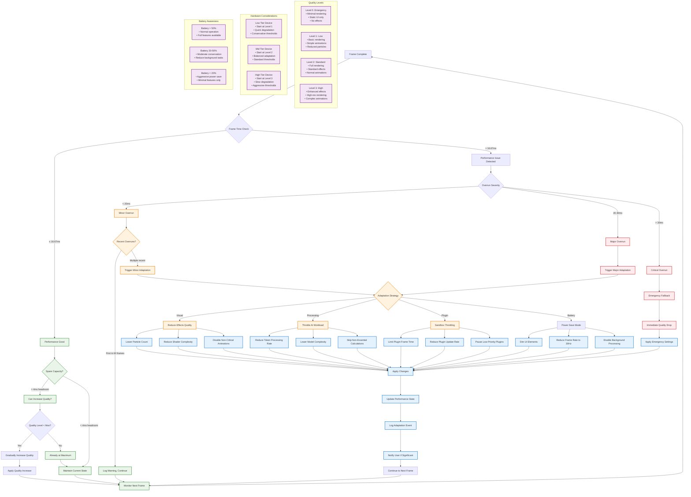

# WF-UX-006 Adaptive Optimization Flow

## Dynamic Performance Adjustment Decision Tree

## Optimization Flow Components

### **Performance Detection**
- **Frame Time Monitoring**: Continuous measurement of execution time
- **Severity Classification**: Minor/Major/Critical overrun categories
- **Pattern Recognition**: Detection of sustained performance issues
- **Threshold-Based Triggers**: Configurable performance boundaries

### **Adaptation Strategies**
- **Visual Quality Scaling**: Effects, particles, shader complexity
- **Processing Throttling**: AI workload, token rate, model complexity
- **Plugin Management**: Resource limits, update rate control
- **Power Conservation**: Battery-aware feature reduction

### **Quality Level Management**
- **Graduated Levels**: 0 (Emergency) to 3 (High) quality tiers
- **Smooth Transitions**: Gradual quality changes to avoid jarring UX
- **Hardware-Aware Defaults**: Appropriate starting points per device tier
- **Recovery Logic**: Automatic quality restoration when performance improves

### **User Communication**
- **Transparent Feedback**: Visual indicators of performance state
- **Significant Change Notifications**: User awareness of major adaptations
- **Energy Truth Principle**: Visual effects reflect computational load
- **Accessibility Considerations**: Screen reader announcements for changes
