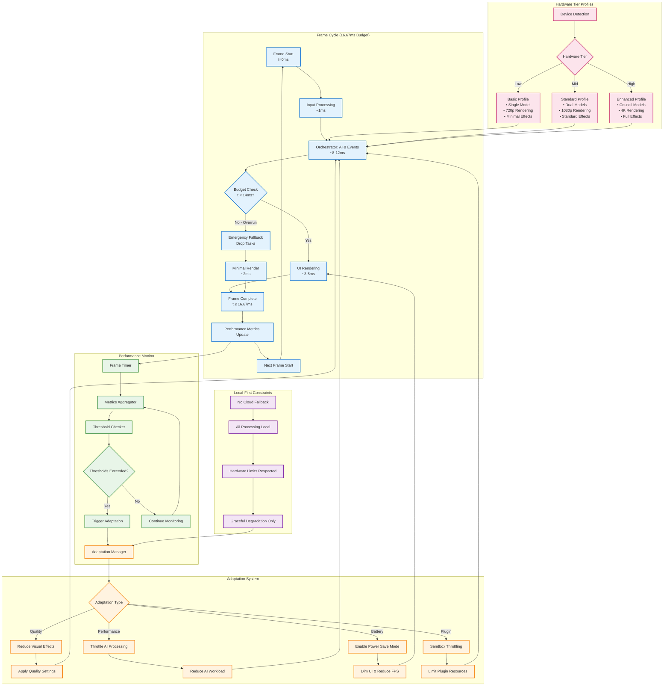

# WF-UX-006 Performance Architecture

## Real-Time Frame Loop and Performance Management

## Architecture Components

### **Frame Loop Management**
- **Fixed 16.67ms Budget**: Strict timing enforcement for 60 FPS
- **Budget Monitoring**: Real-time tracking of frame execution time
- **Emergency Fallback**: Immediate task dropping when budget exceeded
- **Graceful Recovery**: Automatic quality restoration when performance improves

### **Performance Monitoring System**
- **Frame Timer**: High-precision timing measurement
- **Metrics Aggregator**: CPU, GPU, memory, battery tracking
- **Threshold Checker**: Configurable performance limits
- **Adaptive Triggers**: Automatic optimization activation

### **Hardware Tier Adaptation**
- **Device Detection**: Automatic capability assessment
- **Profile Selection**: Low/Mid/High tier configurations
- **Feature Scaling**: Appropriate complexity for each tier
- **Dynamic Adjustment**: Runtime tier switching if needed

### **Local-First Enforcement**
- **No Cloud Dependencies**: All processing remains on-device
- **Hardware Respect**: Never exceed device capabilities
- **Transparent Degradation**: User-visible quality adjustments
- **Energy Truth**: Visual feedback reflects computational load

## Integration Points

### **Layer 3 (Orchestrator) Integration**
- Frame timing coordination with DECIPHER engine
- AI workload throttling based on performance metrics
- Energy state synchronization for visual feedback

### **Layer 5 (UI) Integration**
- Real-time rendering adaptation
- Visual effect quality scaling
- User feedback for performance state changes

### **Plugin System Integration**
- Sandbox resource monitoring
- Plugin throttling and quality reduction
- Isolation to prevent performance impact on core system
