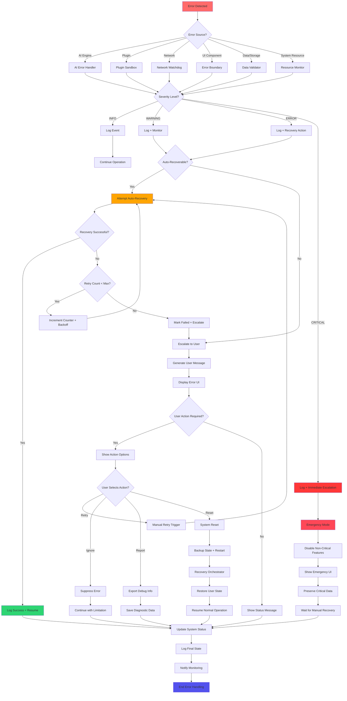

# WF-UX-007 Error Propagation Flow Diagram

## Overview
End-to-end flowchart showing how an error progresses from detection in a subsystem (AI model failure, plugin crash) to UI notification and logging. Illustrates decision points like "auto-retry or escalate to user?" and the interplay between orchestrator and UI during an error event.

## Mermaid Diagram

## Error Flow States

### Detection Phase
- **Error Sources**: AI Engine, Plugin Sandbox, Network, UI Components, Data/Storage, System Resources
- **Initial Classification**: Automatic categorization by source and type
- **Severity Assessment**: INFO, WARNING, ERROR, CRITICAL levels

### Processing Phase
- **Auto-Recovery Assessment**: Determines if error can be handled automatically
- **Retry Logic**: Exponential backoff with maximum retry limits
- **Escalation Triggers**: Failed auto-recovery or critical severity

### User Communication Phase
- **Message Generation**: User-friendly error descriptions
- **UI Presentation**: Context-appropriate error display
- **Action Options**: Retry, Ignore, Report, Reset based on error type

### Resolution Phase
- **Recovery Actions**: Automatic or manual recovery procedures
- **State Preservation**: Backup and restore user progress
- **System Status Update**: Final state logging and monitoring notification

## Integration Points

- **Recovery Manager**: Coordinates all recovery actions
- **Error Boundary**: Catches UI component failures
- **Network Watchdog**: Monitors connectivity issues
- **Backup Utility**: Preserves user state during recovery
- **Logging System**: Records all error events and outcomes

## Error Categories

1. **Transient Errors**: Network timeouts, temporary resource unavailability
2. **Component Failures**: Plugin crashes, AI model errors
3. **Data Corruption**: Invalid state files, checksum mismatches
4. **Resource Exhaustion**: Memory limits, storage full
5. **User Input Errors**: Invalid commands, malformed data
6. **System Failures**: Critical service unavailability

This flow ensures no error goes unhandled and maintains user trust through transparent communication and reliable recovery mechanisms.
