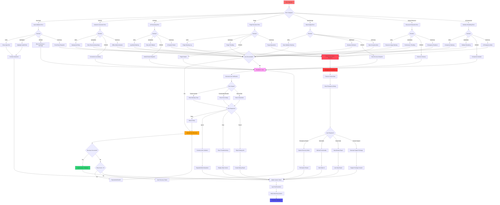

# WF-UX-007 Escalation Decision Tree Diagram

## Overview
A decision tree diagram outlining how the system decides the severity of an error and the corresponding response. Branches through questions like "Is the error recoverable without user input? If yes, attempt auto-recovery x3. If no, notify user immediately."

## Mermaid Diagram

## Decision Criteria

### Severity Assessment Matrix

| Category | INFO | WARNING | ERROR | CRITICAL |
|----------|------|---------|-------|----------|
| **User Input** | Hint shown | Field highlighted | Submission blocked | Form reset |
| **Network** | Background retry | Status indicator | Connection dialog | Offline mode |
| **AI Model** | Warning logged | Fallback retry | Model restart | System failure |
| **Plugin** | Warning logged | Throttling applied | Plugin restart | Quarantine mode |
| **Data/Storage** | Validation warning | Backup check | Recovery needed | Corruption alert |
| **System Resource** | Usage warning | Throttling | Cleanup required | Emergency shutdown |
| **UI Component** | Component warning | Fallback render | Isolation | Emergency UI |

### Auto-Recovery Eligibility

**Eligible for Auto-Recovery:**
- Network timeouts and transient failures
- Temporary resource constraints
- Plugin minor errors
- AI model temporary unavailability
- Non-critical UI component failures

**Requires User Escalation:**
- Data corruption or integrity issues
- Critical system resource exhaustion
- Authentication/authorization failures
- User input validation errors
- Persistent service failures

### Recovery Attempt Limits

1. **Maximum Auto-Retries**: 3 attempts
2. **Backoff Strategy**: Exponential (1s, 2s, 4s)
3. **Timeout Thresholds**: 
   - Network: 30 seconds
   - AI Model: 60 seconds
   - Plugin: 15 seconds
   - Data Operations: 45 seconds

### User Notification Levels

**Toast Notifications** (Non-blocking):
- Feature limitations
- Background recovery attempts
- Status updates
- Minor warnings

**Modal Dialogs** (Blocking):
- Functionality completely blocked
- User action required
- Recovery options available
- Data integrity concerns

**Critical Alerts** (Urgent):
- Data loss risk
- Security concerns
- System instability
- Emergency procedures needed

### Emergency Procedures

**Triggered When:**
- Multiple critical failures
- Data corruption detected
- System resources critically low
- Security breach suspected
- Core services unresponsive

**Emergency Actions:**
1. Immediate data preservation
2. Non-essential service shutdown
3. User notification with clear options
4. Diagnostic data collection
5. Safe mode preparation

### Resolution Tracking

**Success Metrics:**
- Recovery time under thresholds
- No data loss during recovery
- User satisfaction with communication
- System stability post-recovery

**Failure Indicators:**
- Multiple escalation cycles
- User abandonment of recovery
- Data integrity compromised
- System performance degraded

This decision tree ensures consistent, predictable error handling while maintaining user trust through transparent communication and reliable recovery procedures.
