# WF-UX-007 Recovery Sequence Diagram

## Overview
A sequence diagram mapping out the timeline of recovery actions for a sample scenario (WebSocket disconnection). Highlights the system's automatic actions (retry attempts, state preservation) and where in the timeline the user is brought in (after 3 failed retries, show error dialog).

## Mermaid Diagram

```mermaid
sequenceDiagram
    participant U as User
    participant UI as UI Component
    participant NW as Network Watchdog
    participant RM as Recovery Manager
    participant BU as Backup Utility
    participant WS as WebSocket Service
    participant LOG as Logging System

    Note over U,LOG: Normal Operation Phase
    U->>UI: Interact with application
    UI->>WS: Send request via WebSocket
    WS-->>UI: Response received
    UI->>U: Display result

    Note over U,LOG: Connection Failure Detection
    UI->>WS: Send request via WebSocket
    WS--xUI: Connection lost (timeout)
    UI->>NW: Report connection failure
    NW->>LOG: Log connection loss event
    
    Note over U,LOG: Automatic Recovery Phase 1
    NW->>NW: Start retry timer (2s)
    NW->>UI: Update status: "Reconnecting..."
    UI->>U: Show subtle reconnection indicator
    
    Note over NW: Retry Attempt 1
    NW->>WS: Attempt reconnection
    WS--xNW: Connection failed
    NW->>LOG: Log retry attempt 1 failed
    NW->>NW: Exponential backoff (4s)
    
    Note over NW: Retry Attempt 2
    NW->>WS: Attempt reconnection
    WS--xNW: Connection failed
    NW->>LOG: Log retry attempt 2 failed
    NW->>NW: Exponential backoff (8s)
    
    Note over NW: Retry Attempt 3
    NW->>WS: Attempt reconnection
    WS--xNW: Connection failed
    NW->>LOG: Log retry attempt 3 failed
    NW->>RM: Escalate: Max retries exceeded
    
    Note over U,LOG: User Notification Phase
    RM->>BU: Preserve current session state
    BU->>BU: Create state snapshot
    BU->>LOG: Log state preservation
    RM->>UI: Display connection error dialog
    UI->>U: Show error: "Connection lost. Retry?"
    
    Note over U,LOG: User Decision Point
    alt User chooses Retry
        U->>UI: Click "Retry" button
        UI->>RM: Manual retry requested
        RM->>NW: Reset retry counter
        RM->>LOG: Log manual retry initiated
        
        Note over NW: Manual Retry Sequence
        NW->>WS: Attempt reconnection
        alt Connection Successful
            WS->>NW: Connection established
            NW->>RM: Report success
            RM->>BU: Restore session state
            BU->>UI: Load preserved state
            RM->>UI: Clear error dialog
            UI->>U: Resume normal operation
            RM->>LOG: Log successful recovery
        else Connection Still Failed
            WS--xNW: Connection failed
            NW->>RM: Manual retry failed
            RM->>UI: Update error: "Still unable to connect"
            UI->>U: Show advanced options
        end
        
    else User chooses Work Offline
        U->>UI: Click "Work Offline"
        UI->>RM: Enable offline mode
        RM->>UI: Switch to offline UI mode
        RM->>LOG: Log offline mode activation
        UI->>U: Show offline indicator
        
    else User chooses Restart Service
        U->>UI: Click "Restart Service"
        UI->>RM: Service restart requested
        RM->>BU: Full state backup
        BU->>LOG: Log full backup created
        RM->>WS: Restart WebSocket service
        WS->>RM: Service restarted
        RM->>NW: Reset all counters
        NW->>WS: Test connection
        WS->>NW: Connection established
        NW->>RM: Connection restored
        RM->>BU: Restore full state
        BU->>UI: Load complete session
        RM->>UI: Clear all error states
        UI->>U: Resume with full functionality
        RM->>LOG: Log complete recovery
        
    else User dismisses error
        U->>UI: Close error dialog
        UI->>RM: Error dismissed
        RM->>UI: Continue in degraded mode
        UI->>U: Show limited functionality warning
        RM->>LOG: Log degraded mode operation
    end

    Note over U,LOG: Background Monitoring
    loop Every 30 seconds
        NW->>WS: Health check ping
        alt Service Healthy
            WS->>NW: Pong response
            NW->>LOG: Log health check success
        else Service Unhealthy
            WS--xNW: No response
            NW->>RM: Health check failed
            RM->>UI: Update connection status
        end
    end

    Note over U,LOG: Automatic Recovery Success
    rect rgb(200, 255, 200)
        Note over NW,WS: Service Self-Recovery
        WS->>NW: Connection restored
        NW->>RM: Auto-recovery detected
        RM->>UI: Clear offline indicators
        RM->>BU: Sync any offline changes
        BU->>WS: Upload pending data
        RM->>UI: Show "Connection restored" toast
        UI->>U: Brief success notification
        RM->>LOG: Log automatic recovery success
    end

    Note over U,LOG: Error State Cleanup
    RM->>RM: Reset all error counters
    RM->>NW: Clear failure history
    RM->>UI: Return to normal status
    RM->>LOG: Log session recovery complete
```

## Timeline Breakdown

### Phase 1: Detection (0-2 seconds)
- Connection failure detected immediately
- Network Watchdog notified
- Initial logging event recorded
- User sees subtle "reconnecting" indicator

### Phase 2: Auto-Recovery (2-14 seconds)
- **Retry 1**: 2 seconds after failure
- **Retry 2**: 6 seconds after failure (4s backoff)
- **Retry 3**: 14 seconds after failure (8s backoff)
- Each failure logged with increasing severity

### Phase 3: User Escalation (15+ seconds)
- State preservation triggered before user notification
- Error dialog presented with clear options
- User maintains control over recovery approach

### Phase 4: Recovery Execution (Variable)
- **Manual Retry**: 1-3 seconds for connection attempt
- **Offline Mode**: Immediate switch with feature limitations
- **Service Restart**: 5-10 seconds for full recovery
- **Dismissal**: Continue with degraded functionality

### Phase 5: Monitoring (Ongoing)
- Health checks every 30 seconds
- Automatic detection of service recovery
- Background sync of offline changes
- Status updates to user interface

## Recovery Strategies

### Automatic Recovery
- **Exponential Backoff**: 2s, 4s, 8s intervals
- **Maximum Retries**: 3 attempts before escalation
- **State Preservation**: Automatic before user notification
- **Background Monitoring**: Continuous health checks

### User-Directed Recovery
- **Manual Retry**: Reset counters, immediate attempt
- **Offline Mode**: Feature-limited but functional
- **Service Restart**: Full system recovery
- **Graceful Degradation**: Continue with limitations

### Success Indicators
- **Connection Restored**: Full functionality resumed
- **State Recovered**: No data loss during outage
- **User Notified**: Clear communication of status changes
- **Logging Complete**: Full audit trail maintained

This sequence ensures users are never left wondering about connection status and always have clear options for recovery.
