# WF-UX-008 Social Architecture Diagram

## Social Features & Community Integration Architecture

```mermaid
graph TB
    subgraph LocalDevice["User's Local Device"]
        subgraph CoreApp["WIRTHFORGE Core App"]
            UI[User Interface]
            GameSys[Gamification System<br/>WF-UX-002]
            AchieveSys[Achievement System]
            ProgressSys[Progress Tracking]
        end
        
        subgraph SocialLayer["Optional Social Layer"]
            SocialMgr[Social Manager]
            PrivacyCtrl[Privacy Controller]
            ShareMgr[Share Manager]
            ConsentMgr[Consent Manager]
            LocalSocial[(Local Social Data)]
        end
        
        subgraph CommunityFeatures["Community Features"]
            MentorSys[Mentorship System]
            ChallengeSys[Challenge System]
            ContentSys[User Content System]
            ModerationSys[Local Moderation]
        end
    end
    
    subgraph NetworkLayer["Network Layer (Optional)"]
        subgraph CommunityServer["WIRTHFORGE Community Server"]
            CommAPI[Community API]
            FeedSvc[Community Feed Service]
            ChallengeSvc[Challenge Service]
            MentorSvc[Mentorship Service]
            LeaderboardSvc[Leaderboard Service]
            ModerationSvc[Community Moderation]
            CommDB[(Community Database<br/>Anonymized Data)]
        end
        
        subgraph ExternalPlatforms["External Platforms"]
            Discord[Discord Integration]
            Twitch[Twitch Streaming]
            Reddit[Reddit Sharing]
            Twitter[Twitter/X Sharing]
        end
    end
    
    subgraph PrivacyLayer["Privacy & Security Layer"]
        Encryption[End-to-End Encryption]
        Anonymization[Data Anonymization]
        ConsentFlow[Consent Workflows]
        DataSanitization[Data Sanitization]
        LocalValidation[Local Validation]
    end
    
    %% Core App Connections
    UI --> GameSys
    GameSys --> AchieveSys
    GameSys --> ProgressSys
    
    %% Social Layer Connections
    AchieveSys -.->|Optional| SocialMgr
    ProgressSys -.->|Optional| SocialMgr
    SocialMgr --> PrivacyCtrl
    SocialMgr --> ShareMgr
    SocialMgr --> ConsentMgr
    SocialMgr --> LocalSocial
    
    %% Community Features
    SocialMgr --> MentorSys
    SocialMgr --> ChallengeSys
    SocialMgr --> ContentSys
    SocialMgr --> ModerationSys
    
    %% Privacy Layer Integration
    ShareMgr --> PrivacyLayer
    ConsentMgr --> PrivacyLayer
    
    %% Network Connections (All Optional)
    ShareMgr -.->|User Consent| CommAPI
    ChallengeSys -.->|User Consent| ChallengeSvc
    MentorSys -.->|User Consent| MentorSvc
    ContentSys -.->|User Consent| FeedSvc
    
    %% External Platform Connections
    ShareMgr -.->|User Consent| Discord
    ShareMgr -.->|User Consent| Twitch
    ShareMgr -.->|User Consent| Reddit
    ShareMgr -.->|User Consent| Twitter
    
    %% Community Server Internal
    CommAPI --> FeedSvc
    CommAPI --> ChallengeSvc
    CommAPI --> MentorSvc
    CommAPI --> LeaderboardSvc
    CommAPI --> ModerationSvc
    FeedSvc --> CommDB
    ChallengeSvc --> CommDB
    MentorSvc --> CommDB
    LeaderboardSvc --> CommDB
    
    %% Privacy Enforcement
    PrivacyLayer --> Encryption
    PrivacyLayer --> Anonymization
    PrivacyLayer --> ConsentFlow
    PrivacyLayer --> DataSanitization
    PrivacyLayer --> LocalValidation
    
    %% Styling
    classDef localCore fill:#e1f5fe,stroke:#01579b,stroke-width:2px
    classDef socialLayer fill:#f3e5f5,stroke:#4a148c,stroke-width:2px
    classDef networkLayer fill:#fff3e0,stroke:#e65100,stroke-width:2px
    classDef privacyLayer fill:#e8f5e8,stroke:#1b5e20,stroke-width:2px
    classDef optional stroke-dasharray: 5 5
    
    class LocalDevice,CoreApp,GameSys,AchieveSys,ProgressSys localCore
    class SocialLayer,SocialMgr,PrivacyCtrl,ShareMgr,ConsentMgr,LocalSocial,CommunityFeatures,MentorSys,ChallengeSys,ContentSys,ModerationSys socialLayer
    class NetworkLayer,CommunityServer,CommAPI,FeedSvc,ChallengeSvc,MentorSvc,LeaderboardSvc,ModerationSvc,CommDB,ExternalPlatforms,Discord,Twitch,Reddit,Twitter networkLayer
    class PrivacyLayer,Encryption,Anonymization,ConsentFlow,DataSanitization,LocalValidation privacyLayer
```

## Architecture Overview

This diagram illustrates the comprehensive social architecture for WF-UX-008, showing how social features integrate with WIRTHFORGE's local-first principles:

### **Local Device (Core)**
- **WIRTHFORGE Core App**: The foundation including UI, gamification system, achievements, and progress tracking
- **Optional Social Layer**: Privacy-first social components that enhance but don't replace core functionality
- **Community Features**: Local implementations of mentorship, challenges, content creation, and moderation

### **Network Layer (Optional)**
- **Community Server**: Optional centralized services for community coordination
- **External Platforms**: Integration with Discord, Twitch, Reddit, and Twitter for broader community engagement
- All network interactions require explicit user consent and maintain anonymization

### **Privacy & Security Layer**
- **End-to-End Encryption**: Secure communication channels
- **Data Anonymization**: Strip personal identifiers before any data sharing
- **Consent Workflows**: Explicit user permission for all data sharing
- **Data Sanitization**: Local filtering of sensitive information
- **Local Validation**: Client-side verification of shared data

### **Key Design Principles**

1. **Local-First**: All social features work offline and store data locally first
2. **Opt-In Everything**: Social features are optional overlays that enhance core functionality
3. **Privacy by Design**: Multiple layers of privacy protection with user control
4. **Consent-Driven**: Explicit user permission required for any data sharing
5. **Anonymization**: Personal data is stripped before network transmission
6. **Graceful Degradation**: Full functionality available without network connectivity

### **Data Flow Patterns**

- **Achievements**: Generated locally → Optional sharing with consent → Anonymized transmission
- **Challenges**: Local participation → Optional score submission → Community leaderboards
- **Mentorship**: Local matching → Encrypted communication → Privacy-controlled data sharing
- **Content**: Local creation → User-controlled sharing → Community feed integration

This architecture ensures that WIRTHFORGE's social features enhance user engagement while maintaining the platform's commitment to user privacy, data ownership, and local-first operation.
