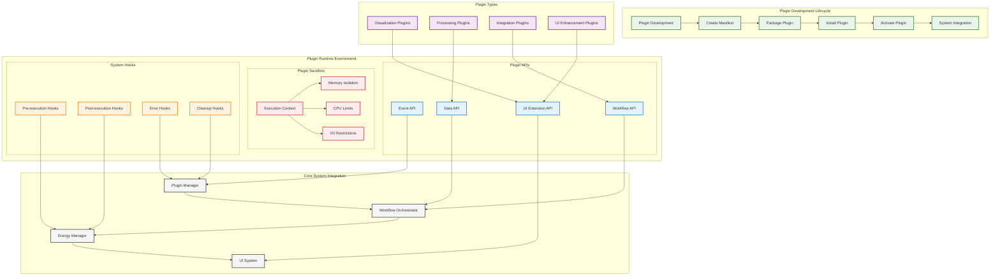
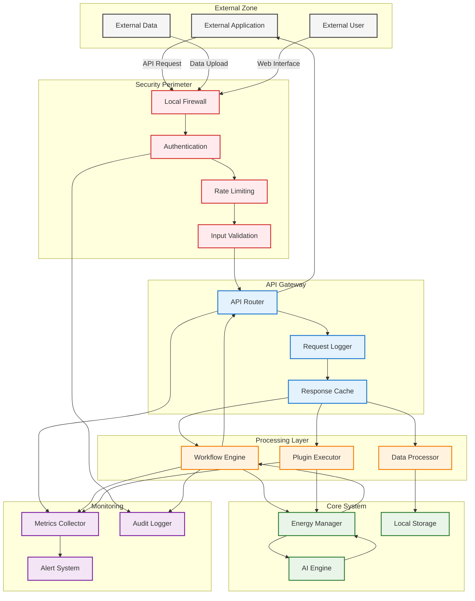

# WF-UX-009 Integration Points Architecture

## External Integration Architecture
This diagram shows all integration points where WIRTHFORGE connects with external tools and systems while maintaining local-first principles.

```mermaid
graph TB
    subgraph "WIRTHFORGE Core System"
        subgraph "Layer 5: Advanced UI"
            PUI[Power User Interface]
            API_UI[API Console]
            PLG_UI[Plugin Manager UI]
        end
        
        subgraph "Layer 4: Integration Layer"
            API[Local API Server]
            PLG_MGR[Plugin Manager]
            SDK_SRV[SDK Service]
            CLI_SRV[CLI Handler]
        end
        
        subgraph "Layer 3: Core Services"
            WO[Workflow Orchestrator]
            EM[Energy Manager]
            FS[File System]
            AUTH[Local Auth]
        end
        
        subgraph "Security Boundary"
            SANDBOX[Plugin Sandbox]
            VALIDATOR[Input Validator]
            LIMITER[Resource Limiter]
        end
    end
    
    subgraph "External Development Tools"
        IDE[IDE/Editor]
        JUPYTER[Jupyter Notebook]
        VSCODE[VS Code Extension]
        POSTMAN[API Testing Tools]
    end
    
    subgraph "Custom Applications"
        PYTHON_APP[Python Applications]
        NODE_APP[Node.js Applications]
        DESKTOP_APP[Desktop Applications]
        WEB_APP[Web Applications]
    end
    
    subgraph "Data Analysis Tools"
        PANDAS[Pandas/NumPy]
        R_LANG[R Scripts]
        MATLAB[MATLAB]
        EXCEL[Excel/Sheets]
    end
    
    subgraph "Custom Plugins"
        VIZ_PLG[Visualization Plugins]
        DATA_PLG[Data Processing Plugins]
        AI_PLG[AI Enhancement Plugins]
        UTIL_PLG[Utility Plugins]
    end
    
    subgraph "File Formats"
        JSON_F[JSON Files]
        CSV_F[CSV Files]
        XML_F[XML Files]
        YAML_F[YAML Files]
    end
    
    %% API Connections
    API -->|HTTP/REST| IDE
    API -->|HTTP/REST| JUPYTER
    API -->|HTTP/REST| POSTMAN
    API -->|WebSocket| PYTHON_APP
    API -->|HTTP/REST| NODE_APP
    API -->|Local TCP| DESKTOP_APP
    API -->|HTTP/REST| WEB_APP
    
    %% SDK Connections
    SDK_SRV -->|Python SDK| PANDAS
    SDK_SRV -->|R Package| R_LANG
    SDK_SRV -->|CLI Tools| MATLAB
    
    %% Plugin Connections
    PLG_MGR -->|Plugin API| VIZ_PLG
    PLG_MGR -->|Plugin API| DATA_PLG
    PLG_MGR -->|Plugin API| AI_PLG
    PLG_MGR -->|Plugin API| UTIL_PLG
    
    %% File System Connections
    FS -->|Import/Export| JSON_F
    FS -->|Import/Export| CSV_F
    FS -->|Import/Export| XML_F
    FS -->|Import/Export| YAML_F
    
    %% Internal Connections
    API --> WO
    PLG_MGR --> WO
    SDK_SRV --> WO
    CLI_SRV --> WO
    WO --> EM
    
    %% Security Connections
    API --> VALIDATOR
    PLG_MGR --> SANDBOX
    SANDBOX --> LIMITER
    VALIDATOR --> AUTH
    
    %% UI Connections
    PUI --> API
    API_UI --> API
    PLG_UI --> PLG_MGR
    
    %% Trust Boundaries
    VALIDATOR -.->|Validates| API
    SANDBOX -.->|Isolates| PLG_MGR
    LIMITER -.->|Constrains| WO
    AUTH -.->|Authenticates| API
    
    classDef core fill:#e8f5e8,stroke:#2e7d32,stroke-width:2px
    classDef integration fill:#e3f2fd,stroke:#1976d2,stroke-width:2px
    classDef security fill:#ffebee,stroke:#d32f2f,stroke-width:2px
    classDef external fill:#f5f5f5,stroke:#424242,stroke-width:2px
    classDef plugins fill:#fff3e0,stroke:#f57c00,stroke-width:2px
    classDef files fill:#f3e5f5,stroke:#7b1fa2,stroke-width:2px
    
    class WO,EM,FS core
    class API,PLG_MGR,SDK_SRV,CLI_SRV,PUI,API_UI,PLG_UI integration
    class SANDBOX,VALIDATOR,LIMITER,AUTH security
    class IDE,JUPYTER,VSCODE,POSTMAN,PYTHON_APP,NODE_APP,DESKTOP_APP,WEB_APP,PANDAS,R_LANG,MATLAB,EXCEL external
    class VIZ_PLG,DATA_PLG,AI_PLG,UTIL_PLG plugins
    class JSON_F,CSV_F,XML_F,YAML_F files
```



## Local API Integration Points
This diagram details the specific API endpoints and communication patterns.

```mermaid
graph LR
    subgraph "Local API Server (localhost:8080)"
        subgraph "REST Endpoints"
            GET_STATUS[GET /api/status]
            POST_WORKFLOW[POST /api/workflows]
            GET_WORKFLOWS[GET /api/workflows]
            PUT_WORKFLOW[PUT /api/workflows/:id]
            DELETE_WORKFLOW[DELETE /api/workflows/:id]
            POST_EXECUTE[POST /api/execute]
            GET_ENERGY[GET /api/energy]
            GET_LOGS[GET /api/logs]
        end
        
        subgraph "WebSocket Endpoints"
            WS_EVENTS[/ws/events]
            WS_ENERGY[/ws/energy]
            WS_LOGS[/ws/logs]
            WS_CONTROL[/ws/control]
        end
        
        subgraph "Plugin Endpoints"
            POST_PLUGIN[POST /api/plugins]
            GET_PLUGINS[GET /api/plugins]
            PUT_PLUGIN[PUT /api/plugins/:id]
            DELETE_PLUGIN[DELETE /api/plugins/:id]
        end
    end
    
    subgraph "External Clients"
        PYTHON[Python Client]
        NODE[Node.js Client]
        CURL[cURL/HTTP Client]
        BROWSER[Browser App]
    end
    
    subgraph "Authentication"
        TOKEN[API Token]
        CORS[CORS Policy]
        RATE[Rate Limiting]
    end
    
    %% REST API Usage
    PYTHON -->|HTTP GET| GET_STATUS
    PYTHON -->|HTTP POST| POST_WORKFLOW
    PYTHON -->|HTTP GET| GET_ENERGY
    
    NODE -->|HTTP POST| POST_EXECUTE
    NODE -->|HTTP GET| GET_WORKFLOWS
    NODE -->|HTTP PUT| PUT_WORKFLOW
    
    CURL -->|HTTP GET| GET_LOGS
    CURL -->|HTTP POST| POST_PLUGIN
    
    %% WebSocket Usage
    BROWSER -->|WebSocket| WS_EVENTS
    PYTHON -->|WebSocket| WS_ENERGY
    NODE -->|WebSocket| WS_CONTROL
    
    %% Security
    TOKEN -.->|Validates| GET_STATUS
    CORS -.->|Restricts| BROWSER
    RATE -.->|Limits| PYTHON
    
    classDef endpoint fill:#e3f2fd,stroke:#1976d2,stroke-width:2px
    classDef websocket fill:#e8f5e8,stroke:#2e7d32,stroke-width:2px
    classDef plugin fill:#fff3e0,stroke:#f57c00,stroke-width:2px
    classDef client fill:#f5f5f5,stroke:#424242,stroke-width:2px
    classDef security fill:#ffebee,stroke:#d32f2f,stroke-width:2px
    
    class GET_STATUS,POST_WORKFLOW,GET_WORKFLOWS,PUT_WORKFLOW,DELETE_WORKFLOW,POST_EXECUTE,GET_ENERGY,GET_LOGS endpoint
    class WS_EVENTS,WS_ENERGY,WS_LOGS,WS_CONTROL websocket
    class POST_PLUGIN,GET_PLUGINS,PUT_PLUGIN,DELETE_PLUGIN plugin
    class PYTHON,NODE,CURL,BROWSER client
    class TOKEN,CORS,RATE security
```

## Plugin Architecture Integration
This shows how custom plugins integrate with the core system.



## Data Flow and Security Boundaries
This diagram shows how data flows between external systems and WIRTHFORGE with security controls.



## Key Integration Principles

### **Local-First Architecture**
- All integrations operate on localhost (127.0.0.1)
- No external network dependencies for core functionality
- Data remains on user's device throughout process
- External tools connect via local APIs only

### **Security Boundaries**
- Plugin sandbox isolates third-party code
- API authentication prevents unauthorized access
- Input validation protects against malicious data
- Resource limits prevent system impact

### **Performance Compliance**
- All integrations respect 60Hz frame budget
- Background processing for heavy operations
- Real-time energy monitoring and feedback
- Graceful degradation under load

### **Developer Experience**
- Comprehensive SDK for multiple languages
- Clear API documentation and examples
- Plugin development tools and templates
- Local testing and debugging support

### **Data Formats**
- Standard JSON for API communication
- CSV/XML support for data exchange
- Plugin manifest for extension metadata
- Workflow definitions for automation

This integration architecture ensures that WIRTHFORGE can connect with external tools and custom plugins while maintaining its core principles of local-first operation, energy-truth visualization, and 60Hz performance.
