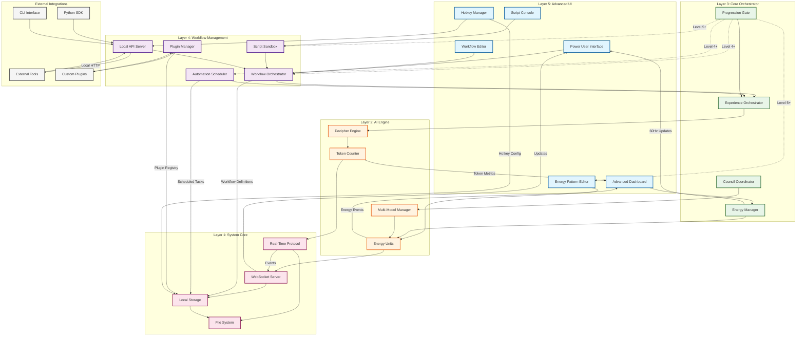

# WF-UX-009 Advanced Workflow Architecture

## System Overview
This diagram illustrates the complete architecture for advanced user workflows in WIRTHFORGE, showing how power-user features integrate with the core system while maintaining local-first principles and 60Hz performance.

## Key Architecture Principles

### 1. **Local-First Design**
- All processing occurs on user's device
- No cloud dependencies for core functionality
- External integrations use localhost APIs only
- Data remains under user control

### 2. **Progressive Disclosure**
- Level 4+ unlocks workflow orchestration
- Level 5+ enables scripting and custom patterns
- Progression gates prevent feature overload
- Expert mode toggles advanced interfaces

### 3. **Performance Boundaries**
- 60Hz update cycle maintained across all layers
- Script sandbox enforces execution limits
- Plugin manager monitors resource usage
- Energy manager provides real-time feedback

### 4. **Extensibility Points**
- Plugin system for custom functionality
- Local API for external tool integration
- Script sandbox for user automation
- Workflow definitions for reusable processes

### 5. **Security Isolation**
- Sandboxed execution for user scripts
- Plugin permission system
- API authentication for external access
- Resource limits prevent system impact

## Component Responsibilities

### **Power User Interface (Layer 5)**
- **Advanced Dashboard**: Multi-panel layout with customizable widgets
- **Energy Pattern Editor**: Visual editor for custom energy visualizations
- **Workflow Editor**: Drag-and-drop workflow creation interface
- **Script Console**: Interactive Python environment for automation
- **Hotkey Manager**: Custom keyboard shortcut configuration

### **Workflow Management (Layer 4)**
- **Workflow Orchestrator**: Executes multi-step user-defined processes
- **Automation Scheduler**: Time-based and event-driven task execution
- **Plugin Manager**: Loads, validates, and manages custom plugins
- **Script Sandbox**: Secure execution environment for user code
- **Local API Server**: HTTP/WebSocket endpoints for external integration

### **Core Integration Points**
- **Experience Orchestrator**: Central coordination with existing system
- **Energy Manager**: Real-time energy metrics and visualization
- **Progression Gate**: Level-based feature access control
- **Council Coordinator**: Multi-model orchestration support

## Data Flow Patterns

### **Workflow Execution Flow**
1. User creates workflow in Workflow Editor
2. Workflow Orchestrator validates and queues steps
3. Experience Orchestrator coordinates with AI engine
4. Energy events flow back through real-time protocol
5. Dashboard updates with progress and metrics

### **Automation Trigger Flow**
1. Automation Scheduler monitors for trigger conditions
2. Scheduled task activates workflow execution
3. Script Sandbox executes user-defined automation
4. Results propagate through energy management system
5. UI updates reflect automation outcomes

### **Plugin Integration Flow**
1. Plugin Manager loads and validates plugin manifest
2. Plugin registers for specific system events
3. Sandbox enforces resource and permission limits
4. Plugin receives events and executes functionality
5. Results integrate through standard API channels

## Performance Considerations

### **60Hz Compliance**
- UI updates prioritized in main thread
- Heavy computations moved to background workers
- Plugin execution time-sliced across frames
- Energy visualizations maintain smooth animation

### **Resource Management**
- Memory limits for script execution
- CPU time budgets for plugin operations
- Network throttling for external API calls
- Disk I/O queuing for batch operations

### **Scalability Boundaries**
- Maximum concurrent workflows: 10
- Plugin execution timeout: 5 seconds
- Script memory limit: 100MB
- API request rate limit: 1000/minute

This architecture ensures that advanced workflows enhance power-user capabilities while preserving WIRTHFORGE's core principles of local-first operation, energy-truth visualization, and 60Hz responsiveness.
