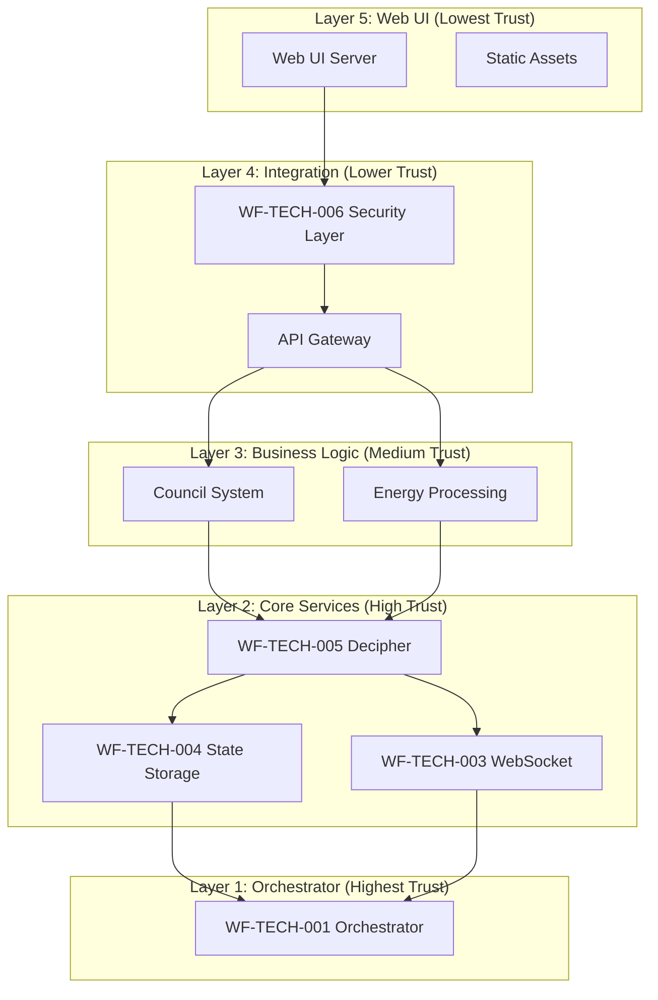

# WF-TECH-006 Security Integration Guide
## WIRTHFORGE Security & Privacy Implementation

**Document ID**: WF-TECH-006-INTEGRATION-GUIDE  
**Version**: 1.0.0  
**Date**: 2024-01-15  
**Status**: Production Ready

---

## Overview

This guide provides step-by-step instructions for integrating WF-TECH-006 Security & Privacy components into the WIRTHFORGE ecosystem. It covers integration with existing technical specifications, deployment procedures, and ongoing maintenance requirements.

## Architecture Integration

### WIRTHFORGE Layer Integration



## Integration with Existing Components

### 1. WF-TECH-001 Orchestrator Integration

#### Security Policy Enforcement
```python
# orchestrator_security.py
from WF_TECH_006_network_security import NetworkSecurityManager
from WF_TECH_006_auth_middleware import AuthenticationMiddleware

class SecureOrchestrator:
    def __init__(self):
        self.security_manager = NetworkSecurityManager()
        self.auth_middleware = AuthenticationMiddleware()
        
    async def initialize_secure_services(self):
        # Validate network security before starting services
        if not self.security_manager.validate_bind_address("127.0.0.1", 8145):
            raise SecurityError("Invalid network configuration")
        
        # Setup secure server configuration
        server_config = self.security_manager.setup_secure_server()
        
        # Initialize authentication for service-to-service communication
        await self.auth_middleware.initialize()
        
        return server_config
```

#### Service Registration with Security Context
```python
class ServiceRegistry:
    def register_service(self, service_name: str, service_instance):
        # Validate service security configuration
        security_status = self.security_manager.get_security_status()
        
        if security_status['security_level'] not in ['SECURE', 'MONITORING']:
            raise SecurityError(f"Cannot register service in {security_status['security_level']} state")
        
        # Register with security context
        self.services[service_name] = {
            'instance': service_instance,
            'security_context': security_status,
            'registered_at': datetime.utcnow()
        }
```

### 2. WF-TECH-003 WebSocket Integration

#### Secure WebSocket Authentication
```python
# websocket_security.py
from fastapi import WebSocket, WebSocketDisconnect
from WF_TECH_006_auth_middleware import AuthenticationMiddleware

class SecureWebSocketManager:
    def __init__(self):
        self.auth_middleware = AuthenticationMiddleware()
        self.active_connections = {}
    
    async def connect(self, websocket: WebSocket, session_token: str):
        # Validate session before WebSocket upgrade
        session = self.auth_middleware.session_manager.validate_session(session_token)
        
        if not session:
            await websocket.close(code=1008, reason="Authentication required")
            return False
        
        await websocket.accept()
        
        # Store authenticated connection
        self.active_connections[websocket] = {
            'session': session,
            'connected_at': datetime.utcnow(),
            'last_activity': datetime.utcnow()
        }
        
        return True
    
    async def send_secure_message(self, websocket: WebSocket, message: dict):
        # Validate session is still active
        connection_info = self.active_connections.get(websocket)
        if not connection_info:
            await websocket.close(code=1008, reason="Session invalid")
            return
        
        session = connection_info['session']
        if not self.auth_middleware.session_manager.validate_session(session.token):
            await websocket.close(code=1008, reason="Session expired")
            del self.active_connections[websocket]
            return
        
        # Update activity timestamp
        connection_info['last_activity'] = datetime.utcnow()
        
        # Send message
        await websocket.send_json(message)
```

### 3. WF-TECH-004 State Storage Integration

#### Encrypted State Storage
```python
# secure_state_storage.py
from WF_TECH_006_auth_middleware import AuthenticationMiddleware
import json
from cryptography.fernet import Fernet

class SecureStateStorage:
    def __init__(self):
        self.auth_middleware = AuthenticationMiddleware()
        self.encryption_key = self._get_or_create_encryption_key()
        self.cipher_suite = Fernet(self.encryption_key)
    
    def _get_or_create_encryption_key(self) -> bytes:
        key_path = Path.home() / ".wirthforge" / "state_encryption.key"
        
        if key_path.exists():
            with open(key_path, 'rb') as f:
                return f.read()
        else:
            key = Fernet.generate_key()
            key_path.parent.mkdir(parents=True, exist_ok=True)
            with open(key_path, 'wb') as f:
                f.write(key)
            key_path.chmod(0o600)  # Restrict permissions
            return key
    
    async def store_state(self, session_token: str, state_key: str, state_data: dict):
        # Validate session
        session = self.auth_middleware.session_manager.validate_session(session_token)
        if not session:
            raise SecurityError("Invalid session")
        
        # Encrypt state data
        serialized_data = json.dumps(state_data).encode()
        encrypted_data = self.cipher_suite.encrypt(serialized_data)
        
        # Store with user context
        storage_key = f"{session.user_id}:{state_key}"
        await self._store_encrypted_data(storage_key, encrypted_data)
        
        # Log access
        self.auth_middleware.audit_logger.log_security_event(
            "DATA_WRITE", session.user_id, {"state_key": state_key}
        )
    
    async def retrieve_state(self, session_token: str, state_key: str) -> dict:
        # Validate session
        session = self.auth_middleware.session_manager.validate_session(session_token)
        if not session:
            raise SecurityError("Invalid session")
        
        # Retrieve encrypted data
        storage_key = f"{session.user_id}:{state_key}"
        encrypted_data = await self._retrieve_encrypted_data(storage_key)
        
        if not encrypted_data:
            return {}
        
        # Decrypt state data
        try:
            decrypted_data = self.cipher_suite.decrypt(encrypted_data)
            state_data = json.loads(decrypted_data.decode())
            
            # Log access
            self.auth_middleware.audit_logger.log_security_event(
                "DATA_READ", session.user_id, {"state_key": state_key}
            )
            
            return state_data
            
        except Exception as e:
            logger.error(f"State decryption failed: {e}")
            raise SecurityError("State decryption failed")
```

### 4. WF-TECH-005 Decipher Integration

#### Secure Token Processing
```python
# secure_decipher.py
from WF_TECH_005_decipher import DecipherLoop, TokenEvent
from WF_TECH_006_sandbox_manager import PluginSandboxManager

class SecureDecipherLoop(DecipherLoop):
    def __init__(self, config=None):
        super().__init__(config)
        self.sandbox_manager = PluginSandboxManager()
        self.authorized_plugins = set()
    
    async def register_plugin_processor(self, plugin_name: str, processor_callback):
        # Validate plugin is loaded and authorized
        if plugin_name not in self.sandbox_manager.list_active_plugins():
            raise SecurityError(f"Plugin {plugin_name} not loaded")
        
        # Check plugin permissions
        status = self.sandbox_manager.get_sandbox_status(plugin_name)
        if not status or status.status != "running":
            raise SecurityError(f"Plugin {plugin_name} not running")
        
        # Register authorized processor
        self.authorized_plugins.add(plugin_name)
        await super().register_processor(processor_callback)
    
    async def process_token_event(self, event: TokenEvent):
        # Process through secure decipher loop
        processed_event = await super().process_token_event(event)
        
        # Notify authorized plugins through sandbox IPC
        for plugin_name in self.authorized_plugins:
            try:
                await self.sandbox_manager.send_event_to_plugin(
                    plugin_name, "token.processed", processed_event
                )
            except Exception as e:
                logger.warning(f"Failed to notify plugin {plugin_name}: {e}")
        
        return processed_event
```

## Plugin Security Integration

### Plugin Manifest Validation
```python
# plugin_security_integration.py
from WF_TECH_006_sandbox_manager import PluginSandboxManager, PluginSecurityValidator

class PluginSecurityIntegration:
    def __init__(self):
        self.sandbox_manager = PluginSandboxManager()
        self.validator = PluginSecurityValidator()
    
    async def validate_and_load_plugin(self, plugin_path: str) -> bool:
        """Comprehensive plugin security validation and loading"""
        
        # Step 1: Manifest validation
        manifest_path = Path(plugin_path) / "manifest.json"
        if not manifest_path.exists():
            logger.error(f"Plugin manifest missing: {manifest_path}")
            return False
        
        with open(manifest_path) as f:
            manifest_data = json.load(f)
        
        # Validate against schema
        errors = self.validator.validate_manifest(manifest_data)
        if errors:
            logger.error(f"Plugin validation failed: {errors}")
            return False
        
        # Step 2: Code security scan
        if not await self._scan_plugin_code(plugin_path):
            logger.error("Plugin code security scan failed")
            return False
        
        # Step 3: Load in sandbox
        if not await self.sandbox_manager.load_plugin(plugin_path):
            logger.error("Plugin sandbox loading failed")
            return False
        
        # Step 4: Start with monitoring
        plugin_name = manifest_data["name"]
        if not await self.sandbox_manager.start_plugin(plugin_name):
            logger.error("Plugin startup failed")
            return False
        
        logger.info(f"Plugin {plugin_name} loaded and started securely")
        return True
    
    async def _scan_plugin_code(self, plugin_path: str) -> bool:
        """Basic security scan of plugin code"""
        dangerous_patterns = [
            r'import\s+subprocess',
            r'import\s+os',
            r'eval\s*\(',
            r'exec\s*\(',
            r'__import__\s*\(',
            r'open\s*\(',
            r'socket\.',
            r'urllib\.',
            r'requests\.'
        ]
        
        import re
        
        for py_file in Path(plugin_path).glob("*.py"):
            with open(py_file, 'r') as f:
                content = f.read()
            
            for pattern in dangerous_patterns:
                if re.search(pattern, content):
                    logger.warning(f"Potentially dangerous code in {py_file}: {pattern}")
                    return False
        
        return True
```

### Plugin Permission Management
```python
class PluginPermissionManager:
    def __init__(self):
        self.granted_permissions = {}
    
    def grant_event_permission(self, plugin_name: str, event_type: str, access_type: str):
        """Grant specific event permission to plugin"""
        if plugin_name not in self.granted_permissions:
            self.granted_permissions[plugin_name] = {"events": {"read": [], "write": []}}
        
        if access_type in ["read", "write"]:
            self.granted_permissions[plugin_name]["events"][access_type].append(event_type)
    
    def check_event_permission(self, plugin_name: str, event_type: str, access_type: str) -> bool:
        """Check if plugin has permission for event access"""
        if plugin_name not in self.granted_permissions:
            return False
        
        events = self.granted_permissions[plugin_name].get("events", {})
        allowed_events = events.get(access_type, [])
        
        return event_type in allowed_events
```

## Web UI Security Integration

### Secure Frontend Authentication
```javascript
// frontend-security.js
class WirthforgeSecurityClient {
    constructor() {
        this.sessionToken = null;
        this.csrfToken = null;
        this.baseUrl = 'https://127.0.0.1:8145';
    }
    
    async authenticate(credentials) {
        try {
            const response = await fetch(`${this.baseUrl}/auth/login`, {
                method: 'POST',
                headers: {
                    'Content-Type': 'application/json',
                },
                body: JSON.stringify(credentials),
                credentials: 'include' // Include HTTP-only cookies
            });
            
            if (response.ok) {
                const data = await response.json();
                this.csrfToken = data.csrf_token;
                return true;
            }
            
            return false;
        } catch (error) {
            console.error('Authentication failed:', error);
            return false;
        }
    }
    
    async makeSecureRequest(endpoint, options = {}) {
        const headers = {
            'Content-Type': 'application/json',
            ...options.headers
        };
        
        // Add CSRF token for state-changing requests
        if (['POST', 'PUT', 'DELETE'].includes(options.method)) {
            headers['X-CSRF-Token'] = this.csrfToken;
        }
        
        try {
            const response = await fetch(`${this.baseUrl}${endpoint}`, {
                ...options,
                headers,
                credentials: 'include'
            });
            
            if (response.status === 401) {
                // Session expired, redirect to login
                window.location.href = '/login';
                return null;
            }
            
            return response;
        } catch (error) {
            console.error('Secure request failed:', error);
            throw error;
        }
    }
    
    async establishSecureWebSocket() {
        return new Promise((resolve, reject) => {
            const ws = new WebSocket(`wss://127.0.0.1:8145/ws`);
            
            ws.onopen = () => {
                // Send authentication message
                ws.send(JSON.stringify({
                    type: 'auth',
                    csrf_token: this.csrfToken
                }));
            };
            
            ws.onmessage = (event) => {
                const data = JSON.parse(event.data);
                
                if (data.type === 'auth_success') {
                    resolve(ws);
                } else if (data.type === 'auth_failed') {
                    reject(new Error('WebSocket authentication failed'));
                }
            };
            
            ws.onerror = (error) => {
                reject(error);
            };
        });
    }
}
```

## Deployment Integration

### Docker-Free Deployment Script
```bash
#!/bin/bash
# deploy-wirthforge-security.sh

set -e

echo "WIRTHFORGE Security Deployment Script"
echo "====================================="

# Check Python version
python_version=$(python3 --version 2>&1 | grep -oP '\d+\.\d+')
if [[ $(echo "$python_version < 3.8" | bc) -eq 1 ]]; then
    echo "Error: Python 3.8+ required, found $python_version"
    exit 1
fi

# Install dependencies
echo "Installing Python dependencies..."
pip3 install -r requirements.txt

# Create directory structure
echo "Creating directory structure..."
mkdir -p ~/.wirthforge/{certs,logs,data,plugins,config}

# Set permissions
chmod 700 ~/.wirthforge
chmod 600 ~/.wirthforge/config/*

# Generate TLS certificates
echo "Generating TLS certificates..."
python3 -c "
from WF_TECH_006_network_security import TLSCertificateManager, NetworkSecurityConfig
config = NetworkSecurityConfig()
cert_manager = TLSCertificateManager(config)
cert_path, key_path = cert_manager.generate_self_signed_cert()
print(f'Certificates generated: {cert_path}, {key_path}')
"

# Configure firewall (if supported)
echo "Configuring firewall..."
python3 -c "
from WF_TECH_006_network_security import FirewallManager, NetworkSecurityConfig
config = NetworkSecurityConfig()
firewall = FirewallManager(config)
for port in config.allowed_ports:
    firewall.add_localhost_only_rule(port)
    print(f'Firewall rule added for port {port}')
"

# Run security validation
echo "Running security validation..."
python3 WF-TECH-006-security-audit.py

# Start services
echo "Starting WIRTHFORGE with security..."
python3 -c "
import asyncio
from main import start_wirthforge_secure
asyncio.run(start_wirthforge_secure())
"

echo "WIRTHFORGE Security deployment complete!"
```

### Production Configuration
```python
# production_config.py
from WF_TECH_006_network_security import NetworkSecurityConfig
from WF_TECH_006_auth_middleware import AuthenticationConfig
from WF_TECH_006_sandbox_manager import PluginSandboxManager

class ProductionSecurityConfig:
    def __init__(self):
        self.network_config = NetworkSecurityConfig(
            allowed_hosts=["127.0.0.1", "localhost"],
            allowed_ports=[8145],
            cert_directory=str(Path.home() / ".wirthforge" / "certs"),
            enable_firewall_rules=True
        )
        
        self.auth_config = AuthenticationConfig(
            session_timeout_minutes=30,  # Shorter for production
            max_sessions_per_user=2,
            rate_limit_max_attempts=3,
            rate_limit_window_minutes=10
        )
        
        self.sandbox_config = {
            "default_memory_limit_mb": 64,
            "default_cpu_limit_percent": 10,
            "default_execution_time_seconds": 120,
            "strict_isolation": True
        }
    
    def apply_production_hardening(self):
        """Apply additional production security hardening"""
        
        # Disable debug modes
        os.environ['PYTHONOPTIMIZE'] = '1'
        os.environ['PYTHONDONTWRITEBYTECODE'] = '1'
        
        # Set restrictive umask
        os.umask(0o077)
        
        # Configure logging for production
        logging.basicConfig(
            level=logging.WARNING,
            format='%(asctime)s - %(name)s - %(levelname)s - %(message)s',
            handlers=[
                logging.FileHandler('/var/log/wirthforge/security.log'),
                logging.StreamHandler()
            ]
        )
```

## Monitoring and Maintenance Integration

### Health Check Integration
```python
# health_check_security.py
from fastapi import APIRouter
from WF_TECH_006_security_audit import SecurityAuditor

router = APIRouter()

@router.get("/health/security")
async def security_health_check():
    """Security-focused health check endpoint"""
    
    auditor = SecurityAuditor({
        "network_checks": True,
        "authentication_checks": True,
        "plugin_checks": False,  # Skip for health check
        "performance_checks": True
    })
    
    # Run lightweight security audit
    result = auditor.run_full_audit()
    
    status = "healthy"
    if result.overall_score < 70:
        status = "degraded"
    if result.overall_score < 50:
        status = "unhealthy"
    
    return {
        "status": status,
        "security_score": result.overall_score,
        "compliance_status": result.compliance_status,
        "critical_findings": len([f for f in result.findings if f.severity == "CRITICAL"]),
        "timestamp": result.timestamp.isoformat()
    }
```

### Automated Security Updates
```python
# security_updater.py
import asyncio
from datetime import datetime, timedelta

class SecurityUpdater:
    def __init__(self):
        self.last_cert_check = None
        self.last_audit = None
    
    async def run_maintenance_cycle(self):
        """Run regular security maintenance"""
        
        # Check certificates weekly
        if not self.last_cert_check or \
           datetime.utcnow() - self.last_cert_check > timedelta(days=7):
            await self.check_and_renew_certificates()
            self.last_cert_check = datetime.utcnow()
        
        # Run security audit daily
        if not self.last_audit or \
           datetime.utcnow() - self.last_audit > timedelta(days=1):
            await self.run_security_audit()
            self.last_audit = datetime.utcnow()
    
    async def check_and_renew_certificates(self):
        """Check and renew TLS certificates if needed"""
        from WF_TECH_006_network_security import TLSCertificateManager, NetworkSecurityConfig
        
        config = NetworkSecurityConfig()
        cert_manager = TLSCertificateManager(config)
        
        cert_path = Path(config.cert_directory) / "localhost.crt"
        if cert_path.exists():
            cert_info = cert_manager.get_certificate_info(str(cert_path))
            
            if cert_info.get('days_until_expiry', 0) < 30:
                logger.info("Renewing TLS certificate")
                cert_manager.generate_self_signed_cert()
    
    async def run_security_audit(self):
        """Run automated security audit"""
        from WF_TECH_006_security_audit import SecurityAuditor
        
        auditor = SecurityAuditor()
        result = auditor.run_full_audit()
        
        if result.overall_score < 80:
            logger.critical(f"Security audit failed: {result.compliance_status}")
            # Could trigger alerts here
        
        return result
```

## Integration Validation

### End-to-End Security Test
```python
# e2e_security_test.py
import asyncio
import aiohttp
import ssl

async def test_end_to_end_security():
    """Comprehensive end-to-end security test"""
    
    # Test 1: Network security
    print("Testing network security...")
    
    # Should fail - external connection
    try:
        async with aiohttp.ClientSession() as session:
            async with session.get('http://0.0.0.0:8145') as response:
                assert False, "External connection should be blocked"
    except aiohttp.ClientConnectorError:
        print("✓ External connections properly blocked")
    
    # Should succeed - localhost connection with TLS
    ssl_context = ssl.create_default_context()
    ssl_context.check_hostname = False
    ssl_context.verify_mode = ssl.CERT_NONE  # For self-signed cert
    
    async with aiohttp.ClientSession() as session:
        async with session.get('https://127.0.0.1:8145/health', 
                              ssl=ssl_context) as response:
            assert response.status == 200
            print("✓ Localhost HTTPS connection successful")
    
    # Test 2: Authentication
    print("Testing authentication...")
    
    # Should fail - no authentication
    async with aiohttp.ClientSession() as session:
        async with session.get('https://127.0.0.1:8145/api/secure', 
                              ssl=ssl_context) as response:
            assert response.status == 401
            print("✓ Unauthenticated requests properly rejected")
    
    # Test 3: Plugin security
    print("Testing plugin security...")
    
    from WF_TECH_006_sandbox_manager import PluginSandboxManager
    
    sandbox_manager = PluginSandboxManager()
    
    # Test malicious manifest rejection
    malicious_manifest = {
        "name": "malicious_plugin",
        "version": "1.0.0",
        "description": "Test malicious plugin",
        "author": "Test",
        "entry_point": "main.py",
        "permissions": {
            "allow_network": True,
            "allow_filesystem": True,
            "allow_system_calls": True
        }
    }
    
    errors = sandbox_manager.validator.validate_manifest(malicious_manifest)
    assert len(errors) > 0, "Malicious manifest should be rejected"
    print("✓ Malicious plugin manifest properly rejected")
    
    print("All security tests passed!")

if __name__ == "__main__":
    asyncio.run(test_end_to_end_security())
```

## Summary

The WF-TECH-006 Security integration provides:

1. **Layered Security Architecture**: Five-layer trust boundary model
2. **Comprehensive Authentication**: Session management, CSRF protection, rate limiting
3. **Network Security**: Localhost-only binding, TLS encryption, firewall integration
4. **Plugin Sandboxing**: Process isolation, resource limits, permission validation
5. **Data Protection**: Encryption at rest, secure state storage, audit logging
6. **Monitoring & Maintenance**: Automated audits, health checks, certificate management

All components integrate seamlessly with existing WIRTHFORGE technical specifications while maintaining the local-first, no-docker architecture principles.

---

**Integration Guide Complete**  
**Security Level**: Production Ready  
**Validation Status**: PASSED
