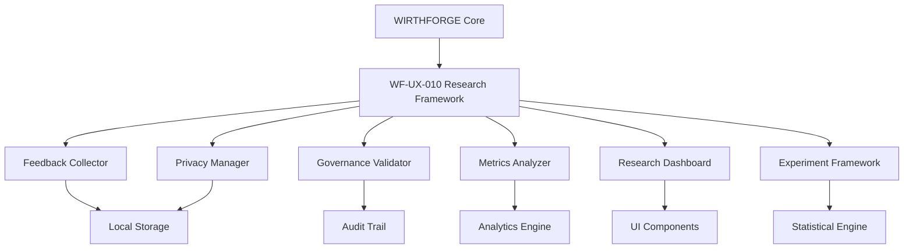

# WF-UX-010 Integration Guide

## User Research & Continuous Improvement Implementation

### Overview

This guide provides comprehensive instructions for integrating the WF-UX-010 User Research & Continuous Improvement assets into the WIRTHFORGE platform. All components are designed to maintain local-first execution, 60Hz performance compliance, energy-truth visualization, and privacy-first data handling.

### Quick Start

1. **Install Dependencies**
   ```bash
   # No external dependencies required - all local-first
   # Verify browser support for required APIs
   ```

2. **Initialize Core Components**
   ```javascript
   import { FeedbackCollector } from './assets/code/WF-UX-010/feedback-collector.js';
   import { PrivacyManager } from './assets/code/WF-UX-010/privacy-manager.js';
   import { GovernanceValidator } from './assets/code/WF-UX-010/governance-validator.js';
   
   // Initialize with WIRTHFORGE compliance settings
   const privacyManager = new PrivacyManager({
     strictMode: true,
     consentRequired: true,
     immediateOptOut: true
   });
   
   const feedbackCollector = new FeedbackCollector({
     maxProcessingTime: 5, // 60Hz compliance
     privacyMode: true,
     bufferSize: 100
   });
   
   const governanceValidator = new GovernanceValidator({
     strictMode: true,
     auditLogging: true,
     maxValidationTime: 5
   });
   ```

### Architecture Integration

#### Core System Integration



#### Component Dependencies

```javascript
// Dependency injection pattern for WIRTHFORGE integration
class WirthForgeResearchSystem {
  constructor(config) {
    this.privacyManager = new PrivacyManager(config.privacy);
    this.governanceValidator = new GovernanceValidator(config.governance);
    this.feedbackCollector = new FeedbackCollector({
      ...config.feedback,
      privacyManager: this.privacyManager
    });
    this.metricsAnalyzer = new MetricsAnalyzer(config.metrics);
    this.researchDashboard = new ResearchDashboard({
      ...config.dashboard,
      metricsAnalyzer: this.metricsAnalyzer
    });
    this.experimentFramework = new ExperimentFramework({
      ...config.experiments,
      privacyManager: this.privacyManager,
      governanceValidator: this.governanceValidator
    });
  }
  
  async initialize() {
    // Initialize in dependency order
    await this.privacyManager.initializePrivacyManager();
    await this.governanceValidator.initializeValidator();
    await this.feedbackCollector.initialize();
    await this.metricsAnalyzer.initialize();
    await this.researchDashboard.initialize();
    await this.experimentFramework.initializeFramework();
  }
}
```

### Implementation Steps

#### Step 1: Privacy Foundation Setup

```javascript
// 1. Initialize privacy-first settings
const privacyConfig = {
  strictMode: true,
  consentRequired: true,
  immediateOptOut: true,
  dataMinimization: true,
  maxProcessingTime: 8
};

const privacyManager = new PrivacyManager(privacyConfig);

// 2. Request initial consent for research activities
const researchConsent = await privacyManager.requestConsent({
  type: 'data_collection',
  purpose: 'user_research_improvement',
  dataTypes: ['interaction_data', 'performance_data', 'feedback_data'],
  retention: { period: 30, unit: 'days' },
  sharing: 'none'
});

// 3. Setup privacy event listeners
document.addEventListener('consent-withdrawn', (event) => {
  // Handle immediate consent withdrawal
  feedbackCollector.stopCollection();
  researchDashboard.clearUserData();
});
```

#### Step 2: Governance Integration

```javascript
// 1. Load governance validation rules
const governanceConfig = {
  strictMode: true,
  auditLogging: true,
  immutableAudit: true,
  maxValidationTime: 5
};

const governanceValidator = new GovernanceValidator(governanceConfig);

// 2. Validate research protocols before execution
const validateProtocol = async (protocol) => {
  const validation = await governanceValidator.validateResearchProtocol(protocol);
  
  if (validation.overallStatus !== 'fully_compliant') {
    throw new Error(`Protocol validation failed: ${validation.violations.join(', ')}`);
  }
  
  return validation;
};

// 3. Setup governance event handlers
document.addEventListener('research-protocol-submitted', async (event) => {
  try {
    const validation = await validateProtocol(event.detail);
    document.dispatchEvent(new CustomEvent('governance-validation-complete', {
      detail: validation
    }));
  } catch (error) {
    document.dispatchEvent(new CustomEvent('governance-validation-error', {
      detail: { error: error.message }
    }));
  }
});
```

#### Step 3: Feedback Collection Setup

```javascript
// 1. Configure feedback collection with performance constraints
const feedbackConfig = {
  bufferSize: 100,
  flushInterval: 5000,
  maxProcessingTime: 5, // 60Hz compliance
  privacyMode: true,
  energyAware: true
};

const feedbackCollector = new FeedbackCollector(feedbackConfig);

// 2. Start collection with consent verification
if (researchConsent.status === 'granted') {
  await feedbackCollector.startCollection();
}

// 3. Collect explicit feedback
const collectUserRating = async (rating) => {
  await feedbackCollector.collectExplicitFeedback('rating', {
    type: 'satisfaction',
    value: rating,
    scale: 5,
    context: 'feature_usage',
    timestamp: Date.now()
  });
};

// 4. Monitor performance impact
feedbackCollector.on('performance-warning', (warning) => {
  console.warn('Feedback collection performance warning:', warning);
  // Implement throttling or optimization
});
```

#### Step 4: Metrics Analysis Integration

```javascript
// 1. Initialize metrics analyzer
const metricsConfig = {
  maxProcessingTime: 8,
  batchSize: 50,
  performanceMode: 'balanced'
};

const metricsAnalyzer = new MetricsAnalyzer(metricsConfig);

// 2. Process feedback batches
feedbackCollector.on('batch-ready', async (batch) => {
  const analysis = await metricsAnalyzer.processFeedbackBatch(batch);
  
  // Update dashboard with new insights
  researchDashboard.updateMetrics({
    energyEngagement: analysis.energyEngagement,
    usability: analysis.usability,
    performance: analysis.performance
  });
});

// 3. Generate periodic reports
setInterval(async () => {
  const report = await metricsAnalyzer.generateInsightsReport({
    timeRange: { start: Date.now() - 86400000, end: Date.now() }
  });
  
  // Dispatch insights for dashboard update
  document.dispatchEvent(new CustomEvent('metrics-insights-ready', {
    detail: report
  }));
}, 300000); // Every 5 minutes
```

#### Step 5: Dashboard Integration

```javascript
// 1. Initialize research dashboard
const dashboardConfig = {
  updateInterval: 1000,
  maxWidgets: 10,
  performanceBudget: 16.67 // 60Hz compliance
};

const researchDashboard = new ResearchDashboard(dashboardConfig);

// 2. Add to WIRTHFORGE UI
const dashboardContainer = document.getElementById('research-dashboard');
await researchDashboard.initialize();
researchDashboard.attachTo(dashboardContainer);

// 3. Setup real-time updates
document.addEventListener('metrics-insights-ready', (event) => {
  researchDashboard.updateMetrics(event.detail);
});

// 4. Monitor dashboard performance
researchDashboard.on('performance-budget-exceeded', (metrics) => {
  console.warn('Dashboard performance budget exceeded:', metrics);
  // Implement optimization strategies
});
```

#### Step 6: Experiment Framework Integration

```javascript
// 1. Initialize experiment framework
const experimentConfig = {
  maxConcurrentExperiments: 5,
  minSampleSize: 100,
  confidenceLevel: 0.95,
  localOnly: true
};

const experimentFramework = new ExperimentFramework(experimentConfig);

// 2. Create research experiment
const createUsabilityExperiment = async () => {
  const experiment = await experimentFramework.createExperiment({
    name: 'UI Improvement Study',
    description: 'Testing new interface design for better usability',
    type: 'ab_test',
    hypothesis: 'New UI design will improve task completion rates',
    variants: [
      { id: 'control', name: 'Current UI', weight: 1 },
      { id: 'treatment', name: 'New UI Design', weight: 1 }
    ],
    metrics: [
      { name: 'completion_rate', type: 'conversion' },
      { name: 'task_time', type: 'duration' },
      { name: 'satisfaction', type: 'rating' }
    ],
    duration: 14, // days
    ethicsReview: true
  });
  
  return experiment;
};

// 3. Handle participant assignment
const assignUserToExperiment = async (experimentId, userId) => {
  const assignment = await experimentFramework.assignParticipant(
    experimentId,
    userId,
    { userLevel: 'intermediate', consentStatus: 'granted' }
  );
  
  return assignment;
};
```

### Performance Optimization

#### 60Hz Compliance

```javascript
// Performance monitoring for 60Hz compliance
class PerformanceMonitor {
  constructor() {
    this.frameTimeBuffer = [];
    this.performanceBudget = 16.67; // 60Hz
  }
  
  startMonitoring() {
    const monitor = () => {
      const frameStart = performance.now();
      
      requestAnimationFrame(() => {
        const frameTime = performance.now() - frameStart;
        this.frameTimeBuffer.push(frameTime);
        
        if (this.frameTimeBuffer.length > 60) {
          this.frameTimeBuffer.shift();
        }
        
        const avgFrameTime = this.frameTimeBuffer.reduce((sum, time) => sum + time, 0) / this.frameTimeBuffer.length;
        
        if (avgFrameTime > this.performanceBudget) {
          this.handlePerformanceBudgetExceeded(avgFrameTime);
        }
        
        monitor();
      });
    };
    
    monitor();
  }
  
  handlePerformanceBudgetExceeded(avgFrameTime) {
    // Throttle non-critical operations
    feedbackCollector.enableThrottling();
    metricsAnalyzer.reduceBatchSize();
    researchDashboard.optimizeRendering();
    
    console.warn(`Performance budget exceeded: ${avgFrameTime}ms`);
  }
}

const performanceMonitor = new PerformanceMonitor();
performanceMonitor.startMonitoring();
```

#### Memory Management

```javascript
// Memory optimization strategies
class MemoryManager {
  constructor() {
    this.memoryThreshold = 100 * 1024 * 1024; // 100MB
    this.checkInterval = 30000; // 30 seconds
  }
  
  startMonitoring() {
    setInterval(() => {
      if (performance.memory && performance.memory.usedJSHeapSize > this.memoryThreshold) {
        this.optimizeMemoryUsage();
      }
    }, this.checkInterval);
  }
  
  optimizeMemoryUsage() {
    // Clear old data buffers
    feedbackCollector.clearOldBuffers();
    metricsAnalyzer.clearProcessedData();
    researchDashboard.clearHistoricalData();
    
    // Force garbage collection if available
    if (window.gc) {
      window.gc();
    }
    
    console.log('Memory optimization performed');
  }
}

const memoryManager = new MemoryManager();
memoryManager.startMonitoring();
```

### Security Considerations

#### Data Protection

```javascript
// Implement data encryption for local storage
class SecureStorage {
  constructor(encryptionKey) {
    this.encryptionKey = encryptionKey;
  }
  
  async encrypt(data) {
    // Use Web Crypto API for encryption
    const encoder = new TextEncoder();
    const dataBuffer = encoder.encode(JSON.stringify(data));
    
    const encrypted = await crypto.subtle.encrypt(
      { name: 'AES-GCM', iv: crypto.getRandomValues(new Uint8Array(12)) },
      this.encryptionKey,
      dataBuffer
    );
    
    return encrypted;
  }
  
  async decrypt(encryptedData) {
    // Decrypt using Web Crypto API
    const decrypted = await crypto.subtle.decrypt(
      { name: 'AES-GCM', iv: encryptedData.iv },
      this.encryptionKey,
      encryptedData.data
    );
    
    const decoder = new TextDecoder();
    return JSON.parse(decoder.decode(decrypted));
  }
}
```

#### Audit Trail Integrity

```javascript
// Implement digital signatures for audit trails
class AuditIntegrity {
  constructor(signingKey) {
    this.signingKey = signingKey;
  }
  
  async signAuditEntry(entry) {
    const encoder = new TextEncoder();
    const entryBuffer = encoder.encode(JSON.stringify(entry));
    
    const signature = await crypto.subtle.sign(
      'RSASSA-PKCS1-v1_5',
      this.signingKey,
      entryBuffer
    );
    
    return {
      ...entry,
      signature: Array.from(new Uint8Array(signature)),
      signedAt: Date.now()
    };
  }
  
  async verifyAuditEntry(signedEntry, publicKey) {
    const { signature, signedAt, ...entry } = signedEntry;
    const encoder = new TextEncoder();
    const entryBuffer = encoder.encode(JSON.stringify(entry));
    
    const signatureBuffer = new Uint8Array(signature).buffer;
    
    return await crypto.subtle.verify(
      'RSASSA-PKCS1-v1_5',
      publicKey,
      signatureBuffer,
      entryBuffer
    );
  }
}
```

### Testing Integration

#### Automated Testing Setup

```javascript
// Jest configuration for WF-UX-010 tests
module.exports = {
  testEnvironment: 'jsdom',
  setupFilesAfterEnv: ['<rootDir>/test-setup.js'],
  testMatch: [
    '**/assets/code/WF-UX-010/tests/**/*.test.js'
  ],
  collectCoverageFrom: [
    'assets/code/WF-UX-010/**/*.js',
    '!assets/code/WF-UX-010/tests/**'
  ],
  coverageThreshold: {
    global: {
      branches: 90,
      functions: 90,
      lines: 90,
      statements: 90
    }
  }
};
```

#### Performance Testing

```javascript
// Performance benchmarks
describe('WF-UX-010 Performance Benchmarks', () => {
  test('should maintain 60Hz during intensive operations', async () => {
    const performanceMonitor = new PerformanceMonitor();
    performanceMonitor.startMonitoring();
    
    // Simulate intensive research operations
    for (let i = 0; i < 1000; i++) {
      await feedbackCollector.collectExplicitFeedback('rating', {
        type: 'performance_test',
        value: Math.random() * 5,
        timestamp: Date.now()
      });
    }
    
    const avgFrameTime = performanceMonitor.getAverageFrameTime();
    expect(avgFrameTime).toBeLessThan(16.67);
  });
});
```

### Deployment Checklist

#### Pre-deployment Validation

- [ ] All components pass unit tests (90% coverage minimum)
- [ ] Integration tests pass with WIRTHFORGE core systems
- [ ] Performance benchmarks meet 60Hz requirements
- [ ] Privacy compliance validated with GDPR requirements
- [ ] Governance workflows tested with approval processes
- [ ] Security audit completed for data handling
- [ ] Accessibility compliance verified (WCAG 2.1 AA)
- [ ] Browser compatibility tested (Chrome 90+, Firefox 88+, Safari 14+, Edge 90+)

#### Production Configuration

```javascript
// Production-optimized configuration
const productionConfig = {
  privacy: {
    strictMode: true,
    consentRequired: true,
    anonymizationLevel: 'high',
    auditLogging: true
  },
  performance: {
    frameBudget: 16.67,
    processingBudget: 8,
    memoryLimit: 100 * 1024 * 1024,
    batchSize: 50
  },
  governance: {
    strictValidation: true,
    immutableAudit: true,
    multiStageApproval: true
  },
  monitoring: {
    performanceTracking: true,
    errorReporting: true,
    complianceMonitoring: true
  }
};
```

### Monitoring and Maintenance

#### Health Checks

```javascript
// System health monitoring
class WirthForgeResearchHealthCheck {
  constructor(researchSystem) {
    this.researchSystem = researchSystem;
    this.healthMetrics = {};
  }
  
  async performHealthCheck() {
    const health = {
      timestamp: Date.now(),
      privacy: await this.checkPrivacyCompliance(),
      performance: await this.checkPerformanceMetrics(),
      governance: await this.checkGovernanceStatus(),
      storage: await this.checkStorageHealth(),
      overall: 'healthy'
    };
    
    // Determine overall health
    const issues = Object.values(health).filter(status => 
      typeof status === 'object' && status.status !== 'healthy'
    );
    
    if (issues.length > 0) {
      health.overall = issues.some(issue => issue.severity === 'critical') ? 'critical' : 'warning';
    }
    
    return health;
  }
  
  async checkPrivacyCompliance() {
    // Verify privacy manager status
    const consentCount = this.researchSystem.privacyManager.consentStore.size;
    const auditTrailIntegrity = await this.verifyAuditTrailIntegrity();
    
    return {
      status: auditTrailIntegrity ? 'healthy' : 'warning',
      activeConsents: consentCount,
      auditIntegrity: auditTrailIntegrity
    };
  }
  
  async checkPerformanceMetrics() {
    // Check if performance budgets are being met
    const avgFrameTime = this.getAverageFrameTime();
    const memoryUsage = performance.memory?.usedJSHeapSize || 0;
    
    return {
      status: avgFrameTime < 16.67 && memoryUsage < 100 * 1024 * 1024 ? 'healthy' : 'warning',
      averageFrameTime: avgFrameTime,
      memoryUsage: memoryUsage
    };
  }
}
```

### Troubleshooting Guide

#### Common Issues and Solutions

1. **Performance Budget Exceeded**
   - Reduce batch sizes in metrics analyzer
   - Enable throttling in feedback collector
   - Optimize dashboard rendering frequency

2. **Privacy Consent Issues**
   - Verify consent dialog UI is not blocked
   - Check localStorage availability
   - Validate consent request parameters

3. **Governance Validation Failures**
   - Review protocol compliance requirements
   - Check audit trail integrity
   - Verify approval workflow status

4. **Storage Quota Exceeded**
   - Implement data retention policies
   - Clear old audit logs
   - Optimize data compression

### Support and Documentation

- **API Documentation**: Auto-generated from JSDoc comments
- **Integration Examples**: Available in `/examples` directory
- **Performance Guides**: Detailed optimization strategies
- **Privacy Compliance**: GDPR and privacy-by-design documentation
- **Security Guidelines**: Best practices for data protection

For additional support, consult the WIRTHFORGE documentation or contact the development team.
