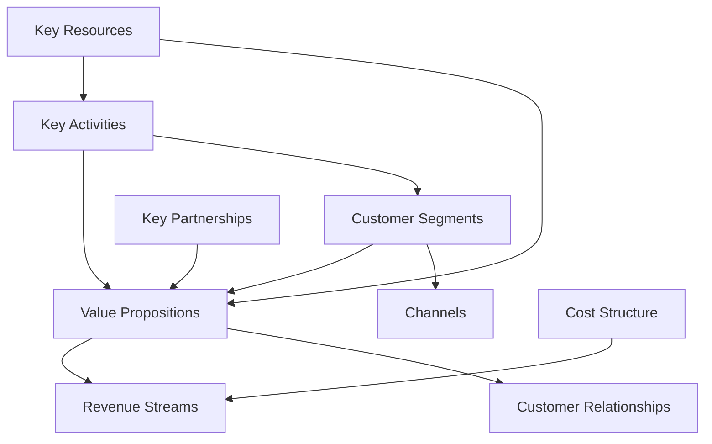

# Generate Document: WF‑BIZ‑001 – Business Model & Value Proposition

## 🧬 Document DNA

* **Unique ID**: WF‑BIZ‑001
* **Category**: Business – Strategy
* **Priority**: P1 (launch‑critical)
* **Dev Phase**: Pre‑Release (Beta)
* **Estimated Length**: \~100 pages (40 pp Business Model Canvas, 35 pp Market Analysis, 25 pp Financial Projections)
* **Document Type**: Business Model & Financial Strategy Guide
* **Path**: Forge
* **Target Hardware**: Mid‑tier (4 GB+ RAM, modest GPU)
* **Budget**: Free (no hidden fees; pricing reflects energy use)
* **Audience Expertise**: Novice (accessible to entrepreneurs and non‑technical decision makers)

---

## 🔗 Dependency Matrix

### Required Before This Document

* **WF‑FND‑001 – Vision & Principles** – Establishes the local‑first business philosophy and ethical guidelines.
* **WF‑FND‑006 – Governance** – Provides the rules for user privacy, data ownership, and no cloud requirements.
* **WF‑UX‑002 – Progressive Levels** – Supplies monetization mechanics and tier definitions used in pricing and value segmentation.
* **WF‑TECH‑001 – Core Platform** – Describes the technical value drivers (local AI runtime, energy measurement) that underpin the business model.

### Enables After This Document

* **WF‑BIZ‑002 – Pricing Strategy & Monetization** – Builds on the business model to define tiered pricing, energy‑based billing, and marketplace revenue streams.
* **WF‑BIZ‑003 – Marketing & Community Strategy** – Uses the defined target markets, value propositions, and growth projections to craft brand messaging, community engagement, and acquisition strategies.
* **WF‑BIZ‑004 (Future) – Investment & Funding Plan** – Can draw on financial projections and sustainability analysis to plan capital raises and partnership pitches.

### Cross‑References

* **Local‑First Value Proposition** – The core idea that all computation happens locally, preserving user data ownership and privacy.
* **Privacy‑Preserving Revenue** – Monetization must not compromise personal data or require cloud harvesting.
* **Energy‑Honest Pricing** – Pricing models tied to actual computational cost and energy use, as defined in WF‑FND‑002 (Energy & Circuits) and WF‑OPS docs.
* **Community‑Driven Growth** – Growth comes from cultivating an ecosystem of users, developers, and partners; a theme elaborated in WF‑BIZ‑003.

---

## 🎯 Core Objective

To define a comprehensive business model that monetizes WIRTHFORGE’s **local‑first AI platform** while upholding user privacy and data ownership, ensuring revenues are generated through **energy‑honest** mechanisms and community participation, and leveraging **web‑engaged experiences** for user engagement and retention.

---

## 📚 Knowledge Integration Checklist

* ✅ **Local‑First Value Proposition** – All business strategies revolve around computation on the user’s device; no mandatory cloud or data harvesting.
* ✅ **Privacy‑Preserving Revenue** – Monetization mechanisms are designed so users retain ownership of their data; revenue is derived from value delivered, not from selling personal data.
* ✅ **Energy‑Honest Pricing** – Pricing reflects the real computational effort and energy consumed; users see and pay only for what they use.
* ✅ **Web‑Engaged Experience** – Business model leverages rich web UIs for onboarding, conversion, and community engagement; frictionless web experiences drive retention.
* ✅ **Community‑Driven Growth** – The business relies on user and developer communities to co‑create value; incentives, rewards, and ecosystem programs are integral.
* ✅ **Compliance with Governance** – All revenue strategies conform to WF‑FND‑006 governance policies (local‑first, privacy, energy, UI presence).
* ✅ **Alignment with Technical Foundation** – The model capitalizes on WIRTHFORGE’s unique technical features (local AI inference, real‑time energy telemetry) for differentiation and cost accounting.

---

## 📝 Content Architecture

### 1) Opening Hook

> **What if running an AI platform could be as private as an offline app yet as engaging as a modern web experience?** Imagine a creative studio powered entirely by your own hardware, where models never send your work to the cloud, and the pricing you pay is transparently tied to the compute cycles and energy your art consumes. WIRTHFORGE sets out to make this a reality. This business model centers on the radical notion that *users own their data* and *should pay only for what they compute*, while the platform thrives by cultivating a vibrant ecosystem of creators, developers, and partners—all connected through an elegant web interface.

The aim of WF‑BIZ‑001 is to transform that vision into a viable business. We detail how to generate revenue from local AI capabilities, how to position the platform against cloud‑dominant competitors, and how to ensure long‑term sustainability without compromising the foundational principles of privacy and local control. Through a combination of a robust **business model canvas**, comprehensive **market and competitive analysis**, and rigorous **financial projections**, we craft a blueprint that guides WIRTHFORGE to profitability while honoring its values. This document serves as a roadmap for founders, investors, and stakeholders to understand and execute on WIRTHFORGE’s unique value proposition.

### 2) Core Concepts

1. **Value Proposition** – WIRTHFORGE offers privacy‑preserving AI creation on local devices. Users (artists, researchers, hobbyists, enterprises) gain creative AI powers without sending their data to the cloud. The value is in sovereignty: **own your data, own your compute, own your energy cost**. Differentiation comes from a seamless web interface that makes local AI as easy as a SaaS tool but with none of the data compromises.
2. **Customer Segments & Market** – Primary segments include:

   * **Individual creators (Free & Paid tiers)** – hobbyists or freelancers using local AI tools for art, code, writing.
   * **Professional creators & SMEs** – small studios and agencies requiring reliable local AI with priority features.
   * **Enterprise & Research** – organizations needing on‑premise AI with strict data control.
   * **Developers & Partners** – plugin/module developers building tools on the WIRTHFORGE platform.
     Each segment has distinct willingness to pay and feature requirements (e.g. parallel models, energy limits).
3. **Revenue Streams** – Derived from:

   * **Subscription tiers** – aligned with progressive levels (Free, Novice, Adept, Master) where higher tiers unlock more parallel models, specialized workflows, or advanced tools.
   * **Energy‑based usage fees** – micro‑charges proportional to actual computational energy expended; enforced through transparent energy accounting.
   * **Marketplace commissions** – revenue share on plugins, models, and creative assets sold via the WIRTHFORGE store (no data selling).
   * **Professional services** – training, support, customization for enterprise clients.
4. **Cost Structure** – Dominated by R\&D for local AI integration (model licensing, engine optimization), UX development (web interface, energy visualization), community programs, and support operations. Minimal cloud infrastructure costs because computation is local; hosting costs are limited to serving static assets and optional encrypted cloud backups (opt‑in).
5. **Key Partnerships** – Hardware manufacturers (to optimize for GPUs/CPUs), open‑source AI model providers, content creators, and universities. Partnerships emphasize co‑development and community rather than dependency.
6. **Channels & Customer Relationships** – The primary channel is WIRTHFORGE’s web portal, which includes onboarding, user management, marketplace, and community forums. Secondary channels include social media, developer conferences, and targeted industry events. Relationships are nurtured through user support forums, community recognition (badges, leaderboards), and partner co‑marketing.
7. **Competitive Differentiation** – WIRTHFORGE stands apart from cloud‑centric platforms by offering absolute data sovereignty, local performance (no latency to remote servers), and energy‑honest pricing. Competitors like Adobe Firefly, Midjourney, or OpenAI’s ChatGPT rely on centralized models; WIRTHFORGE’s local-first position is unique.
8. **Sustainability & Ethics** – The business model embeds environmental awareness by connecting pricing to energy usage, encouraging users to be mindful of computational cost and carbon footprint. Governance requires transparency in how revenue relates to compute cost and discourages over‑consumption.

### 3) Implementation Details

#### 3.1 Business Model Canvas

A standard business model canvas is adapted to WIRTHFORGE’s local‑first paradigm (see **Figure 1**):

*Figure 1 – WIRTHFORGE Business Model Canvas Structure.* The canvas organizes critical elements: customer segments, value propositions, channels, customer relationships, revenue streams, key resources, key activities, key partnerships, and cost structure. Unlike typical SaaS, the value proposition (local, private AI) drives both revenue and cost logic. Costs are anchored in engineering and community programs instead of server spend; revenue flows through subscriptions, energy fees, and marketplace commissions.

**Value Proposition Detail** – For each segment, the value proposition includes:

* **Free/Novice**: Access to a single local model, limited energy budget, community support, exposure to the marketplace.
* **Adept/Master**: Multiple parallel models, advanced energy patterns, professional support, custom workflows.
* **Enterprise**: Dedicated support, custom licenses, extended energy budgets, integration help, on‑premise deployment.
* **Developers/Partners**: SDKs, APIs, revenue share on marketplace contributions.

**Revenue Streams** – The pricing structure uses **tiered subscriptions** with energy‑based usage caps. For example, free users have a daily energy allocation; paid users pay for additional energy units or opt into monthly packages. The **marketplace** charges a 15–20% commission on paid plugins and assets, with the remainder going to creators. **Professional services** are billed hourly or via project contracts, entirely offline and optional.

**Cost Analysis** – Costs include:

1. **R\&D** – Model license fees, compensation for AI engineers, hardware for testing.
2. **UX & Web Engineering** – Development and maintenance of web interfaces, energy visualization, and cross‑platform installers.
3. **Community & Support** – Moderators, community managers, events, documentation.
4. **Marketing & Sales** – Mostly community‑driven, with expenditures on content creation, events, and partner co‑marketing.
5. **Infrastructure** – Minimal, focusing on static hosting, update servers, and optional backup encryption.
6. **Administrative** – Legal, accounting, compliance (especially regarding privacy laws).

#### 3.2 Market Analysis & Positioning

The market analysis examines both **macro trends** and **micro segmentation**:

1. **Market Size & Segmentation** – The local AI creative tools market sits at the intersection of generative AI, consumer creativity software (e.g. Adobe Creative Suite), and edge computing. The market is growing as users demand privacy and control. We segment into four groups: individuals (hobbyists), prosumers, SMB/enterprise, and developers.
2. **Competitive Landscape** – Traditional AI tools (Midjourney, DALL·E, LLM chatbots) rely on central servers and subscription models; consumer creative software (Photoshop, Blender) lacks AI or requires plugins. Local AI frameworks (Ollama) offer technical capabilities but no unified UI or marketplace. WIRTHFORGE differentiates by blending local AI, a polished web UI, and an energy‑honest economy.
3. **Value Proposition Differentiation** – WIRTHFORGE’s unique strengths lie in *data sovereignty*, *no latency dependence*, and *energy‑based pricing*. Competitors cannot easily match these due to their reliance on massive server farms.
4. **Market Entry Strategy** – Launch targeted to creators and hobbyists through community channels; leverage open‑source enthusiasm and early adopters. Gradually scale into prosumer and SMB segments with advanced features. Use partnerships with hardware vendors and educational institutions to gain credibility.
5. **Growth & Scaling Projections** – Organic growth fueled by community engagement (see WF‑BIZ‑003) with optional paid promotion on social media. Forecast user base growth at 2× per year for the first three years, with revenue following subscription and marketplace adoption curves.
6. **Risk Analysis** – Technical complexity of maintaining local AI models, potential legal/regulatory challenges around AI usage (copyright, privacy), and competition from centralized providers. Mitigation strategies include strong legal counsel, compliance automation, and continuous community dialogue.

#### 3.3 Financial Projections & Sustainability

The financial model uses **revenue forecasting** and **scenario modeling** to predict outcomes under different adoption rates.

1. **Revenue Forecast** – Assume 100 k active users in Year 1 with a 5% conversion to paid tiers at €9.42/month (as indicated in WF‑BIZ‑001’s free tier note), plus a 20% marketplace take on average €5 monthly per user. Progressive adoption increases conversion to 10% by Year 3. Use multiple scenarios (best‑case, base‑case, worst‑case) to account for market uncertainties.
2. **Cost Forecast** – R\&D budgets front‑loaded in Year 1–2 to finalize the platform. Marketing spend increases as user base grows. Community costs scale with engagement.
3. **Break‑Even Analysis** – The model shows break‑even in Year 2 under base‑case scenario, with profitability improving from Year 3 onward as recurring revenues stabilize and R\&D expenditure tapers.
4. **Funding & Investment Strategy** – Initial capital may come from seed investment or founder resources to cover pre‑revenue period. The plan includes a potential Series A raise once product-market fit is proven, using the projections to demonstrate viability.
5. **Long‑Term Sustainability** – Emphasize revenue diversification: subscriptions, marketplace, professional services. Scale gradually to avoid overextension. Maintain strong community support to reduce customer acquisition costs. Adhere to governance principles to foster trust and long‑term loyalty.

### 4) Integration Points

WF‑BIZ‑001 integrates with multiple other WIRTHFORGE documents and systems:

* **WF‑OPS‑001 & WF‑OPS‑002** – The business model leverages performance and energy metrics (from the monitoring system) to create energy‑honest pricing, aligning costs with actual compute use. The success of local installation and monitoring is critical for accurate billing and user experience.
* **WF‑TECH‑002 & WF‑TECH‑004** – Local AI integration and plugin systems enable marketplace revenue streams. The business model must align incentives for developers to build modules (e.g. fair revenue splits, clear licensing).
* **WF‑FND‑006** – Governance policies influence data usage agreements, privacy disclosures, and user consent; pricing and monetization must be transparent and non‑predatory.
* **WF‑UX‑002** – Progressive levels inform tier definitions and feature gating; the business model uses these to differentiate user experience and price points.
* **WF‑BIZ‑002 & WF‑BIZ‑003** – Pricing details and marketing plans extend from the foundation laid here. Marketing strategies rely on clearly defined target segments and value propositions; pricing strategies rely on cost and revenue models established in this document.

### 5) Validation & Metrics

To ensure the business model is viable and aligned with WIRTHFORGE’s principles, we define the following validation criteria:

* **User Adoption Metrics** – Track conversion rates by tier, energy usage patterns, and marketplace engagement. Targets: 5–10% paid conversions within first two years, monthly active users to total users ratio > 40%, and marketplace contributions growing month‑over‑month.
* **Revenue vs Energy Correlation** – Monitor whether revenue scales proportionally with measured energy usage; check for fairness and transparency (e.g. no hidden fees).
* **Customer Satisfaction & Churn** – Measure NPS (Net Promoter Score), retention rates, and churn across segments. Aim for churn < 5% for paid tiers.
* **Community Engagement** – Evaluate the number of active contributors, plugin submissions, and forum participation. A thriving community indicates strong brand affinity and organic growth.
* **Governance Compliance** – Periodic audits to verify that all revenue activities respect local‑first and privacy principles: no mandatory cloud usage, no data selling, and transparent pricing.
* **Financial Health** – Assess run‑rate, burn rate, and cash runway based on cost and revenue forecasts. Adjust budgets and pricing tiers if profitability diverges from projections.

---

## 🎨 Required Deliverables

1. **Business Model Canvas (40 pages)** – A detailed canvas mapping each customer segment to specific value propositions, revenue streams, key activities, resources, partnerships, and cost structures. Include illustrations (Mermaid diagrams) of the value chain and revenue flows.
2. **Market Analysis & Positioning (35 pages)** – Deep research into target markets, competitors, and differentiation strategies. Provide segmentation matrices, competitive landscape diagrams, and growth projections.
3. **Financial Projections & Sustainability (25 pages)** – Multi‑scenario financial models with revenue forecasts, cost breakdowns, break‑even charts, funding plans, and long‑term sustainability strategies. Include JSON schema examples of revenue models and cost structures.
4. **Asset Inventory** – Deliver at least 4 Mermaid diagrams (business canvas, value chain, revenue flows, competitive landscape); 4 JSON schemas (customer segments, revenue models, cost structures, financial forecast structure); 5 code files (pricing calculators, energy billing logic, revenue analytics, financial modeling scripts); and 3 test suites (business model validation, financial projection tests, market analysis verification) as specified.

---

## ✅ Quality Validation Criteria

* **Template Adherence** – All universal template sections (Document DNA, Dependency Matrix, etc.) are present.
* **Principles Compliance** – Business model strictly honors local-first, privacy, and energy-honest principles; no hidden fees, no mandatory cloud, no data harvesting.
* **Completeness & Clarity** – All required deliverables are thoroughly addressed; diagrams and schemas are included and well‑explained.
* **Accuracy & Consistency** – Data and projections are cross‑checked against technical and market assumptions; terminology aligns with WIRTHFORGE standards.
* **Novice Readability** – Language is accessible to non‑technical stakeholders; complex financial terms are defined; diagrams and charts are used to clarify concepts.
* **Governance Validation** – The plan passes WF‑FND‑006 governance checks: local-first implementation, no Docker or external dependencies in billing logic, energy-truth alignment, and UI presence for any monetary interactions.

---

## 🔄 Post‑Generation Protocol

* **Publication & Versioning** – Save this document as version **1.0.0** and commit it to the WIRTHFORGE documentation repository. Add an entry in the master index and dependency graph linking WF‑BIZ‑001 to its prerequisites and dependents.
* **Glossary & Terminology Update** – Add business terms such as *Energy‑Honest Pricing*, *Value Proposition*, *Break‑Even Analysis*, and *Marketplace Commission* to the common glossary (WF‑FND‑006), with definitions and cross‑links.
* **Review & Feedback** – Run the internal consistency checker (terminology, style, citations). Share the document with the Business and Governance teams for feedback. Incorporate any required changes before final release.
* **Coordination with Next Docs** – Notify the authors of **WF‑BIZ‑002** and **WF‑BIZ‑003** that WF‑BIZ‑001 has been completed so they can align their pricing and marketing strategies with the defined business model.
* **User Testing & Iteration** – After launch, collect feedback from early adopters on the perceived value and fairness of pricing; revisit the business model based on real‑world data. Adjust the financial projections, revenue tiers, or partnership models as necessary.

---

With WF‑BIZ‑001, WIRTHFORGE has a structured business blueprint that respects its core ethos—local control, privacy, energy honesty, and community empowerment—while laying out a clear path to revenue and sustainability.
