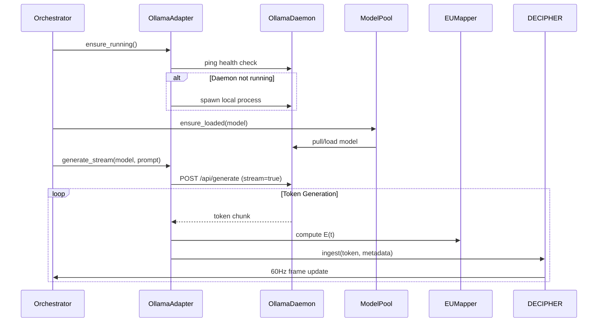

# WF-TECH-002: Ollama Adapter Architecture

## Overview

The Ollama Adapter provides native integration with Ollama runtime for local AI model execution, ensuring zero-Docker deployment and real-time token streaming with energy telemetry.

## Core Responsibilities

### 1. Process Management
- **Health Monitoring**: Continuous ping to Ollama service endpoint
- **Auto-Spawn**: Launch local Ollama daemon when not running
- **Lifecycle Control**: Clean startup/shutdown integration with TECH-001 orchestrator

### 2. Token Streaming
- **Async Iterator**: Non-blocking token generation with backpressure handling
- **Telemetry Capture**: Timestamp, delta timing, and optional logprobs per token
- **Abort Signaling**: Immediate stream cancellation on user stop

### 3. Energy Integration
- **Real-time E(t)**: Token cadence and certainty mapping to energy values
- **60Hz Compliance**: Frame-aligned emission to DECIPHER ingestion pipeline
- **Graceful Degradation**: Maintain core functionality when logprobs unavailable

## Architecture Diagram



## Implementation Contract

### Interface Definition
```python
class OllamaAdapter:
    async def ensure_running(self) -> None
    async def generate_stream(self, model: str, prompt: str, **kwargs) -> AsyncIterator[TokenEvent]
    async def stop_generation(self, session_id: str) -> None
    async def health_check(self) -> bool
```

### Token Event Schema
```python
@dataclass
class TokenEvent:
    token: str
    timestamp_ms: int
    delta_ms: int
    session_id: str
    model: str
    logprobs: Optional[List[float]] = None
    energy: Optional[float] = None
```

## Failure Modes & Recovery

### 1. Daemon Unavailable
- **Detection**: Health check timeout (2s)
- **Recovery**: Auto-spawn with retry backoff
- **Fallback**: Graceful degradation to cached responses

### 2. Model Loading Failure
- **Detection**: HTTP 404/500 from Ollama
- **Recovery**: Automatic model pull if missing
- **Fallback**: Tier-appropriate model substitution

### 3. Stream Interruption
- **Detection**: Connection reset or timeout
- **Recovery**: Resume from last token if possible
- **Fallback**: Clean session termination

## Performance Guarantees

- **TTFT**: <2s for warm models, <10s for cold start
- **Throughput**: Tier-appropriate TPS (Low: 5-15, Mid: 15-30, High: 30+)
- **Latency**: <16.67ms per token processing for 60Hz compliance
- **Memory**: Respect tier VRAM/RAM budgets with graceful eviction

## Security & Privacy

- **Local-Only**: All communication via 127.0.0.1
- **No External Calls**: Zero network traffic except user-initiated model downloads
- **Data Isolation**: No prompt/response logging or external telemetry
- **Process Sandboxing**: Ollama daemon runs with minimal privileges
