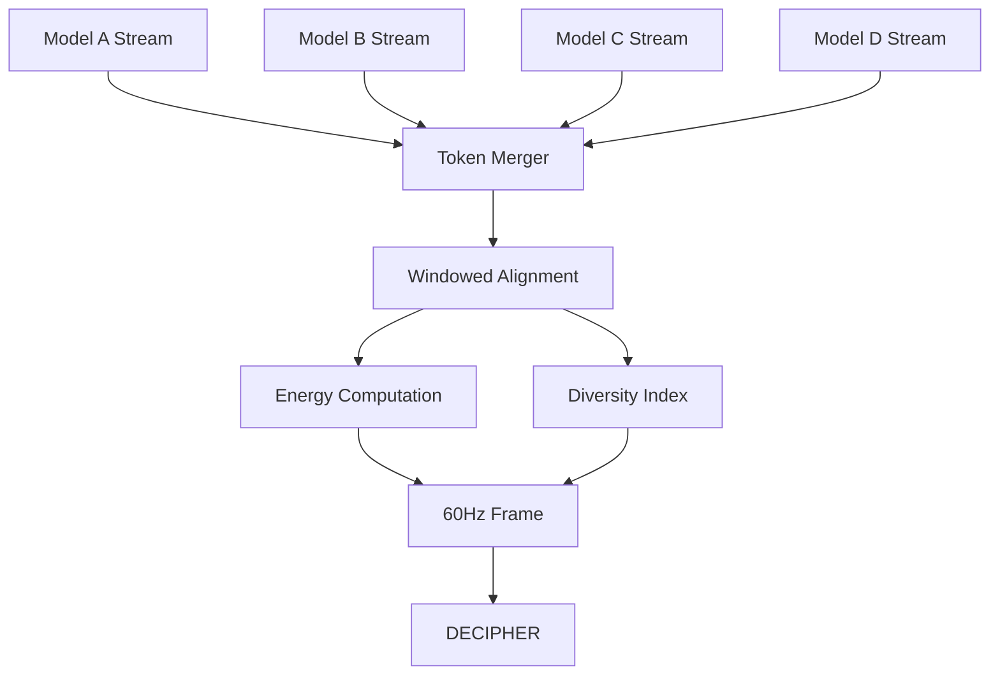

# WF-TECH-002: Turbo Ensemble (Local Council)

## Overview

Turbo Ensemble orchestrates 4-6 concurrent local models for enhanced AI capabilities, computing ensemble energy E_ensemble(t) and diversity index (DI) while maintaining 60Hz performance targets.

## Core Architecture

### Multi-Model Coordination
- **Parallel Execution**: Concurrent token generation from multiple models
- **Token Interleaving**: Merge streams with source attribution
- **Energy Aggregation**: Weighted ensemble energy computation
- **Diversity Analysis**: Real-time DI calculation when logprobs available

### Tier-Aware Scaling
```yaml
tier_limits:
  low: 2        # Basic dual-model ensemble
  mid: 4        # Standard council size
  high: 6       # Maximum local parallelism
  hybrid: 6     # Same as high, optional broker assist
```

## Implementation Design

### Ensemble Orchestrator
```python
class TurboEnsemble:
    def __init__(self, tier_policy: TierPolicy):
        self.max_models = tier_policy.max_parallel_models
        self.models = []
        self.energy_weights = {}
    
    async def generate_ensemble(self, prompt: str, models: List[str]) -> AsyncIterator[EnsembleEvent]:
        # Constrain by tier policy
        active_models = models[:self.max_models]
        
        # Launch parallel streams
        tasks = [self._generate_single(model, prompt) for model in active_models]
        
        async for event in self._merge_streams(tasks):
            event.ensemble_energy = self._compute_ensemble_energy(event)
            event.diversity_index = self._compute_di(event)
            yield event
```

### Energy Ensemble Formula
```python
def compute_ensemble_energy(self, token_events: List[TokenEvent]) -> float:
    """
    E_ensemble(t) = Σ(γ_m * E_m(t)) / Σ(γ_m)
    where γ_m is the confidence weight for model m
    """
    weighted_sum = 0.0
    total_weight = 0.0
    
    for event in token_events:
        weight = self._get_model_weight(event.model)
        weighted_sum += weight * event.energy
        total_weight += weight
    
    return min(1.0, weighted_sum / total_weight) if total_weight > 0 else 0.0
```

### Diversity Index (DI) Computation
```python
def compute_diversity_index(self, aligned_tokens: List[TokenEvent]) -> float:
    """
    DI = 1 - max(P_i) where P_i is probability of most likely token
    Higher DI indicates more model disagreement/exploration
    """
    if not all(event.logprobs for event in aligned_tokens):
        return 0.5  # Graceful fallback when logprobs unavailable
    
    # Aggregate probability distributions
    combined_probs = self._aggregate_distributions(aligned_tokens)
    max_prob = max(combined_probs.values())
    
    return 1.0 - max_prob
```

## Stream Coordination

### Token Alignment Strategy


### Backpressure Handling
- **Queue Monitoring**: Track per-model buffer depths
- **Adaptive Throttling**: Slow faster models to maintain sync
- **Graceful Degradation**: Drop to single-model if coordination fails

## Performance Optimization

### Memory Management
- **Model Rotation**: LRU eviction when hitting VRAM limits
- **Lazy Loading**: Load models on-demand with warm-up caching
- **Resource Budgeting**: Respect tier-specific memory constraints

### Latency Optimization
- **Pre-warming**: Keep tier-appropriate models loaded
- **Connection Pooling**: Reuse HTTP connections to Ollama
- **Batch Processing**: Group similar requests when possible

## Interference Patterns

### Constructive Interference
- **High Agreement**: Models converge on similar tokens
- **Energy Amplification**: E_ensemble > individual E_m values
- **Visual Cue**: Resonance celebration effects in UI

### Destructive Interference  
- **High Disagreement**: Models produce diverse tokens
- **Energy Dampening**: E_ensemble < average E_m values
- **Visual Cue**: Interference pattern visualization

## Quality Assurance

### Validation Metrics
- **Synchronization Lag**: <50ms between fastest/slowest model
- **Frame Budget**: Maintain 60Hz with ensemble overhead
- **Energy Consistency**: E_ensemble mathematically valid
- **DI Accuracy**: Correct diversity measurement when logprobs available

### Failure Recovery
- **Model Dropout**: Continue with remaining models
- **Sync Loss**: Fallback to independent streams
- **Resource Exhaustion**: Graceful degradation to lower tier

## Integration Points

- **TECH-001**: Ensemble lifecycle managed by orchestrator
- **DECIPHER**: Ensemble events fed to 60Hz frame composer
- **TECH-003**: Council events broadcast via real-time protocol
- **TECH-005**: Ensemble energy drives web visualization effects
