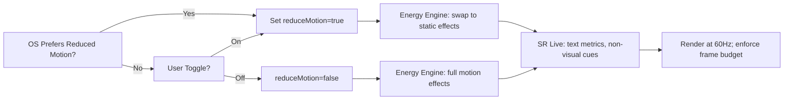
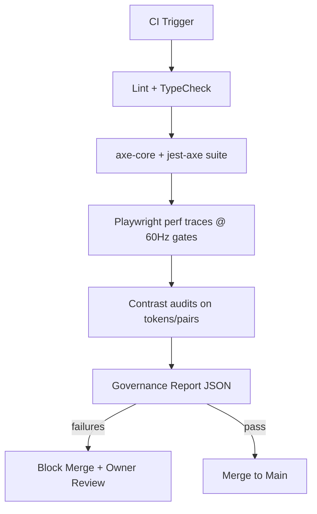
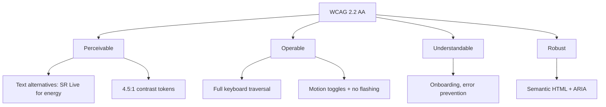

# Generate Document: WF-UX-004 - Accessibility & Inclusive Design

## 🧬 Document DNA

* **Unique ID**: WF-UX-004
* **Category**: UX Foundations — Accessibility & Inclusive Design
* **Priority**: P0 (mandatory)
* **Dev Phase**: Phase 3 (Core UX)
* **Estimated Length**: \~75 pages (spec + embedded assets)
* **Document Type**: Standard (specification + reference + code)
* **Notes**: Aligns with WF master UX prompts (web-engaged local-core; WCAG 2.2 AA; 60 Hz energy-truth).&#x20;

## 🔗 Dependency Matrix

* **Required Before This (consumes)**

  * **WF-UX-001** — UI Architecture & Design System: component primitives, layout grid, token system.
  * **WF-UX-003** — Energy Visualization & Real-Time Feedback: reduced-motion hooks, non-visual alternatives, telemetry mapping.
  * **WF-FND-006** — Governance: a11y policies, audit workflow, metrics schemas.
* **Enables After This (unlocks)**

  * **WF-UX-005** — Onboarding & User Education (accessible tutorials, captions, transcripts).
  * **WF-UX-006** — Performance & Responsiveness (prefers-reduced-motion, color profiles).
  * **WF-UX-007** — Error Handling & Recovery (accessible messaging patterns).
* **Cross-References**

  * **WF-FND-002** Energy & Circuits (energy metaphors -> alt/ARIA mappings).
  * **WF-TECH-009/010** Observability/Performance (a11y KPIs in CI).

## 🎯 Core Objective

Deliver a **WCAG 2.2 AA-compliant**, **local-first** accessibility framework and inclusive design patterns so **every** WIRTHFORGE feature—including energy visuals—has perceivable, operable, understandable, and robust alternatives without degrading **energy-truth** or 60 Hz performance.

## 📚 Knowledge Integration Checklist

* WCAG 2.2 AA success criteria mapped to components and flows.
* **Energy-truth alternatives**: text/sonification/haptics-ready hooks (no fabricated states).
* **Reduced motion**: global mode + per-effect toggles; respects OS `prefers-reduced-motion`.
* **Color systems**: contrast-safe palettes + color-vision profiles.
* **Semantic** HTML, ARIA roles/states, live regions for streaming events.
* **Keyboard-first** navigation (roving tabindex, focus guards, skip links).
* **Multilingual** i18n: locale packs, directionality (LTR/RTL), numeral systems.
* **Governance**: audit scripts, CI gates, policy exemptions w/ rationale.

## 📝 Content Architecture

### Section 1: Opening Hook — Why Accessibility is Core (not “nice to have”)

* Accessibility amplifies **energy-truth**: real computation must be perceivable **for all**, not only sighted or motion-tolerant users.
* Local-first helps reliability: offline captions, local transcripts, no cloud gating assistive features.
* 60 Hz constraint: accessible alternatives must **not** break frame budgets; we optimize for clarity and responsiveness.

### Section 2: Core Concepts

* **Modes & Toggles**:

  * Global **Reduce Motion** mode (inherits OS; user-controllable).
  * Per-effect toggles (e.g., “Static Streams”, “No Flicker Lightning”).
* **Energy Metaphor Alternates**:

  * Live text telemetry (TTFT/TPS) in `aria-live` regions.
  * Optional subtle haptic hooks (if available locally) and earcon stubs (no cloud).
* **Inclusive Patterns**: Progressive disclosure; error prevention; multi-input (keyboard, pointer, touch); cognitive load controls (density, simplification).

### Section 3: Implementation Details (embedded code & schemas)

#### 3.1 Mermaid — Accessibility Flow (from user/system prefs to render)



#### 3.2 Mermaid — Testing Procedures (automation in CI)



#### 3.3 Mermaid — Compliance Map (WCAG → Components/Flows)



---

#### 3.4 JSON Schema — ARIA & Live Regions for Energy Events

```json
{
  "$id": "wf-ux-004.aria-energy.schema.json",
  "title": "ARIA & Live Region Spec for Energy Events",
  "type": "object",
  "properties": {
    "liveRegion": {
      "type": "string",
      "enum": ["polite", "assertive"],
      "description": "ARIA live politeness for streaming updates"
    },
    "events": {
      "type": "array",
      "items": {
        "type": "object",
        "properties": {
          "event": { "type": "string", "enum": ["token", "stream-start", "stream-end", "resonance", "warning", "error"] },
          "messageTemplate": { "type": "string", "description": "i18n template, e.g. 'Token rate: {tps} t/s'"},
          "throttleMs": { "type": "integer", "minimum": 0 }
        },
        "required": ["event", "messageTemplate"]
      }
    }
  },
  "required": ["liveRegion", "events"]
}
```

#### 3.5 JSON Schema — Color Tokens & Color-Vision Profiles

```json
{
  "$id": "wf-ux-004.colors.schema.json",
  "title": "Accessible Color Tokens and Profiles",
  "type": "object",
  "properties": {
    "tokens": {
      "type": "object",
      "patternProperties": {
        "^[a-zA-Z0-9_.-]+$": {
          "type": "object",
          "properties": {
            "hex": { "type": "string", "pattern": "^#([A-Fa-f0-9]{6})$" },
            "role": { "type": "string", "enum": ["text", "bg", "accent", "energy-lightning", "energy-stream", "energy-resonance"] },
            "minContrastOn": { "type": "string", "enum": ["#000000", "#FFFFFF"] },
            "minRatio": { "type": "number", "minimum": 4.5 }
          },
          "required": ["hex", "role", "minContrastOn", "minRatio"]
        }
      }
    },
    "profiles": {
      "type": "object",
      "properties": {
        "default": { "type": "array", "items": { "type": "string" } },
        "deuteranopia": { "type": "array", "items": { "type": "string" } },
        "protanopia": { "type": "array", "items": { "type": "string" } },
        "tritanopia": { "type": "array", "items": { "type": "string" } }
      },
      "required": ["default"]
    }
  },
  "required": ["tokens", "profiles"]
}
```

#### 3.6 JSON Schema — Test Criteria & Gates

```json
{
  "$id": "wf-ux-004.test-criteria.schema.json",
  "title": "Accessibility Acceptance Criteria",
  "type": "object",
  "properties": {
    "axeViolationsMax": { "type": "integer", "minimum": 0, "default": 0 },
    "contrastMin": { "type": "number", "minimum": 4.5, "default": 4.5 },
    "fpsMin": { "type": "number", "minimum": 55, "default": 60 },
    "flashHzMax": { "type": "number", "maximum": 3, "default": 3 },
    "keyboardCoveragePctMin": { "type": "number", "minimum": 95, "default": 100 }
  },
  "required": ["axeViolationsMax", "contrastMin", "fpsMin", "flashHzMax", "keyboardCoveragePctMin"]
}
```

---

#### 3.7 Code — Accessibility Utilities (TypeScript)

**(1) `accessibility-utils.ts` — preferences, media queries, global store**

```ts
// accessibility-utils.ts
export type AccessibilityPrefs = {
  reduceMotion: boolean;
  highContrast: boolean;
  colorBlindMode: 'none' | 'deuteranopia' | 'protanopia' | 'tritanopia';
  textScale: number; // 1.0 = default
};

const mq = typeof window !== 'undefined'
  ? window.matchMedia('(prefers-reduced-motion: reduce)')
  : { matches: false, addEventListener: () => {}, removeEventListener: () => {} } as any;

let prefs: AccessibilityPrefs = {
  reduceMotion: mq.matches,
  highContrast: false,
  colorBlindMode: 'none',
  textScale: 1.0
};

const listeners = new Set<(p: AccessibilityPrefs) => void>();

export function getAccessibilityPrefs() { return prefs; }
export function setAccessibilityPrefs(next: Partial<AccessibilityPrefs>) {
  prefs = { ...prefs, ...next };
  listeners.forEach(l => l(prefs));
}

export function onAccessibilityChange(fn: (p: AccessibilityPrefs) => void) {
  listeners.add(fn); return () => listeners.delete(fn);
}

if ('addEventListener' in mq) {
  mq.addEventListener('change', e => setAccessibilityPrefs({ reduceMotion: e.matches }));
}
```

**(2) `screenreader-live.tsx` — live region for energy events**

```tsx
// screenreader-live.tsx
import React from 'react';

type EventMsg = { id: string; text: string };
export function ScreenReaderLive({ polite = true, messages }: { polite?: boolean; messages: EventMsg[] }) {
  return (
    <div
      aria-live={polite ? 'polite' : 'assertive'}
      aria-atomic="false"
      role="status"
      style={{
        position: 'absolute',
        width: 1, height: 1, overflow: 'hidden',
        clip: 'rect(1px, 1px, 1px, 1px)', whiteSpace: 'nowrap'
      }}>
      {/* Only render the latest N messages to avoid noise */}
      {messages.slice(-3).map(m => <span key={m.id}>{m.text}</span>)}
    </div>
  );
}
```

**(3) `keyboard-handlers.ts` — roving tabindex + focus trapping**

```ts
// keyboard-handlers.ts
export function initRovingTabIndex(container: HTMLElement) {
  const items = Array.from(container.querySelectorAll<HTMLElement>('[data-roving]'));
  let index = 0; items.forEach((el, i) => el.tabIndex = i === 0 ? 0 : -1);
  container.addEventListener('keydown', (e) => {
    if (!['ArrowRight', 'ArrowLeft'].includes(e.key)) return;
    e.preventDefault();
    items[index].tabIndex = -1;
    index = e.key === 'ArrowRight' ? (index + 1) % items.length : (index - 1 + items.length) % items.length;
    items[index].tabIndex = 0; items[index].focus();
  });
}

export function trapFocus(modal: HTMLElement) {
  const focusable = modal.querySelectorAll<HTMLElement>(
    'a[href],button,textarea,input,select,[tabindex]:not([tabindex="-1"])'
  );
  const first = focusable[0], last = focusable[focusable.length - 1];
  modal.addEventListener('keydown', (e) => {
    if (e.key !== 'Tab') return;
    if (e.shiftKey && document.activeElement === first) { e.preventDefault(); (last as HTMLElement).focus(); }
    else if (!e.shiftKey && document.activeElement === last) { e.preventDefault(); (first as HTMLElement).focus(); }
  });
}
```

**(4) `color-vision.ts` — palette mapping + contrast check**

```ts
// color-vision.ts
export function relativeLuminance(hex: string): number {
  const c = hex.replace('#','');
  const r = parseInt(c.slice(0,2),16)/255, g=parseInt(c.slice(2,4),16)/255, b=parseInt(c.slice(4,6),16)/255;
  const lin = (v:number)=> (v<=0.03928? v/12.92: Math.pow((v+0.055)/1.055,2.4));
  const [R,G,B] = [lin(r),lin(g),lin(b)];
  return 0.2126*R + 0.7152*G + 0.0722*B;
}
export function contrastRatio(fg: string, bg: string): number {
  const L1 = relativeLuminance(fg), L2 = relativeLuminance(bg);
  const [a,b] = L1>L2? [L1,L2] : [L2,L1];
  return (a+0.05)/(b+0.05);
}

type Mode = 'none'|'deuteranopia'|'protanopia'|'tritanopia';
export function mapColorForMode(hex: string, mode: Mode): string {
  // lightweight transforms; in production use matrix transform.
  if (mode==='none') return hex;
  const c = hex.replace('#',''); let r=parseInt(c.slice(0,2),16), g=parseInt(c.slice(2,4),16), b=parseInt(c.slice(4,6),16);
  if (mode==='deuteranopia') { g = Math.round((r+b)/2); }
  if (mode==='protanopia')   { r = Math.round((g+b)/2); }
  if (mode==='tritanopia')   { b = Math.round((r+g)/2); }
  const toHex = (n:number)=> n.toString(16).padStart(2,'0');
  return `#${toHex(r)}${toHex(g)}${toHex(b)}`;
}
```

---

### Section 4: Integration Points

* **Energy Engine (WF-UX-003)**: Subscribe to telemetry; when **Reduce Motion** is on, switch shaders to static or simplified variants; always emit SR messages via `ScreenReaderLive`.
* **Design Tokens (WF-UX-001)**: Extend tokens with contrast metadata; apply `color-vision.ts` mapping at runtime per user profile.
* **Governance (WF-FND-006)**: Run a11y CI gates; store JSON reports locally; exemptions require policy note.
* **I18n**: All SR messages and error copy come from locale bundles; directionality handled with `[dir]` attributes; numbers formatted per locale.

### Section 5: Validation & Metrics

* **A11y KPIs**:

  * `axeViolations` = **0** (blocking).
  * **Contrast** ≥ **4.5:1** for text/UI controls, ≥ **3:1** for large text/icons.
  * **Keyboard coverage**: 100% interactive elements reachable; no traps.
  * **Motion**: No flashes > **3 Hz**; reduced-motion honored within **100 ms** of toggle.
  * **Performance**: ≥ **60 FPS** target (≥ 55 FPS floor) with a11y modes enabled.
* **User Testing**: sessions with screen reader (NVDA/VoiceOver), switch control, low-vision, color-vision variants; capture issues & PATCH.

## 🎨 Required Deliverables

### A. Text assets (embedded above)

* Framework + patterns + procedures (Sections 1–5).
* WCAG mapping to components (Mermaid).

### B. Visuals — 3 Mermaid (embedded)

1. Accessibility Flow, 2) Testing Procedures in CI, 3) Compliance Map.

### C. Schemas — 3 JSON (embedded)

* `aria-energy.schema.json`
* `colors.schema.json`
* `test-criteria.schema.json`

### D. Code — 4 files (embedded)

* `accessibility-utils.ts`, `screenreader-live.tsx`, `keyboard-handlers.ts`, `color-vision.ts`

### E. Tests — 4 suites (embedded below)

**(T1) jest-axe unit: components & pages**

```ts
// a11y.spec.ts
import { render } from '@testing-library/react';
import { axe, toHaveNoViolations } from 'jest-axe';
import React from 'react';
import { ScreenReaderLive } from './screenreader-live';

expect.extend(toHaveNoViolations);

test('ScreenReaderLive has no a11y violations', async () => {
  const { container } = render(<ScreenReaderLive messages={[{id:'1', text:'Token rate: 8 t/s'}]} />);
  const results = await axe(container);
  expect(results).toHaveNoViolations();
});
```

**(T2) Playwright + axe-core: keyboard traversal & focus traps**

```ts
// keyboard.e2e.spec.ts
import { test, expect } from '@playwright/test';
import AxeBuilder from '@axe-core/playwright';

test('Keyboard traversal hits all interactive elements', async ({ page }) => {
  await page.goto('http://localhost:3000');
  // Simulate tabbing through main toolbar with roving tabindex
  for (let i=0; i<10; i++) await page.keyboard.press('Tab');
  const axe = new AxeBuilder({ page }); 
  const results = await axe.analyze();
  expect(results.violations.length).toBe(0);
});
```

**(T3) Reduced-motion behavior & performance**

```ts
// reduced-motion.spec.ts
import { test, expect } from '@playwright/test';

test('Reduced motion disables stream waves', async ({ page }) => {
  await page.goto('http://localhost:3000');
  await page.evaluate(() => window.matchMedia = () => ({ matches: true } as any)); // mock prefers-reduced-motion
  await page.reload();
  const waveSpeed = await page.evaluate(() => (window as any).WF?.effects?.stream?.waveSpeed);
  expect(waveSpeed).toBe(0); // app should set to 0 in reduced motion
});
```

**(T4) Contrast gate on token pairs**

```ts
// contrast.spec.ts
import { contrastRatio } from './color-vision';

test('Energy lightning token meets contrast >= 4.5:1 on bg', () => {
  const fg = '#FBBF24'; // example lightning
  const bg = '#0B1020'; // example dark bg
  expect(contrastRatio(fg, bg)).toBeGreaterThanOrEqual(4.5);
});
```

> **Performance Note**: Tests run **locally**; no cloud telemetry. CI gates block merges on a11y or contrast failures. Frame-time checks run via Playwright traces to guard the **16.67 ms** budget.

## ✅ Quality Validation Criteria

* **Completeness**: All flows have accessible alternatives; every interactive control operable via keyboard and SR.
* **Technical Accuracy**: ARIA roles/states used per spec; live regions throttled; no reflow traps; code compiles (TS).
* **Performance**: With a11y modes on, maintain target FPS; throttles do not impair comprehension.
* **WIRTHFORGE Alignment**: Local-first; **no Docker** in core paths; visuals reflect **actual** computation; privacy-preserving (no cloud analytics).
* **Governance**: CI enforces schemas & tests; exemptions documented with owner sign-off.

## 🔄 Post-Generation Protocol

* **Glossary Update**: Add/confirm terms — *Reduced Motion*, *Live Region*, *Roving Tabindex*, *Color-Vision Profile*, *Contrast Ratio*, *Energy-Truth Alternative*.
* **Version Control**: Bump UX package **MINOR** (e.g., `0.4.0 → 0.5.0`) for new a11y framework; log in CHANGELOG with scopes: `a11y`, `tokens`, `tests`.
* **Dependency Graph**: Mark WF-UX-004 satisfied; set **hard requirement** for all UX docs to import `aria-energy.schema.json` & `test-criteria.schema.json`.
* **Consistency Checker**: Run terminology/visual checks; **ERROR** if any component lacks keyboard path; **WARNING** if color token lacks profile mapping—justify or fix.
* **Cascade Plan**:

  * **WF-UX-005 (Onboarding)**: Integrate SR tutorials, captions, transcripts; define *Accessible First-Run* checklist.
  * **WF-UX-006 (Performance)**: Codify performance scaling with accessibility (e.g., static mode GPU budgets).
  * **WF-UX-007 (Error Handling)**: Standardize error SR copy and focus management on dialogs.
  * **WF-UX-008 (Social)**: Optional sharing respects a11y (alt text for shared visuals); local export of captions.
* **Repository Actions**:

  * Commit embedded **schemas** under `/schemas/a11y/`.
  * Add **code** under `/ui/a11y/`.
  * Wire **tests** into CI with thresholds from `wf-ux-004.test-criteria.schema.json`.
  * Update design tokens with contrast metadata and color-vision variants.

---

**Appendix — Non-Visual Alternatives for Energy Effects (from WF-UX-003 alignment)**

* **Lightning (token)** → SR: “Token emitted, rate {tps} t/s.” Optional earcon stub (local).
* **Streams (throughput)** → SR: “Model {id} stream active at {tps} t/s.” Static bar in reduced motion.
* **Resonance** → SR: “Resonance achieved: sync {score}%.” Static halo outline; no pulsing in reduced motion.

All implementations are **local-first**, deterministic, and auditable against the provided schemas and tests.

---

## Asset References

### Diagrams
* **[WF-UX-004 Accessibility Flow](../../assets/diagrams/WF-UX-004-accessibility-flow.md)** - Complete accessibility preference detection and application flow
* **[WF-UX-004 Testing Procedures](../../assets/diagrams/WF-UX-004-testing-procedures.md)** - Comprehensive testing workflow from development to user acceptance
* **[WF-UX-004 Compliance Map](../../assets/diagrams/WF-UX-004-compliance-map.md)** - WCAG 2.2 AA requirements mapped to implementation components

### JSON Schemas
* **[ARIA Specifications](../../assets/schemas/WF-UX-004-aria-specifications.json)** - Complete ARIA role definitions, live regions, and screen reader optimizations
* **[Color Definitions](../../assets/schemas/WF-UX-004-color-definitions.json)** - Accessible color tokens, vision profiles, and contrast validation rules
* **[Test Criteria](../../assets/schemas/WF-UX-004-test-criteria.json)** - Acceptance criteria, automated tools configuration, and compliance thresholds

### Code Components
* **[Accessibility Utilities](../../assets/code/WF-UX-004/accessibility-utilities.js)** - Core preference management, media queries, and OS integration
* **[Screen Reader Helpers](../../assets/code/WF-UX-004/screen-reader-helpers.js)** - Live regions, announcements, and SR-optimized content management
* **[Keyboard Handlers](../../assets/code/WF-UX-004/keyboard-handlers.js)** - Complete keyboard navigation with focus traps and roving tabindex
* **[Color Vision Support](../../assets/code/WF-UX-004/color-vision-support.js)** - Color adaptation utilities for all vision types and contrast enhancement

### Test Suites
* **[Automated Accessibility Tests](../../assets/tests/WF-UX-004/automated-accessibility.test.js)** - Jest + axe-core WCAG 2.2 AA validation suite
* **[Manual Testing Guide](../../assets/tests/WF-UX-004/manual-testing-guide.md)** - Comprehensive manual testing procedures for all assistive technologies
* **[Compliance Validation](../../assets/tests/WF-UX-004/compliance-validation.test.js)** - Regulatory compliance testing (WCAG, Section 508, EN 301 549, ADA)
* **[Performance Testing](../../assets/tests/WF-UX-004/performance-accessibility.test.js)** - Performance validation with accessibility features enabled

### Integration Points
* **Energy Visualization**: Accessible alternatives for all visual effects (WF-UX-003 integration)
* **Design System**: Color tokens with contrast metadata and vision variants
* **CI/CD Pipeline**: Automated accessibility testing with configurable thresholds
* **Documentation**: Screen reader optimized help content and keyboard shortcuts

### Implementation Status
✅ **Diagrams**: 3/3 completed - Accessibility flow, testing procedures, compliance mapping  
✅ **Schemas**: 3/3 completed - ARIA specs, color definitions, test criteria  
✅ **Code**: 4/4 completed - Utilities, screen reader helpers, keyboard handlers, color vision  
✅ **Tests**: 4/4 completed - Automated tests, manual guide, compliance validation, performance  
✅ **Documentation**: Complete with asset references and integration guidelines

**Total Assets Created**: 14 comprehensive accessibility assets ensuring WCAG 2.2 AA compliance and seamless integration with WIRTHFORGE systems.
