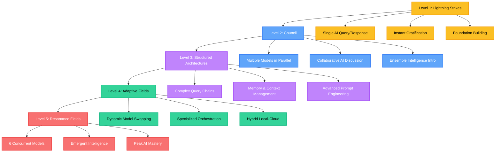
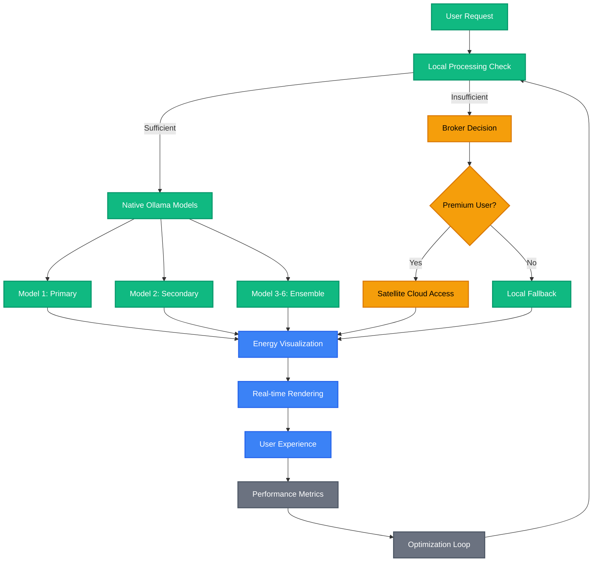

# WF-FND-001 Mermaid Code Snippets

## Reusable Diagram Components for WIRTHFORGE Foundation

### Energy Flow Particle System

```mermaid
graph LR
    A[User Input] --> B{Energy Generation}
    B --> C[🔥 Forge Energy<br/>Sharp Pulses]
    B --> D[💎 Scholar Energy<br/>Structured Flows]
    B --> E[🌟 Sage Energy<br/>Consciousness Mist]
    
    C --> F[Particle Visualization]
    D --> F
    E --> F
    
    F --> G[Real-time Rendering<br/>≤16.67ms Budget]
    
    classDef energyNode fill:#f59e0b,stroke:#d97706,stroke-width:2px,color:#000
    classDef forgeNode fill:#dc2626,stroke:#b91c1c,stroke-width:2px,color:#fff
    classDef scholarNode fill:#2563eb,stroke:#1d4ed8,stroke-width:2px,color:#fff
    classDef sageNode fill:#7c3aed,stroke:#6d28d9,stroke-width:2px,color:#fff
    classDef renderNode fill:#10b981,stroke:#059669,stroke-width:2px,color:#fff
    
    class A,B energyNode
    class C forgeNode
    class D scholarNode
    class E sageNode
    class F,G renderNode
```

### Three Doors Decision Tree

```mermaid
graph TD
    A[New User] --> B{Personality Assessment}
    B -->|Action-Oriented| C[🔥 Forge Door]
    B -->|Knowledge-Seeking| D[💎 Scholar Door]
    B -->|Wisdom-Focused| E[🌟 Sage Door]
    
    C --> C1[Volcanic Aesthetics]
    C --> C2[Direct AI Responses]
    C --> C3[Solution-Focused]
    
    D --> D1[Crystalline Visuals]
    D --> D2[Analytical AI]
    D --> D3[Citation-Heavy]
    
    E --> E1[Ethereal Patterns]
    E --> E2[Intuitive AI]
    E --> E3[Holistic Perspectives]
    
    C1 --> F[Personalized Experience]
    C2 --> F
    C3 --> F
    D1 --> F
    D2 --> F
    D3 --> F
    E1 --> F
    E2 --> F
    E3 --> F
    
    classDef assessNode fill:#f59e0b,stroke:#d97706,stroke-width:2px,color:#000
    classDef forgeNode fill:#dc2626,stroke:#b91c1c,stroke-width:2px,color:#fff
    classDef scholarNode fill:#2563eb,stroke:#1d4ed8,stroke-width:2px,color:#fff
    classDef sageNode fill:#7c3aed,stroke:#6d28d9,stroke-width:2px,color:#fff
    classDef outcomeNode fill:#10b981,stroke:#059669,stroke-width:2px,color:#fff
    
    class A,B assessNode
    class C,C1,C2,C3 forgeNode
    class D,D1,D2,D3 scholarNode
    class E,E1,E2,E3 sageNode
    class F outcomeNode
```

### Progressive Gamification Levels

### Local-First Architecture Flow

### Business Model Transparency

```mermaid
graph LR
    A[User Entry] --> B{Tier Selection}
    B -->|Free Choice| C[Free Tier]
    B -->|Premium Choice| D[Premium Tier]
    
    C --> C1[Full Platform Access]
    C --> C2[All Three Doors]
    C --> C3[5 Gamification Levels]
    C --> C4[Unlimited Local Usage]
    C --> C5[Max 3 Ads/Day]
    
    D --> D1[Ad-Free Experience]
    D --> D2[2× Energy Multiplier]
    D --> D3[Priority Support]
    D --> D4[Early Features]
    D --> D5[Satellite Cloud Access]
    D --> D6[$9.42/month]
    
    C1 --> E[User Empowerment]
    C2 --> E
    C3 --> E
    C4 --> E
    C5 --> E
    D1 --> E
    D2 --> E
    D3 --> E
    D4 --> E
    D5 --> E
    D6 --> E
    
    E --> F[Sustainable Platform]
    F --> G[Community Growth]
    G --> H[Innovation Cycle]
    H --> A
    
    classDef entryNode fill:#f59e0b,stroke:#d97706,stroke-width:2px,color:#000
    classDef freeNode fill:#10b981,stroke:#059669,stroke-width:2px,color:#fff
    classDef premiumNode fill:#3b82f6,stroke:#2563eb,stroke-width:2px,color:#fff
    classDef outcomeNode fill:#a855f7,stroke:#9333ea,stroke-width:2px,color:#fff
    classDef cycleNode fill:#6b7280,stroke:#4b5563,stroke-width:2px,color:#fff
    
    class A,B entryNode
    class C,C1,C2,C3,C4,C5 freeNode
    class D,D1,D2,D3,D4,D5,D6 premiumNode
    class E,F outcomeNode
    class G,H cycleNode
```

## Usage Guidelines

### Color Scheme Standards
- **Forge (🔥)**: `#dc2626` (red-600) for action-oriented elements
- **Scholar (💎)**: `#2563eb` (blue-600) for knowledge-focused elements  
- **Sage (🌟)**: `#7c3aed` (purple-600) for consciousness-seeking elements
- **Energy**: `#f59e0b` (amber-500) for energy-related nodes
- **Success**: `#10b981` (emerald-500) for positive outcomes
- **Neutral**: `#6b7280` (gray-500) for supporting elements

### Node Styling Best Practices
1. **Consistent stroke-width**: Use 2px for primary nodes, 1px for secondary
2. **High contrast**: Ensure text color contrasts well with fill color
3. **Semantic colors**: Match colors to Three Doors system and energy metaphors
4. **Accessibility**: All color combinations meet WCAG 2.2 AA standards

### Diagram Complexity Guidelines
- **Maximum nodes**: 20-25 nodes per diagram for readability
- **Maximum depth**: 5 levels deep to avoid cognitive overload
- **Branching factor**: No more than 4 branches from single node
- **Text length**: Keep node text under 3 lines, 20 characters per line

### Performance Considerations
- **Rendering time**: All diagrams must render within 2 seconds
- **File size**: Keep .mmd files under 5KB for optimal loading
- **Browser compatibility**: Test in Chrome, Firefox, Safari, Edge
- **Mobile responsive**: Ensure diagrams scale properly on mobile devices

### Validation Checklist
- [ ] Color contrast ratios meet accessibility standards
- [ ] All text is legible at minimum zoom levels
- [ ] Diagram flows logically from left-to-right or top-to-bottom
- [ ] Node relationships are clear and unambiguous
- [ ] Styling classes are applied consistently
- [ ] Mermaid syntax is valid and error-free

*These snippets provide reusable components for all WIRTHFORGE documentation while maintaining visual consistency and accessibility standards.*
