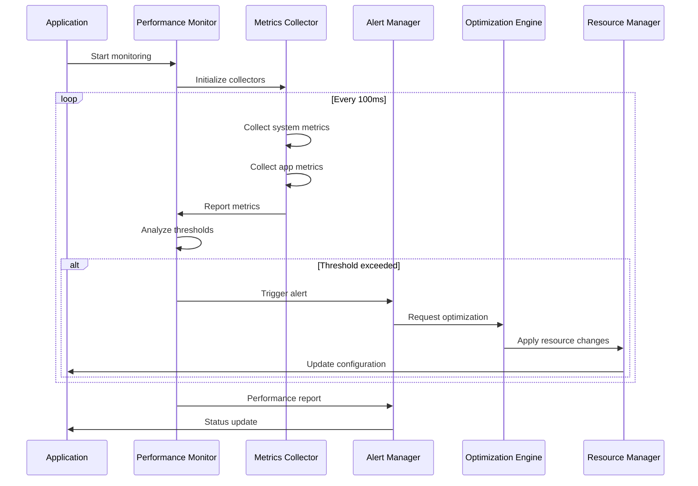
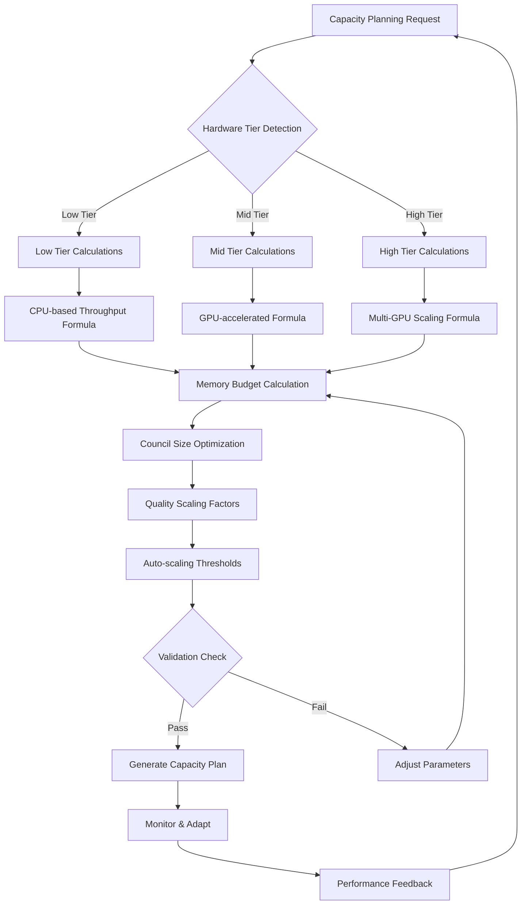
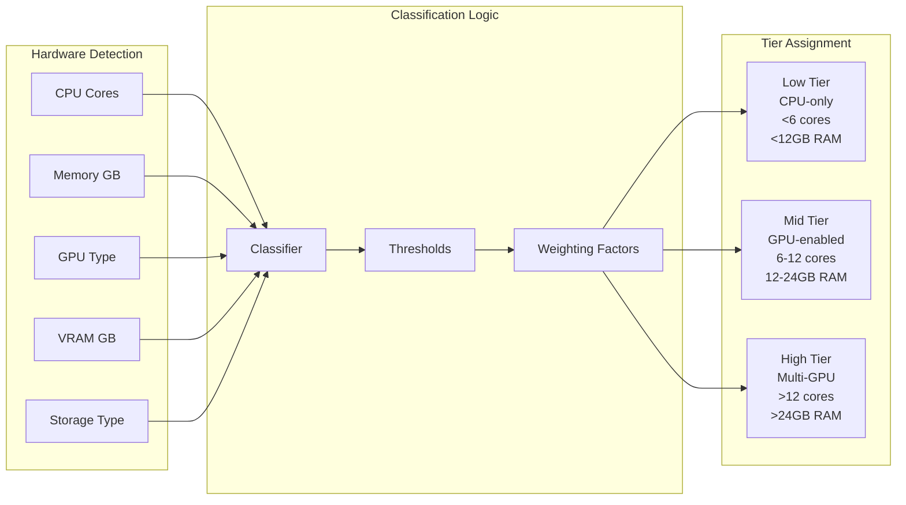
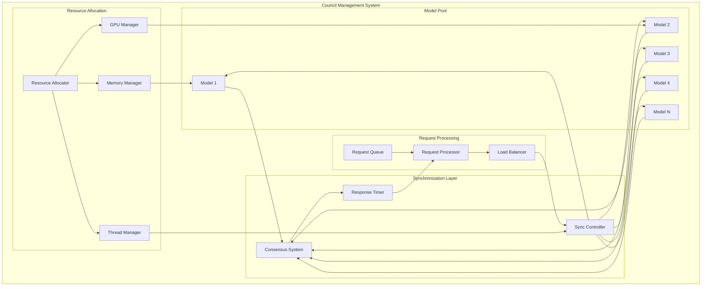
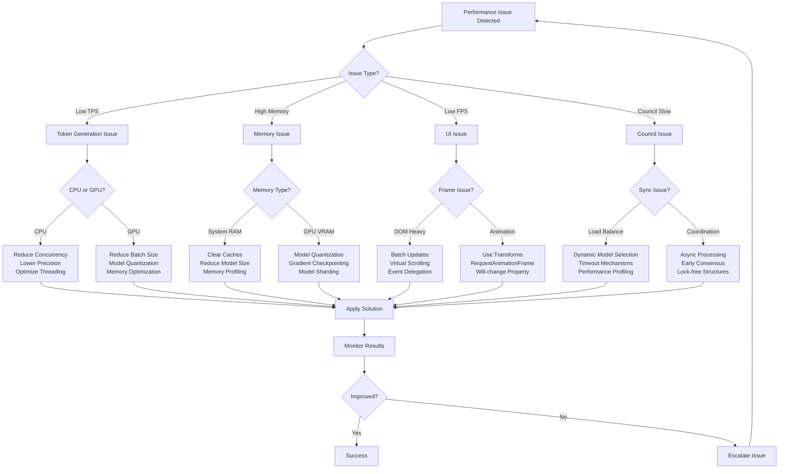
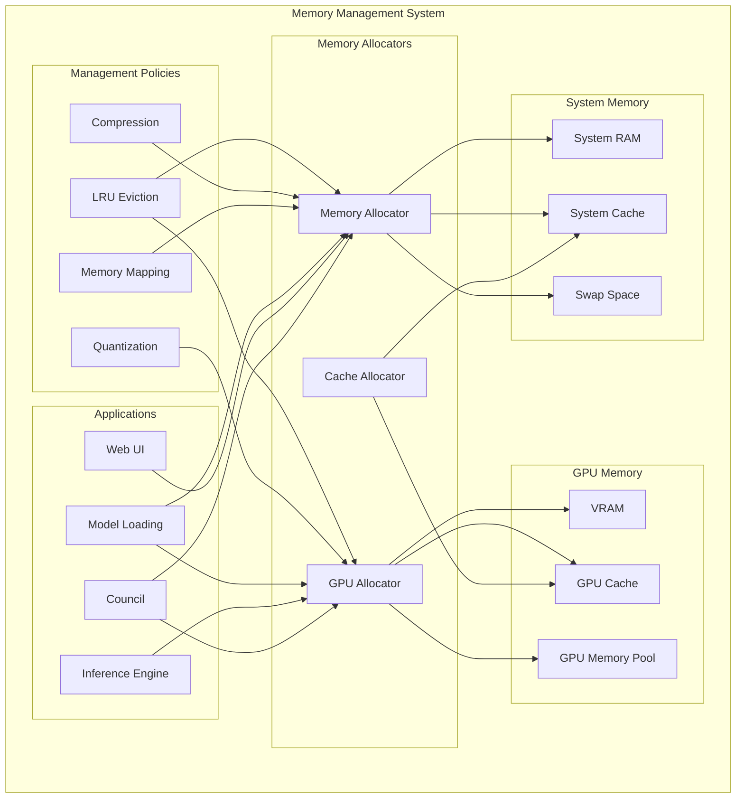
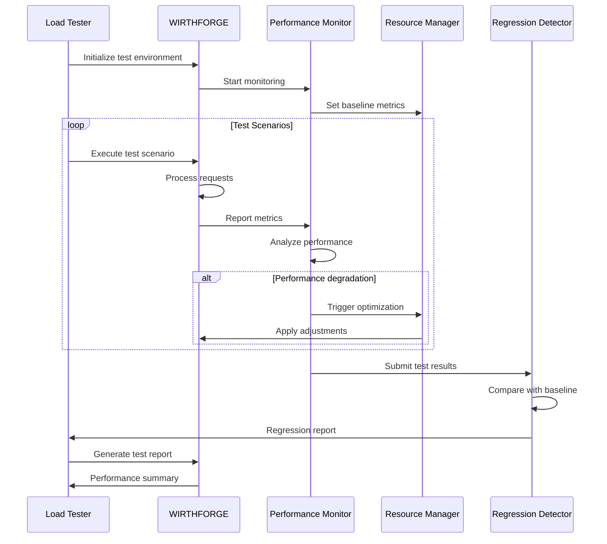
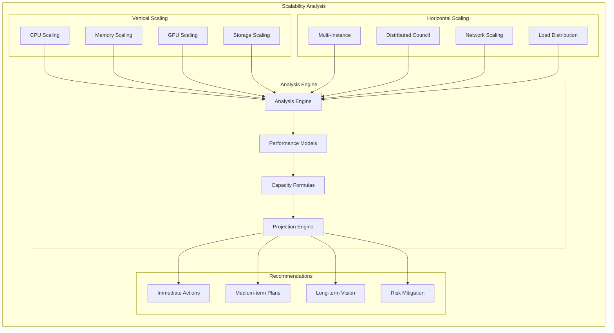
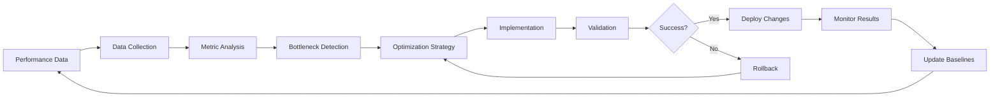

# WF-TECH-010 Performance Architecture Diagrams

**Document ID**: WF-TECH-010  
**Version**: 1.0.0  
**Last Updated**: 2024-01-15  
**Category**: Architecture Diagrams & Visualizations

## Performance System Architecture

```mermaid
graph TB
    subgraph "WIRTHFORGE Performance System"
        subgraph "Hardware Detection Layer"
            HD[Hardware Detector]
            TC[Tier Classifier]
            BC[Benchmark Collector]
        end
        
        subgraph "Performance Monitoring"
            PM[Performance Monitor]
            MC[Metrics Collector]
            AL[Alert Manager]
            RD[Regression Detector]
        end
        
        subgraph "Resource Management"
            RM[Resource Manager]
            MM[Memory Manager]
            GM[GPU Manager]
            CM[Council Manager]
        end
        
        subgraph "Optimization Engine"
            OE[Optimization Engine]
            TP[Tuning Processor]
            AS[Auto Scaler]
            QS[Quality Scaler]
        end
        
        subgraph "Application Layer"
            IE[Inference Engine]
            UI[Web UI]
            CO[Council Orchestrator]
            ML[Model Loader]
        end
    end
    
    HD --> TC
    TC --> BC
    BC --> PM
    
    PM --> MC
    MC --> AL
    MC --> RD
    
    AL --> OE
    RD --> OE
    
    OE --> TP
    OE --> AS
    OE --> QS
    
    RM --> MM
    RM --> GM
    RM --> CM
    
    MM --> ML
    GM --> IE
    CM --> CO
    
    TP --> RM
    AS --> RM
    QS --> UI
    
    IE --> UI
    CO --> IE
    ML --> IE
```

## Performance Monitoring Flow

## Capacity Planning Workflow

## Hardware Tier Classification

## Council Scaling Architecture

## Performance Tuning Decision Tree

## Memory Management Architecture

## Load Testing Architecture

## Scalability Analysis Framework

## Performance Optimization Pipeline

---

These diagrams provide comprehensive visual representations of WIRTHFORGE's performance architecture, covering monitoring, optimization, scaling, and troubleshooting workflows. Each diagram follows Mermaid syntax for easy integration into documentation and can be rendered in any Markdown-compatible environment.
