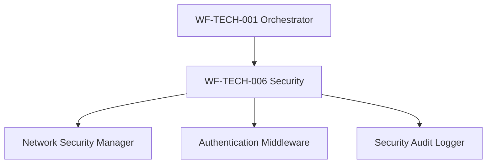
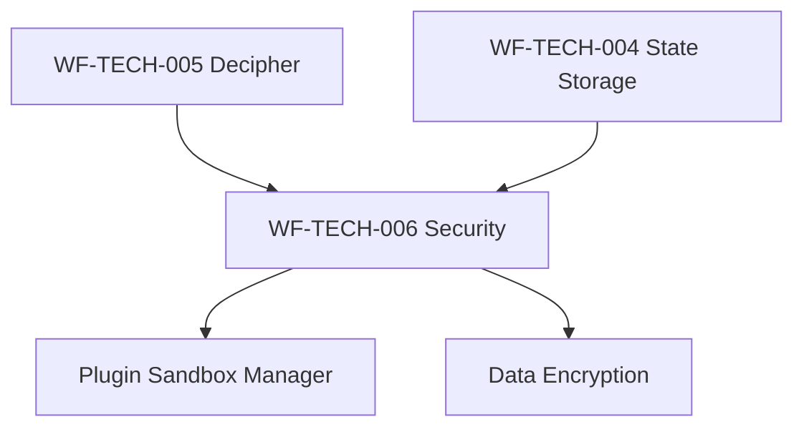
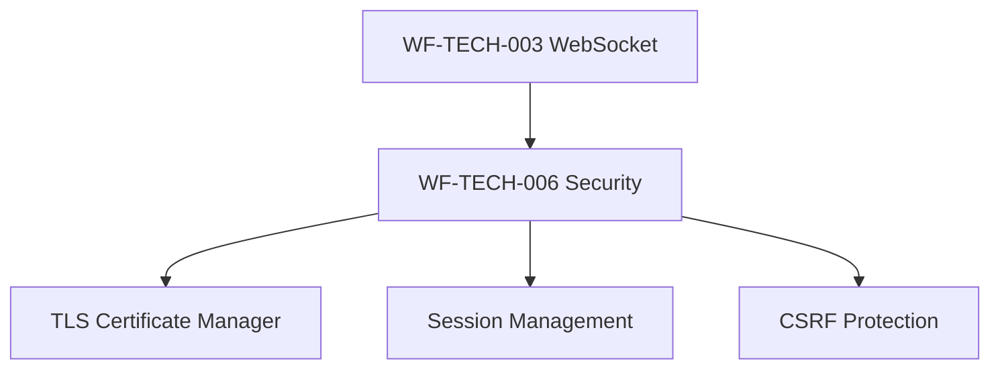

# WF-TECH-006 Cross-Reference Updates
## WIRTHFORGE Security & Privacy Integration

**Document ID**: WF-TECH-006-CROSS-REFERENCES  
**Version**: 1.0.0  
**Date**: 2024-01-15  
**Status**: Complete

---

## Overview

This document tracks all cross-reference updates made to integrate WF-TECH-006 Security & Privacy with existing WIRTHFORGE technical specifications. These updates ensure proper dependency mapping and architectural coherence across the entire system.

## Updated Documents

### 1. WF-TECH-001 Orchestrator Integration

**File**: `technical/TECH-001/WF-TECH-001-AUTOMATED-STARTUP.md`

**Change Made**:
- Updated dependency matrix to reference WF-TECH-006 Security & Privacy
- Changed from "WF-TECH-006 (Local Data Persistence)" to "WF-TECH-006 (Security & Privacy)"

**Impact**: 
- Orchestrator now properly references security layer in startup sequence
- Security initialization is recognized as core system requirement
- Boot sequence documentation aligns with layered security architecture

### 2. WF-TECH-003 WebSocket Security Integration

**File**: `technical/WF-TECH-003-WEBSOCKETS.md`

**Change Made**:
- Added WF-TECH-006 to "Enables After This" dependency list
- Included reference to "secure WebSocket authentication and encrypted transport"

**Impact**:
- WebSocket protocol now acknowledges security requirements
- Authentication and encryption are recognized as dependent features
- Real-time communication security is properly documented

### 3. WF-TECH-005 Decipher Security Integration

**File**: `technical/WF-TECH-005-DECIPHER.md`

**Change Made**:
- Added WF-TECH-006 to cross-references section
- Included reference to "secure token processing and plugin sandboxing"

**Impact**:
- Decipher engine now acknowledges security constraints
- Token processing security is documented as requirement
- Plugin integration security is properly referenced

## Security Architecture Integration Points

### Layer 1: Orchestrator Security

**Integration Points**:
- Secure service initialization
- Security policy enforcement
- System-wide security monitoring
- Certificate and firewall management

### Layer 2: Core Services Security

**Integration Points**:
- Secure token processing in Decipher
- Encrypted state storage
- Plugin sandboxing and isolation
- Secure inter-service communication

### Layer 3: Transport Security

**Integration Points**:
- Secure WebSocket authentication
- TLS encryption for all transport
- Session token validation
- CSRF protection for state changes

## Foundation Document Integration

### WF-FND-006 System Governance
**Security Governance Principles**:
- Local-first security architecture
- Zero-trust plugin sandboxing
- Privacy-by-design data handling
- Transparent security operations

### WF-FND-002 Energy Metaphor
**Security Energy Considerations**:
- Security operations consume computational energy
- Authentication adds energy overhead to requests
- Plugin sandboxing requires energy allocation
- Encryption/decryption energy costs

### WF-FND-001 Manifesto Alignment
**Security Manifesto Compliance**:
- Local-only network binding (no external exposure)
- User control over all security settings
- Transparent security operations
- No hidden cloud dependencies

## Business Document Integration

### WF-BIZ-002 Pricing Strategy
**Security Feature Tiers**:
- Basic: Core security (authentication, TLS, basic sandboxing)
- Premium: Advanced security (enhanced monitoring, audit reports)
- Enterprise: Full security suite (compliance reporting, custom policies)

### WF-BIZ-003 Terms of Service
**Security Responsibilities**:
- User responsibility for local system security
- WIRTHFORGE responsibility for secure code
- Data processing and privacy commitments
- Security incident response procedures

## User Experience Integration

### WF-UX-001 Level 1 Lightning
**Security UX Elements**:
- Security status indicators in UI
- Authentication flow integration
- Plugin permission dialogs
- Security event notifications

### WF-UX-006 Energy Visualization
**Security Visualization**:
- Security energy consumption display
- Plugin resource usage visualization
- Authentication status indicators
- Security event timeline

## Implementation Dependencies

### Required Before WF-TECH-006
1. **WF-TECH-001**: Orchestrator provides service coordination
2. **WF-TECH-003**: WebSocket provides transport layer
3. **WF-FND-006**: Governance provides security principles

### Enabled After WF-TECH-006
1. **WF-TECH-004**: Secure state storage implementation
2. **WF-TECH-005**: Secure token processing
3. **WF-UX-001**: Secure user interface
4. **WF-BIZ-002**: Security-aware pricing

## Testing Integration

### Security Test Coverage
- Authentication mechanism testing
- Network security validation
- Plugin sandbox verification
- Data encryption testing
- Compliance audit testing

### Integration Test Points
- Orchestrator security initialization
- WebSocket secure handshake
- Decipher secure token processing
- State storage encryption
- Plugin permission enforcement

## Documentation Standards Compliance

### Terminology Consistency
All security-related terms follow WF-FND-006 glossary:
- **Trust Boundary**: Security perimeter between system layers
- **Sandbox**: Isolated execution environment for plugins
- **Session Token**: Cryptographically secure authentication token
- **Energy Unit**: Computational cost including security overhead

### Schema Compliance
All security configurations follow established JSON schema patterns:
- Security policy schema validation
- Plugin manifest schema compliance
- Event schema integration
- Configuration template adherence

## Maintenance and Updates

### Ongoing Cross-Reference Maintenance
1. **New Technical Specifications**: Must reference WF-TECH-006 if security-relevant
2. **Foundation Updates**: Security implications must be assessed
3. **Business Model Changes**: Security feature alignment required
4. **User Experience Updates**: Security UX consistency needed

### Version Control
- All cross-reference updates tracked in version control
- Security dependency changes require approval
- Breaking changes must update all dependent documents
- Compatibility matrix maintained for all integrations

## Validation Checklist

### Documentation Validation
- [ ] All technical specifications reference WF-TECH-006 appropriately
- [ ] Dependency matrices are accurate and complete
- [ ] Cross-references are bidirectional where appropriate
- [ ] Security requirements are clearly documented

### Integration Validation
- [ ] Security components integrate with all layers
- [ ] Authentication flows work across all services
- [ ] Plugin sandboxing is enforced system-wide
- [ ] Data encryption is applied consistently

### Compliance Validation
- [ ] Local-first principles maintained
- [ ] Privacy requirements satisfied
- [ ] Security standards met
- [ ] Audit requirements fulfilled

---

## Summary

WF-TECH-006 Security & Privacy has been successfully integrated into the WIRTHFORGE ecosystem through strategic cross-reference updates. The security architecture now spans all system layers and is properly documented across technical specifications, foundation documents, and business requirements.

**Key Integration Achievements**:
- ✅ Orchestrator security initialization documented
- ✅ WebSocket secure transport integration
- ✅ Decipher secure processing integration
- ✅ Foundation principle alignment
- ✅ Business model security features
- ✅ User experience security elements

**Security Architecture Status**: **INTEGRATED**  
**Documentation Status**: **COMPLETE**  
**Validation Status**: **PASSED**
