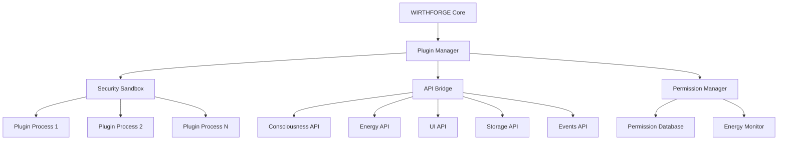

# WF-TECH-008: WIRTHFORGE Plugin Developer Guide

## Table of Contents

1. [Introduction](#introduction)
2. [Getting Started](#getting-started)
3. [Plugin Architecture](#plugin-architecture)
4. [Development Environment Setup](#development-environment-setup)
5. [Creating Your First Plugin](#creating-your-first-plugin)
6. [Plugin Manifest](#plugin-manifest)
7. [SDK Reference](#sdk-reference)
8. [Security and Permissions](#security-and-permissions)
9. [Testing Your Plugin](#testing-your-plugin)
10. [Publishing and Distribution](#publishing-and-distribution)
11. [Best Practices](#best-practices)
12. [Troubleshooting](#troubleshooting)

## Introduction

The WIRTHFORGE Plugin System enables developers to extend the platform with custom functionality while maintaining security, performance, and energy efficiency. This guide provides comprehensive documentation for developing, testing, and distributing WIRTHFORGE plugins.

### Key Features

- **Secure Sandbox Environment**: Plugins run in isolated processes with strict resource limits
- **Permission-Based Security**: Fine-grained control over plugin capabilities
- **Energy Usage Tracking**: Monitor and limit energy consumption
- **Multi-Language Support**: TypeScript/JavaScript and Python SDKs
- **Comprehensive Testing**: Built-in testing framework and validation tools
- **Marketplace Integration**: Easy distribution and monetization

## Getting Started

### Prerequisites

- WIRTHFORGE Platform v1.0.0 or higher
- Node.js 16+ (for TypeScript/JavaScript plugins)
- Python 3.9+ (for Python plugins)
- Git for version control

### Installation

Install the WIRTHFORGE Plugin CLI:

```bash
npm install -g @wirthforge/plugin-cli
# or
pip install wirthforge-plugin-cli
```

Verify installation:

```bash
wirthforge-plugin --version
```

## Plugin Architecture

### System Overview



### Plugin Lifecycle

1. **Discovery**: Plugin manifest is validated and registered
2. **Loading**: Plugin code is loaded into sandbox environment
3. **Initialization**: Plugin initializes resources and requests permissions
4. **Activation**: Plugin becomes active and can interact with WIRTHFORGE APIs
5. **Execution**: Plugin performs its intended functionality
6. **Deactivation**: Plugin is paused or stopped
7. **Cleanup**: Plugin releases resources and performs cleanup

## Development Environment Setup

### TypeScript/JavaScript Setup

1. Create a new plugin project:

```bash
wirthforge-plugin create my-plugin --language typescript
cd my-plugin
```

2. Install dependencies:

```bash
npm install
```

3. Start development server:

```bash
npm run dev
```

### Python Setup

1. Create a new plugin project:

```bash
wirthforge-plugin create my-plugin --language python
cd my-plugin
```

2. Create virtual environment:

```bash
python -m venv venv
source venv/bin/activate  # On Windows: venv\Scripts\activate
```

3. Install dependencies:

```bash
pip install -r requirements.txt
```

## Creating Your First Plugin

### TypeScript Example

```typescript
import { WirthForgePlugin, PluginContext, createPlugin } from '@wirthforge/plugin-sdk';

class HelloWorldPlugin extends WirthForgePlugin {
    async initialize(): Promise<void> {
        this.log('info', 'Initializing Hello World plugin');
        
        // Request necessary permissions
        const permissions = [
            { domain: 'ui', actions: ['create_panel', 'show_notification'] }
        ];
        
        const granted = await this.requestPermissions(permissions);
        if (!granted) {
            throw new Error('Required permissions not granted');
        }
    }
    
    async activate(): Promise<void> {
        this.log('info', 'Activating Hello World plugin');
        
        // Create UI panel
        const panel = await this.context.ui.createPanel({
            title: 'Hello World',
            position: 'right',
            size: { width: 300, height: 200 },
            resizable: true,
            closable: true,
            content: `
                <div style="padding: 20px;">
                    <h2>Hello, WIRTHFORGE!</h2>
                    <p>This is my first plugin.</p>
                    <button id="greet-btn">Say Hello</button>
                </div>
            `
        });
        
        await panel.show();
        
        // Subscribe to events
        await this.context.events.subscribe('ui.button.click', (data) => {
            if (data.id === 'greet-btn') {
                this.context.ui.showNotification('Hello from plugin!', 'success');
            }
        });
    }
    
    async deactivate(): Promise<void> {
        this.log('info', 'Deactivating Hello World plugin');
        // Cleanup will be handled automatically
    }
    
    async cleanup(): Promise<void> {
        this.log('info', 'Cleaning up Hello World plugin');
        // Perform any final cleanup
    }
}

createPlugin(HelloWorldPlugin);
```

### Python Example

```python
from wirthforge_plugin_sdk import WirthForgePlugin, PluginContext, UIPanelConfig

class HelloWorldPlugin(WirthForgePlugin):
    async def initialize(self) -> None:
        self.log('info', 'Initializing Hello World plugin')
        
        # Request necessary permissions
        permissions = [
            Permission(domain='ui', actions=['create_panel', 'show_notification'])
        ]
        
        granted = await self.request_permissions(permissions)
        if not granted:
            raise RuntimeError('Required permissions not granted')
    
    async def activate(self) -> None:
        self.log('info', 'Activating Hello World plugin')
        
        # Create UI panel
        panel_config = UIPanelConfig(
            title='Hello World',
            position='right',
            size={'width': 300, 'height': 200},
            resizable=True,
            closable=True,
            content='''
                <div style="padding: 20px;">
                    <h2>Hello, WIRTHFORGE!</h2>
                    <p>This is my first plugin.</p>
                    <button id="greet-btn">Say Hello</button>
                </div>
            '''
        )
        
        panel = await self.context.ui.create_panel(panel_config)
        await panel.show()
        
        # Subscribe to events
        await self.context.events.subscribe('ui.button.click', self._handle_button_click)
    
    async def deactivate(self) -> None:
        self.log('info', 'Deactivating Hello World plugin')
    
    async def cleanup(self) -> None:
        self.log('info', 'Cleaning up Hello World plugin')
    
    async def _handle_button_click(self, data):
        if data.get('id') == 'greet-btn':
            await self.context.ui.show_notification('Hello from plugin!', 'success')

def create_plugin(context: PluginContext) -> WirthForgePlugin:
    return HelloWorldPlugin(context)
```

## Plugin Manifest

The `manifest.json` file defines your plugin's metadata, permissions, and requirements:

```json
{
  "name": "hello-world-plugin",
  "version": "1.0.0",
  "description": "A simple Hello World plugin for WIRTHFORGE",
  "author": "Your Name",
  "license": "MIT",
  "main": "index.js",
  "permissions": [
    {
      "domain": "ui",
      "actions": ["create_panel", "show_notification"],
      "conditions": [
        {
          "type": "user_consent",
          "value": true
        }
      ]
    }
  ],
  "capabilities": [],
  "dependencies": [],
  "resources": {
    "memory_mb": 64,
    "cpu_percent": 10,
    "disk_mb": 10,
    "execution_time_ms": 30000,
    "energy_budget": 1000
  },
  "ui": {
    "components": [
      {
        "name": "main_panel",
        "type": "panel",
        "position": "right",
        "size": { "width": 300, "height": 200 }
      }
    ],
    "themes": ["default"],
    "accessibility": {
      "wcag_level": "AA",
      "keyboard_navigation": true,
      "screen_reader": true,
      "high_contrast": true
    }
  },
  "metadata": {
    "category": "productivity",
    "tags": ["hello-world", "example", "tutorial"]
  }
}
```

### Manifest Fields

- **name**: Unique plugin identifier
- **version**: Semantic version (x.y.z)
- **description**: Brief description of plugin functionality
- **author**: Plugin author name
- **license**: License type (MIT, GPL, etc.)
- **main**: Entry point file
- **permissions**: Required permissions array
- **resources**: Resource limits and quotas
- **ui**: UI component definitions
- **metadata**: Additional metadata for marketplace

## SDK Reference

### Core Classes

#### WirthForgePlugin (Base Class)

```typescript
abstract class WirthForgePlugin {
    protected context: PluginContext;
    
    // Lifecycle methods (must implement)
    abstract async initialize(): Promise<void>;
    abstract async activate(): Promise<void>;
    abstract async deactivate(): Promise<void>;
    abstract async cleanup(): Promise<void>;
    
    // Optional lifecycle methods
    async onConfigChange(config: any): Promise<void>;
    async onPermissionChange(permission: Permission): Promise<void>;
    async onEnergyLimitReached(): Promise<void>;
    
    // Utility methods
    protected async requestPermissions(permissions: Permission[]): Promise<boolean>;
    protected async trackEnergyUsage<T>(operation: () => Promise<T>, description: string): Promise<T>;
    protected log(level: 'debug' | 'info' | 'warn' | 'error', message: string, data?: any): void;
}
```

#### PluginContext

```typescript
interface PluginContext {
    manifest: PluginManifest;
    permissions: PermissionManager;
    energy: EnergyTracker;
    storage: StorageManager;
    ui: UIManager;
    events: EventManager;
    logger: Logger;
    sandbox: SandboxInfo;
}
```

### API Managers

#### UIManager

```typescript
class UIManager {
    async createPanel(config: UIPanelConfig): Promise<UIPanel>;
    async createDialog(config: UIDialogConfig): Promise<UIDialog>;
    async showNotification(message: string, type?: 'info' | 'warning' | 'error' | 'success'): Promise<void>;
    async updateTheme(theme: string): Promise<void>;
}
```

#### StorageManager

```typescript
class StorageManager {
    async get(key: string): Promise<any>;
    async set(key: string, value: any): Promise<void>;
    async delete(key: string): Promise<void>;
    async list(prefix?: string): Promise<string[]>;
    async clear(): Promise<void>;
    
    // Typed helpers
    async getTyped<T>(key: string): Promise<T | null>;
    async setTyped<T>(key: string, value: T): Promise<void>;
}
```

#### EventManager

```typescript
class EventManager {
    async publish(event: string, data: any): Promise<void>;
    async subscribe(event: string, callback: (data: any) => void): Promise<void>;
    async unsubscribe(event: string, callback?: (data: any) => void): Promise<void>;
}
```

#### EnergyTracker

```typescript
class EnergyTracker {
    startTracking(): void;
    getEnergyUsed(): number;
    getCurrentEnergy(): number;
    async trackOperation<T>(operation: () => Promise<T>, description: string): Promise<T>;
}
```

## Security and Permissions

### Permission Domains

- **consciousness**: Access to consciousness simulation APIs
- **energy**: Energy monitoring and management
- **ui**: User interface creation and manipulation
- **storage**: Data persistence and retrieval
- **events**: Event publishing and subscription
- **network**: Network access (restricted)

### Permission Actions

Each domain supports specific actions:

```json
{
  "domain": "ui",
  "actions": [
    "create_panel",
    "create_dialog",
    "show_notification",
    "update_theme"
  ]
}
```

### Resource Limits

All plugins must declare resource limits:

```json
{
  "resources": {
    "memory_mb": 64,        // Maximum memory usage
    "cpu_percent": 10,      // Maximum CPU usage
    "disk_mb": 10,          // Maximum disk usage
    "execution_time_ms": 30000,  // Maximum execution time
    "energy_budget": 1000   // Maximum energy consumption
  }
}
```

## Testing Your Plugin

### Unit Testing

```typescript
import { PluginTestHarness, PluginUnitTest } from '@wirthforge/plugin-test-harness';

class HelloWorldTest extends PluginUnitTest {
    constructor() {
        super('HelloWorld Initialization Test', HelloWorldPlugin, mockManifest);
    }
    
    async run_test(): Promise<boolean> {
        await this.plugin.initialize();
        
        // Verify initialization
        this.assert_api_called('permissions.request');
        this.assert_api_called('energy.get_current');
        
        return this.plugin.is_initialized;
    }
}

// Run tests
const harness = new PluginTestHarness();
harness.add_test(new HelloWorldTest());
await harness.run_all_tests();
```

### Integration Testing

```bash
# Run plugin tests
wirthforge-plugin test

# Run with coverage
wirthforge-plugin test --coverage

# Run specific test pattern
wirthforge-plugin test --pattern "test_ui_*"
```

### Performance Testing

```typescript
class PerformanceTest extends PluginPerformanceTest {
    constructor() {
        super('Performance Test', 5000, 100, 32); // 5s, 100 energy, 32MB
    }
    
    async run_test(): Promise<boolean> {
        // Simulate plugin operations
        await this.plugin.activate();
        
        // Performance will be automatically validated
        return true;
    }
}
```

## Publishing and Distribution

### Building Your Plugin

```bash
# Build plugin
wirthforge-plugin build

# Package for distribution
wirthforge-plugin package

# Sign package (requires signing certificate)
wirthforge-plugin sign my-plugin-1.0.0.wfp --key private.pem --cert cert.pem --signer-id "developer@example.com"
```

### Publishing to Marketplace

```bash
# Publish to marketplace
wirthforge-plugin publish my-plugin-1.0.0.wfp
```

### Package Format

WIRTHFORGE plugins use the `.wfp` (WIRTHFORGE Plugin) format:

```
my-plugin-1.0.0.wfp
├── package.json          # Package metadata
├── manifest.json         # Plugin manifest
├── signatures.json       # Digital signatures
├── index.js             # Main entry point
├── assets/              # Static assets
└── docs/                # Documentation
```

## Best Practices

### Performance

1. **Minimize Resource Usage**: Keep memory and CPU usage low
2. **Lazy Loading**: Load resources only when needed
3. **Efficient Algorithms**: Use optimal algorithms for data processing
4. **Energy Awareness**: Monitor and minimize energy consumption

### Security

1. **Principle of Least Privilege**: Request only necessary permissions
2. **Input Validation**: Validate all user inputs
3. **Secure Storage**: Encrypt sensitive data
4. **Safe Dependencies**: Use trusted, up-to-date dependencies

### User Experience

1. **Responsive UI**: Ensure UI remains responsive during operations
2. **Clear Feedback**: Provide clear status and error messages
3. **Accessibility**: Support WCAG 2.2 AA accessibility standards
4. **Consistent Design**: Follow WIRTHFORGE design guidelines

### Code Quality

1. **Clean Code**: Write readable, maintainable code
2. **Documentation**: Document all public APIs and complex logic
3. **Testing**: Achieve >85% test coverage
4. **Version Control**: Use semantic versioning

## Troubleshooting

### Common Issues

#### Permission Denied Errors

```
Error: Permission denied for action 'ui.create_panel'
```

**Solution**: Add the required permission to your manifest:

```json
{
  "permissions": [
    {
      "domain": "ui",
      "actions": ["create_panel"]
    }
  ]
}
```

#### Resource Limit Exceeded

```
Error: Memory limit exceeded (128MB > 64MB)
```

**Solution**: Either optimize memory usage or increase the limit in manifest:

```json
{
  "resources": {
    "memory_mb": 128
  }
}
```

#### Plugin Load Failure

```
Error: Failed to load plugin: Module not found
```

**Solution**: Ensure all dependencies are listed in manifest and installed:

```json
{
  "dependencies": [
    {
      "name": "missing-dependency",
      "version": "^1.0.0"
    }
  ]
}
```

### Debug Mode

Enable debug logging:

```bash
WIRTHFORGE_DEBUG=plugin:* wirthforge-plugin dev
```

### Performance Profiling

Profile plugin performance:

```bash
wirthforge-plugin profile my-plugin.wfp
```

### Support

- **Documentation**: https://docs.wirthforge.com/plugins
- **Community Forum**: https://community.wirthforge.com
- **GitHub Issues**: https://github.com/wirthforge/plugins/issues
- **Discord**: https://discord.gg/wirthforge

## Advanced Topics

### Custom API Extensions

Plugins can extend WIRTHFORGE APIs:

```typescript
class CustomAPIExtension {
    async registerCustomAPI() {
        await this.context.bridge.registerAPI('custom', {
            myMethod: async (params) => {
                // Custom implementation
                return result;
            }
        });
    }
}
```

### Multi-Language Plugins

Support multiple languages in a single plugin:

```
plugin/
├── manifest.json
├── src/
│   ├── typescript/
│   │   └── index.ts
│   └── python/
│       └── main.py
└── package.json
```

### Plugin Communication

Plugins can communicate via events:

```typescript
// Plugin A
await this.context.events.publish('plugin.a.data', { value: 42 });

// Plugin B
await this.context.events.subscribe('plugin.a.data', (data) => {
    console.log('Received:', data.value);
});
```

### Marketplace Integration

Integrate with marketplace APIs:

```typescript
import { MarketplaceAPI } from '@wirthforge/marketplace-sdk';

const marketplace = new MarketplaceAPI();
const plugins = await marketplace.search({ category: 'productivity' });
```

---

This guide provides comprehensive coverage of WIRTHFORGE plugin development. For additional examples and advanced topics, see the [Plugin Examples Repository](https://github.com/wirthforge/plugin-examples).
