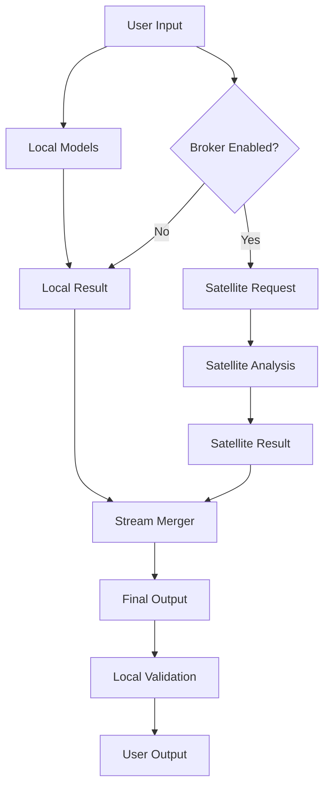

# WF-TECH-002: Hybrid Broker (Optional Satellite Assist)

## Overview

The Hybrid Broker provides optional satellite assistance for enhanced AI capabilities while maintaining local-core integrity. All broker functionality is user-controlled, opt-in, and never required for core system operation.

## Design Principles

### Local-Core Primacy
- **Core Independence**: All essential functions work without broker
- **User Control**: Explicit opt-in required for any external communication
- **Data Minimization**: Only necessary context sent to satellite services
- **Privacy Preservation**: No persistent storage of user data externally

### Optional Enhancement Model
```yaml
broker_modes:
  disabled: "Pure local-only operation"
  advisory: "Satellite provides suggestions, local decides"
  hybrid: "Coordinated local+satellite processing"
  fallback: "Satellite assist when local resources exhausted"
```

## Architecture Design

### Broker Interface
```python
class HybridBroker:
    def __init__(self, config: BrokerConfig):
        self.enabled = config.user_enabled
        self.mode = config.mode
        self.local_primary = True
    
    async def enhance_generation(self, local_result: TokenStream, context: Context) -> EnhancedStream:
        if not self.enabled:
            return local_result
        
        # Satellite assistance with local validation
        satellite_input = self._minimize_context(context)
        satellite_stream = await self._request_satellite(satellite_input)
        
        return self._merge_streams(local_result, satellite_stream)
```

### Data Flow Architecture


## Implementation Components

### Context Minimization
```python
def minimize_context(self, full_context: Context) -> MinimalContext:
    """
    Extract only essential information for satellite processing
    - Remove personal identifiers
    - Compress conversation history
    - Include only task-relevant metadata
    """
    return MinimalContext(
        task_type=full_context.task_type,
        complexity_level=full_context.complexity,
        domain_hints=full_context.domain,
        # Exclude: user_id, full_history, system_details
    )
```

### Satellite Communication
```python
async def request_satellite(self, context: MinimalContext) -> SatelliteResponse:
    """
    Secure communication with satellite services
    - TLS encryption required
    - Request/response validation
    - Timeout and retry handling
    """
    async with aiohttp.ClientSession() as session:
        response = await session.post(
            self.satellite_endpoint,
            json=context.to_dict(),
            headers={"Authorization": f"Bearer {self.api_key}"},
            timeout=aiohttp.ClientTimeout(total=10)
        )
        return SatelliteResponse.from_json(await response.json())
```

### Stream Merging Strategies

#### Advisory Mode
- Local model generates primary response
- Satellite provides suggestions/improvements
- User sees both with clear attribution
- Final choice remains with user

#### Hybrid Mode
- Parallel local and satellite generation
- Real-time stream interleaving
- Confidence-weighted token selection
- Seamless user experience

#### Fallback Mode
- Local processing attempted first
- Satellite engaged only on local failure/timeout
- Transparent failover with user notification

## Security & Privacy

### Data Protection
```python
class PrivacyGuard:
    def sanitize_input(self, user_input: str) -> str:
        """Remove PII and sensitive information"""
        # Remove emails, phone numbers, addresses
        # Anonymize names and identifiers
        # Filter sensitive keywords
        return sanitized_input
    
    def validate_response(self, satellite_response: str) -> bool:
        """Ensure response doesn't contain unexpected data"""
        # Check for data leakage
        # Validate response format
        # Scan for malicious content
        return is_safe
```

### Network Security
- **TLS 1.3**: All satellite communication encrypted
- **Certificate Pinning**: Validate satellite service identity
- **Rate Limiting**: Prevent abuse and DoS
- **Audit Logging**: Track all external requests (locally only)

## Configuration Management

### User Controls
```yaml
broker_config:
  enabled: false                    # Default disabled
  mode: "advisory"                  # advisory|hybrid|fallback
  satellite_endpoint: null          # User-provided
  api_key: null                     # User-provided
  max_requests_per_hour: 100        # Rate limiting
  data_retention: "none"            # Satellite data policy
  fallback_timeout: 5000           # ms before satellite assist
```

### Governance Compliance
- **FND-006 Alignment**: Schema versioning and audit trails
- **No Required Dependencies**: Core functions work without broker
- **User Consent**: Explicit opt-in for each satellite interaction
- **Data Sovereignty**: User controls all external data sharing

## Performance Considerations

### Latency Management
- **Parallel Processing**: Local and satellite streams concurrent
- **Timeout Handling**: Graceful degradation on satellite delays
- **Caching**: Local cache of satellite responses (user-controlled)

### Resource Optimization
- **Connection Pooling**: Reuse satellite connections
- **Request Batching**: Combine multiple requests when possible
- **Bandwidth Limiting**: Respect user network constraints

## Quality Assurance

### Validation Metrics
- **Response Time**: Satellite requests <5s typical, <10s maximum
- **Availability**: Graceful handling of satellite service outages
- **Privacy Compliance**: Zero PII leakage in satellite requests
- **User Control**: All external communication user-initiated

### Testing Strategy
- **Isolation Tests**: Verify core functions work without broker
- **Integration Tests**: Validate satellite communication protocols
- **Privacy Tests**: Ensure no data leakage or unauthorized requests
- **Failure Tests**: Confirm graceful degradation on satellite failures

## Integration Points

- **TECH-001**: Broker lifecycle managed by orchestrator
- **FND-006**: Governance policies enforce privacy and user control
- **TECH-005**: Web UI provides broker configuration and monitoring
- **TECH-006**: Integration tests validate broker security and privacy
